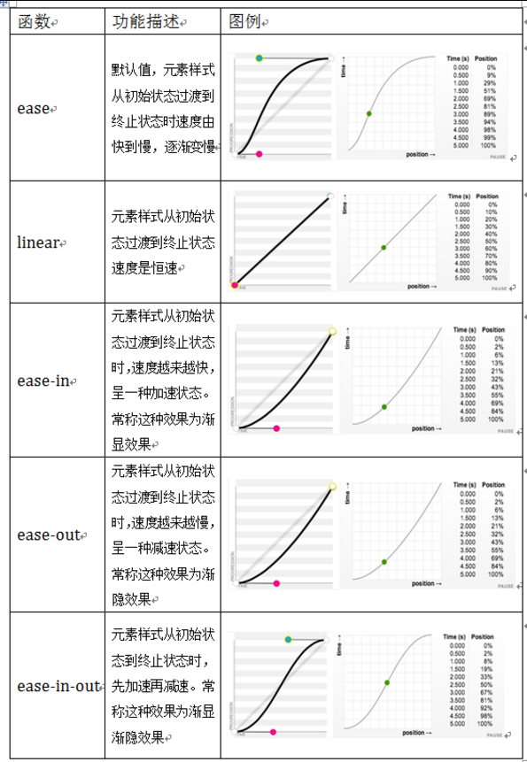

### 边框

1. border-radius

	```css
	/*border-radius是向元素添加圆角边框。
	使用方法：*/
	border-radius:10px; /* 所有角都使用半径为10px的圆角 */ 
	border-radius: 5px 4px 3px 2px; /* 四个半径值分别是左上角、右上角、右下角和左下角，顺时针 */
	```

2. box-shadow

	```css
	box-shadow是向盒子添加阴影。支持添加一个或者多个。
	语法：
	box-shadow: X轴偏移量 Y轴偏移量 [阴影模糊半径] [阴影扩展半径] [阴影颜色] [投影方式];
	1、阴影模糊半径与阴影扩展半径的区别
		阴影模糊半径：此参数可选，其值只能是为正值，如果其值为0时，表示阴影不具有模糊效果，其值越大阴影的边缘就越模糊；
		阴影扩展半径：此参数可选，其值可以是正负值，如果值为正，则整个阴影都延展扩大，反之值为负值时，则缩小；
	2、X轴偏移量和Y轴偏移量值可以设置为负数
	```
	<table>
		<tr>
			<th>值</th>
			<th>描述</th>
		</tr>
		<tr>
			<td>X轴偏移量</td>
			<td>必需。水平阴影的位置。允许负值</td>
		</tr>
		<tr>
			<td>Y轴偏移量</td>
			<td>必需。垂直阴影的位置。允许负值</td>
		</tr>
		<tr>
			<td>阴影模糊半径</td>
			<td>可选。模糊距离</td>
		</tr>
		<tr>
			<td>阴影扩展半径</td>
			<td>可选。阴影尺寸</td>
		</tr>
		<tr>
			<td>阴影颜色</td>
			<td>可选。阴影的颜色，默认为黑色</td>
		</tr>
		<tr>
			<td>投影方式</td>
			<td>可选（设置insert时为内部阴影方式，如果省略为外阴影）</td>
		</tr>
	</table>

3. 为边框应用图片 border-image

	```css
	border-image:url() 70 70 70 70 repeat
	url(): 图片路径
	70 70 70 70: 切割图片的宽度，单位为像素，可以省略px，可以使用百分比，遵循顺时针规律分别设置，可以简写为70
	repeat: 图片延伸方式，三个可选参数：round（平铺），repeat（重复），stretch（拉伸）
	```

### 颜色相关
	
1. CSS3颜色 颜色之RGBA

	```
	RGB是一种色彩标准，是由红(R)、绿(G)、蓝(B)的变化以及相互叠加来得到各式各样的颜色。
	RGBA是在RGB的基础上增加了控制alpha透明度的参数。
	语法：color：rgba(R,G,B,A)
	以上R、G、B三个参数，正整数值的取值范围为：0 - 255。百分数值的取值范围为：0.0% - 100.0%。
	超出范围的数值将被截至其最接近的取值极限。并非所有浏览器都支持使用百分数值。A为透明度参数，取值在0~1之间，不可为负值。
	```
	
2. CSS3颜色 渐变色彩

	```css
	CSS3 Gradient 分为线性渐变(linear)和径向渐变(radial)。
	 background-image:linear-gradient(to top left,red,orange,yellow,green,blue,pink,indigo,violet);
						渐变类型                       渐变方向                 表示颜色的起点和结束点，可以有两个至多个色值
	``` 
	<table>
		<tr>
			<th>角度</th>
			<th>英文</th>
			<th>作用</th>
		</tr>
		<tr>
			<td>0deg</td>
			<td>to top</td>
			<td>从下向上</td>
		</tr>
		<tr>
			<td>90deg</td>
			<td>to right</td>
			<td>从左向右</td>
		</tr>
		<tr>
			<td>180deg</td>
			<td>to bottom</td>
			<td>从上向下</td>
		</tr>
		<tr>
			<td>270deg</td>
			<td>to left</td>
			<td>从右向左</td>
		</tr>
		<tr>
			<td></td>
			<td>to top left</td>
			<td>右下角到左上角</td>
		</tr>
		<tr>
			<td></td>
			<td>to top right</td>
			<td>左下角到右上角</td>
		</tr>
	</table>
	
### 文字与字体

1.  text-overflow 与 word-wrap

	```css
	text-overflow用来设置是否使用一个省略标记（...）标示对象内文本的溢出。
	语法：text-overflow:clip | ellipsis
	clip:表示剪切
	ellipsis：表示显示省略标记
	text-overflow只是用来说明文字溢出时用什么方式显示，要实现溢出时产生省略号的效果，还须定义强制文本在一行内显示（white-space:nowrap）及溢出内容为隐藏（overflow:hidden），只有这样才能实现溢出文本显示省略号的效果
	代码如下：
	text-overflow:ellipsis; 
	overflow:hidden; 
	white-space:nowrap; 
	
	word-wrap也可以用来设置文本行为，当前行超过指定容器的边界时是否断开转行。
	语法：word-wrap:normal | break-word
	normal：表示控制连续文本换行
	break-word：表示内容将在边界内换行				
	```
	
2. 嵌入字体@font-face

	```
	@font-face能够加载服务器端的字体文件，让浏览器端可以显示用户电脑里没有安装的字体。
	语法：
	@font-face {
	    font-family : 字体名称;
	    src : 字体文件在服务器上的相对或绝对路径;
	}
	p {
	    font-size :12px;
	    font-family : "My Font";
	    /*必须项，设置@font-face中font-family同样的值*/
	}
	```
	
3. 文本阴影text-shadow

	```css
	text-shadow 可以用来设置文本的阴影效果。
	语法：text-shadow: X-Offset Y-Offset blur color;
	X-Offset：表示阴影的水平偏移距离，其值为正值时阴影向右偏移，反之向左偏移；
	Y-Offset：是指阴影的垂直偏移距离，如果其值是正值时，阴影向下偏移，反之向上偏移；
	Blur：是指阴影的模糊程度，其值不能是负值，如果值越大，阴影越模糊，反之阴影越清晰，如果不需要阴影模糊可以将Blur值设置为0；
	Color：是指阴影的颜色，其可以使用rgba色。
	```
	
### 与背景相关的样式

1.  background-origin

	```
	设置元素背景图片的原始起始位置。
	语法：
	background-origin ： border-box | padding-box | content-box;
	参数分别表示背景图片是从边框，还是内边距（默认值），或者是内容区域开始显示
	如果背景不是no-repeat，这个属性无效，它会从边框开始显示。
	```

2.  background-clip

	```
	用来将背景图片做适当的裁剪以适应实际需要。
	语法：
	background-clip ： border-box | padding-box | content-box | no-clip
	参数分别表示从边框、或内填充，或者内容区域向外裁剪背景。
	no-clip表示不裁切，和参数border-box显示同样的效果。backgroud-clip默认值为border-box。
	```

3. background-size

	```
	设置背景图片的大小，以长度值或百分比显示，还可以通过cover和contain来对图片进行伸缩。
	语法：
	background-size: auto | <长度值> | <百分比> | cover | contain
	取值说明：
	1、auto：默认值，不改变背景图片的原始高度和宽度；
	2、<长度值>：成对出现如200px 50px，将背景图片宽高依次设置为前面两个值，当设置一个值时，将其作为图片宽度值来等比缩放；
	3、<百分比>：0％~100％之间的任何值，将背景图片宽高依次设置为所在元素宽高乘以前面百分比得出的数值，当设置一个值时同上；
	4、cover：顾名思义为覆盖，即将背景图片等比缩放以填满整个容器；
	5、contain：容纳，即将背景图片等比缩放至某一边紧贴容器边缘为止。
	```

4. multiple backgrounds

	```css
	多重背景，也就是CSS2里background的属性外加origin、clip和size组成的新background的多次叠加，缩写时为用逗号隔开的每组值；
	用分解写法时，如果有多个背景图片，而其他属性只有一个（例如background-repeat只有一个），表明所有背景图片应用该属性值。
	语法缩写如下：
	background ： [background-color] | [background-image] | [background-position][/background-size] | [background-repeat] | [background-attachment] | [background-clip] | [background-origin],...
	可以把上面的缩写拆解成以下形式：
	background-image:url1,url2,...,urlN;
	background-repeat : repeat1,repeat2,...,repeatN;
	backround-position : position1,position2,...,positionN;
	background-size : size1,size2,...,sizeN;
	background-attachment : attachment1,attachment2,...,attachmentN;
	background-clip : clip1,clip2,...,clipN;
	background-origin : origin1,origin2,...,originN;
	background-color : color;
	注意：
	用逗号隔开每组 background 的缩写值；
	如果有 size 值，需要紧跟 position 并且用 "/" 隔开；
	如果有多个背景图片，而其他属性只有一个（例如 background-repeat 只有一个），表明所有背景图片应用该属性值。
	background-color 只能设置一个。
	```
	
### 选择器

1. 属性选择器

	<table>
		<tr>
			<th>属性选择器</th>
			<th>功能描述</th>
		</tr>
		<tr>
			<td>E[att^="val"]</td>
			<td>选择匹配元素E，且E元素定义了属性att，其属性以val开头的任何字符串</td>
		</tr>
		<tr>
			<td>E[att$="val"]</td>
			<td>选择匹配元素E，且E元素定义了属性att，其属性以val结尾的任何字符串</td>
		</tr>
		<tr>
			<td>E[att*="val"]</td>
			<td>选择匹配元素E，且E元素定义了属性att，其属性值任意位置包含val。</td>
		</tr>
	</table>
	
2. 结构性伪类选择器—root

	```css
	:root选择器匹配元素E所在文档的根元素。在HTML文档中，根元素始终是<html>。
	:root {
	  background:orange;
	}
	```
	
3. 结构性伪类选择器—not

	```css
	:not选择器称为否定选择器，和jQuery中的:not选择器一模一样，可以选择除某个元素之外的所有元素。
	比如给表单中除submit按钮之外的input元素添加红色边框，CSS代码可以写成：
	form {
	  width: 200px;
	  margin: 20px auto;
	}
	div {
	  margin-bottom: 20px;
	}
	input:not([type="submit"]){
	  border:1px solid red;
	}
	```
	
4. 结构性伪类选择器—empty

	```css
	:empty选择器表示的就是空。用来选择没有任何内容的元素，这里没有内容指的是一点内容都没有，哪怕是一个空格。
	比如三个段落p元素，把没有任何内容的P元素隐藏起来。可以使用“:empty”选择器来控制。
	p{
	 background: orange;
	 min-height: 30px;
	}
	p:empty {
	  display: none;
	}​
	```
	
5. 结构性伪类选择器—target

	```css
	:target选择器称为目标选择器，用来匹配文档(页面)的url的某个标志符的目标元素。
	点击链接后，段落p将添加橙色背景和白色文字。
	#brand:target p {
	  background: orange;
	  color: #fff;
	}
	1、具体来说，触发元素的URL中的标志符通常会包含一个#号，后面带有一个标志符名称，上面代码中是：#brand
	2、：target就是用来匹配id为“brand”的元素（id="brand"的元素）,上面代码中是那个div元素。
	多个url（多个target）处理：
	就像上面的例子，#brand与后面的id="brand"是对应的，当同一个页面上有很多的url的时候你可以取不同的名字，只要#号后对的名称与id=""中的名称对应就可以了。
	```
	
6. 结构性伪类选择器—first-child

	```
	“:first-child”选择器表示的是选择父元素的第一个子元素的元素E。就是选择元素中的第一个子元素，不是后代元素。
	```
	
7. 结构性伪类选择器—last-child

	```
	“:last-child”选择器与“:first-child”选择器作用类似，不同的是“:last-child”选择器选择的是元素的最后一个子元素。
	```
	
8. 结构性伪类选择器—nth-child(n)

	```
	“:nth-child(n)”选择器用来定位某个父元素的一个或多个特定的子元素。
	其中“n”是其参数，而且可以是整数值(1,2,3,4)，也可以是表达式(2n+1、-n+5)和关键词(odd、even)，但参数n的起始值始终是1，而不是0。也就是说，参数n的值为0时，选择器将选择不到任何匹配的元素。
	```
	
9. 结构性伪类选择器—nth-last-child(n)

	```
	“:nth-last-child(n)”选择器从某父元素的最后一个子元素开始计算，来选择特定的元素。
	```
	
10. first-of-type选择器

	```
	“:first-of-type”选择器类似于“:first-child”选择器，不同之处就是指定了元素的类型,其主要用来定位一个父元素下的某个类型的第一个子元素。
	/*要改变第一个段落的背景为橙色*/
	.wrapper > p:first-of-type {
	  background: orange;
	}
	```
	
11. nth-of-type(n)选择器

	```
	“:nth-of-type(n)”选择器只计算父元素中指定的某种类型的子元素。
	某个元素中的子元素不单单是同一种类型的子元素时，使用“:nth-of-type(n)”选择器来定位于父元素中某种类型的子元素是非常方便和有用的。
	在“:nth-of-type(n)”选择器中的“n”和“:nth-child(n)”选择器中的“n”参数也一样，可以是具体的整数，也可以是表达式，还可以是关键词。
	```

12.  last-of-type选择器

	```
	“:last-of-type”选择器和“:first-of-type”选择器功能是一样的，不同的是他选择是父元素下的某个类型的最后一个子元素。
	```

13.  nth-last-of-type(n)选择器

	```
	“:nth-last-of-type(n)”选择器和“:nth-of-type(n)”选择器是一样的，选择父元素中指定的某种子元素类型，
	但它的起始方向是从最后一个子元素开始，而且它的使用方法类似于上节中介绍的“:nth-last-child(n)”选择器一样。
	```
	
14.  only-child选择器

	```
	“:only-child”选择器选择的是父元素中只有一个子元素，而且只有唯一的一个子元素。匹配的元素的父元素中仅有一个子元素，而且是一个唯一的子元素。
	```
	
15. only-of-type选择器

	```
	“:only-of-type”选择器用来选择一个元素是它的父元素的唯一一个相同类型的子元素。
	“:only-of-type”是表示一个元素他有很多个子元素，而其中只有一种类型的子元素是唯一的，使用“:only-of-type”选择器就可以选中这个元素中的唯一一个类型子元素。
	```
	
16. :enabled选择器

	```
	在Web的表单中，有些表单元素有可用（“:enabled”）和不可用（“:disabled”）状态，通过伪选择器“:enabled”对这些表单元素设置样式。
	```
	
17.  :disabled选择器

	```
	“:disabled”选择器刚好与“:enabled”选择器相反，用来选择不可用表单元素。
	要正常使用“:disabled”选择器，需要在表单元素的HTML中设置“disabled”属性。
	```

18. :checked选择器

	```
	在表单元素中，单选按钮和复选按钮都具有选中和未选中状态。通过状态选择器“:checked”配合其他标签实现自定义样式。而“:checked”表示的是选中状态。
	```
	
19. ::selection选择器

	```
	“::selection”伪元素是用来匹配突出显示的文本(用鼠标选择文本时的文本)。
	```
	
20.  :read-only选择器

	```
	“:read-only”伪类选择器用来指定处于只读状态元素的样式。简单点理解就是，元素中设置了“readonly=’readonly’”
	```
	
21.  :read-write选择器

	```
	“:read-write”选择器刚好与“:read-only”选择器相反，主要用来指定当元素处于非只读状态时的样式。
	```
	
22.  ::before和::after

	```
	::before和::after这两个主要用来给元素的前面或后面插入内容，这两个常和"content"配合使用，使用的场景最多的就是清除浮动。
	```
	
### CSS3中的变形与动画

1. 旋转 rotate()

	```
	旋转rotate()函数通过指定的角度参数使元素相对原点进行旋转。
	它主要在二维空间内进行操作，设置一个角度值，用来指定旋转的幅度。
	如果这个值为正值，元素相对原点中心顺时针旋转；如果这个值为负值，元素相对原点中心逆时针旋转。
	transform: rotate(xxxdeg);
	```
	
2. 扭曲 skew()

	```
	扭曲skew()函数能够让元素倾斜显示。它可以将一个对象以其中心位置围绕着X轴和Y轴按照一定的角度倾斜。
	与rotate()函数的旋转不同，rotate()函数只是旋转，而不会改变元素的形状。skew()函数不会旋转，而只会改变元素的形状。
	Skew()具有三种情况：
	1、skew(x,y)使元素在水平和垂直方向同时扭曲（X轴和Y轴同时按一定的角度值进行扭曲变形）；
	第一个参数对应X轴，第二个参数对应Y轴。如果第二个参数未提供，则值为0，也就是Y轴方向上无斜切。
	2、skewX(x)仅使元素在水平方向扭曲变形（X轴扭曲变形）；
	3、skewY(y)仅使元素在垂直方向扭曲变形（Y轴扭曲变形）
	```
	
3. 缩放 scale()

	```
	缩放 scale()函数 让元素根据中心原点对对象进行缩放。
	缩放 scale 具有三种情况：
	1、 scale(X,Y)使元素水平方向和垂直方向同时缩放（也就是X轴和Y轴同时缩放）,Y是一个可选参数，如果没有设置Y值，则表示X，Y两个方向的缩放倍数是一样的。
	2、scaleX(x)元素仅水平方向缩放（X轴缩放）
	3、scaleY(y)元素仅垂直方向缩放（Y轴缩放）
	```
	
4. 位移 translate()

	```
	translate()函数可以将元素向指定的方向移动，类似于position中的relative。把元素从原来的位置移动，而不影响在X、Y轴上的任何Web组件。
	translate我们分为三种情况：
	1、translate(x,y)水平方向和垂直方向同时移动（也就是X轴和Y轴同时移动）
	2、translateX(x)仅水平方向移动（X轴移动）
	3、translateY(Y)仅垂直方向移动（Y轴移动）
	```
	
5. 矩阵 matrix()

	```
	matrix() 是一个含六个值的(a,b,c,d,e,f)变换矩阵，用来指定一个2D变换，相当于直接应用一个[a b c d e f]变换矩阵。
	就是基于水平方向（X轴）和垂直方向（Y轴）重新定位元素
	通过matrix()函数实现translate(100px,100px)的效果
	transform: matrix(1,0,0,1,100,100);
	```

6. 原点 transform-origin

	```
	任何一个元素都有一个中心点，默认情况之下，其中心点是居于元素X轴和Y轴的50%处。
	我们可以通过transform-origin来对元素进行原点位置改变，使元素原点不在元素的中心位置，以达到需要的原点位置。
	transform-origin取值和元素设置背景中的background-position取值类似，如下表所示：
	```
	<table>
		<tr>
			<th>关键词</th>
			<th>百分比</th>
		</tr>
		<tr>
			<td>top = top center = center top</td>
			<td>50% 0</td>
		</tr>
		<tr>
			<td>right = right center = center right</td>
			<td>100% 或 (100% 50%)</td>
		</tr>
		<tr>
			<td>bottom  = bottom center = center bottom</td>
			<td>50% 100%</td>
		</tr>
		<tr>
			<td>left = left center = center left</td>
			<td>0 或（0 50%）</td>
		</tr>
		<tr>
			<td>center = center center</td>
			<td>50%或（50% 50%）</td>
		</tr>
		<tr>
			<td>top left = left top</td>
			<td>0 0</td>
		</tr>
		<tr>
			<td>right top = top right</td>
			<td>100% 0</td>
		</tr>
		<tr>
			<td>bottom right = right bottom</td>
			<td>100% 100%</td>
		</tr>
		<tr>
			<td>bottom left = left bottom</td>
			<td>0 100%</td>
		</tr>
	</table>
	
7. 过渡属性 transition-property

	```css
	transition，它可以通过一些简单的CSS事件来触发元素的外观变化，让效果显得更加细腻。
	通过鼠标的单击、获得焦点，被点击或对元素任何改变中触发，并平滑地以动画效果改变CSS的属性值。
	
	在CSS中创建简单的过渡效果可以从以下几个步骤来实现：
	第一，在默认样式中声明元素的初始状态样式；
	第二，声明过渡元素最终状态样式，比如悬浮状态；
	第三，在默认样式中通过添加过渡函数，添加一些不同的样式。
	
	CSS3的过度transition属性是一个复合属性，主要包括以下几个子属性：
	transition-property:指定过渡或动态模拟的CSS属性
	transition-duration:指定完成过渡所需的时间
	transition-timing-function:指定过渡函数
	transition-delay:指定开始出现的延迟时间
	
	transition: background-color .5s ease .1s;
	```
	
8. 过渡所需时间 transition-duration

	```
	transition-duration属性主要用来设置一个属性过渡到另一个属性所需的时间，也就是从旧属性过渡到新属性花费的时间长度，俗称持续时间。
	```
	
9. 过渡函数 transition-timing-function

	```
	transition-timing-function属性指的是过渡的“缓动函数”。主要用来指定浏览器的过渡速度，以及过渡期间的操作进展情况
	其中要包括以下几种函数：
	```
	
	
10. 过渡延迟时间 transition-delay

	```
	transition-delay属性和transition-duration属性极其类似，不同的是transition-duration是用来设置过渡动画的持续时间，而transition-delay主要用来指定一个动画开始执行的时间，也就是说当改变元素属性值后多长时间开始执行。
	改变两个或者多个css属性的transition效果时，只要把几个transition的声明串在一起，用逗号（“，”）隔开，然后各自可以有各自不同的延续时间和其时间的速率变换方式。但需要值得注意的一点：第一个时间的值为 transition-duration，第二个为transition-delay。
	eg:a{ transition: background 0.8s ease-in 0.3,color 0.6s ease-out 0.3;}
	```