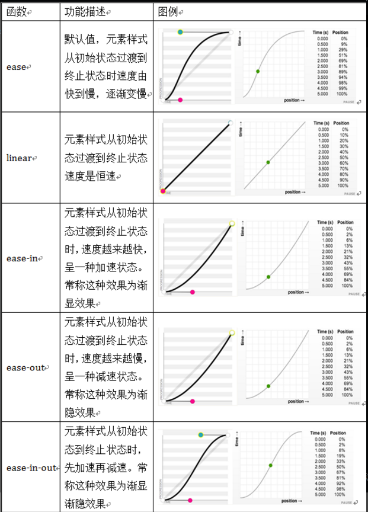
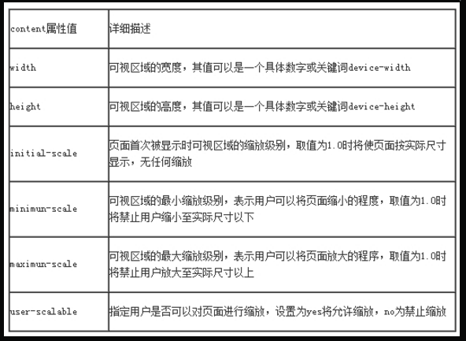

### 边框

1. border-radius

	```css
	/*border-radius是向元素添加圆角边框。
	使用方法：*/
	border-radius:10px; /* 所有角都使用半径为10px的圆角 */ 
	border-radius: 5px 4px 3px 2px; /* 四个半径值分别是左上角、右上角、右下角和左下角，顺时针 */
	```

2. box-shadow

	```css
	box-shadow是向盒子添加阴影。支持添加一个或者多个。
	语法：
	box-shadow: X轴偏移量 Y轴偏移量 [阴影模糊半径] [阴影扩展半径] [阴影颜色] [投影方式];
	1、阴影模糊半径与阴影扩展半径的区别
		阴影模糊半径：此参数可选，其值只能是为正值，如果其值为0时，表示阴影不具有模糊效果，其值越大阴影的边缘就越模糊；
		阴影扩展半径：此参数可选，其值可以是正负值，如果值为正，则整个阴影都延展扩大，反之值为负值时，则缩小；
	2、X轴偏移量和Y轴偏移量值可以设置为负数
	```
	<table>
		<tr>
			<th>值</th>
			<th>描述</th>
		</tr>
		<tr>
			<td>X轴偏移量</td>
			<td>必需。水平阴影的位置。允许负值</td>
		</tr>
		<tr>
			<td>Y轴偏移量</td>
			<td>必需。垂直阴影的位置。允许负值</td>
		</tr>
		<tr>
			<td>阴影模糊半径</td>
			<td>可选。模糊距离</td>
		</tr>
		<tr>
			<td>阴影扩展半径</td>
			<td>可选。阴影尺寸</td>
		</tr>
		<tr>
			<td>阴影颜色</td>
			<td>可选。阴影的颜色，默认为黑色</td>
		</tr>
		<tr>
			<td>投影方式</td>
			<td>可选（设置insert时为内部阴影方式，如果省略为外阴影）</td>
		</tr>
	</table>

3. 为边框应用图片 border-image

	```css
	border-image:url() 70 70 70 70 repeat
	url(): 图片路径
	70 70 70 70: 切割图片的宽度，单位为像素，可以省略px，可以使用百分比，遵循顺时针规律分别设置，可以简写为70
	repeat: 图片延伸方式，三个可选参数：round（平铺），repeat（重复），stretch（拉伸）
	```

### 颜色相关
	
1. CSS3颜色 颜色之RGBA

	```
	RGB是一种色彩标准，是由红(R)、绿(G)、蓝(B)的变化以及相互叠加来得到各式各样的颜色。
	RGBA是在RGB的基础上增加了控制alpha透明度的参数。
	语法：color：rgba(R,G,B,A)
	以上R、G、B三个参数，正整数值的取值范围为：0 - 255。百分数值的取值范围为：0.0% - 100.0%。
	超出范围的数值将被截至其最接近的取值极限。并非所有浏览器都支持使用百分数值。A为透明度参数，取值在0~1之间，不可为负值。
	```
	
2. CSS3颜色 渐变色彩

	```css
	CSS3 Gradient 分为线性渐变(linear)和径向渐变(radial)。
	 background-image:linear-gradient(to top left,red,orange,yellow,green,blue,pink,indigo,violet);
			   渐变类型          渐变方向                 表示颜色的起点和结束点，可以有两个至多个色值
	``` 
	<table>
		<tr>
			<th>角度</th>
			<th>英文</th>
			<th>作用</th>
		</tr>
		<tr>
			<td>0deg</td>
			<td>to top</td>
			<td>从下向上</td>
		</tr>
		<tr>
			<td>90deg</td>
			<td>to right</td>
			<td>从左向右</td>
		</tr>
		<tr>
			<td>180deg</td>
			<td>to bottom</td>
			<td>从上向下</td>
		</tr>
		<tr>
			<td>270deg</td>
			<td>to left</td>
			<td>从右向左</td>
		</tr>
		<tr>
			<td></td>
			<td>to top left</td>
			<td>右下角到左上角</td>
		</tr>
		<tr>
			<td></td>
			<td>to top right</td>
			<td>左下角到右上角</td>
		</tr>
	</table>
	
### 文字与字体

1.  text-overflow 与 word-wrap

	```css
	text-overflow用来设置是否使用一个省略标记（...）标示对象内文本的溢出。
	语法：text-overflow:clip | ellipsis
	clip:表示剪切
	ellipsis：表示显示省略标记
	text-overflow只是用来说明文字溢出时用什么方式显示，要实现溢出时产生省略号的效果，还须定义强制文本在一行内显示（white-space:nowrap）及溢出内容为隐藏（overflow:hidden），只有这样才能实现溢出文本显示省略号的效果
	代码如下：
	text-overflow:ellipsis; 
	overflow:hidden; 
	white-space:nowrap; 
	
	word-wrap也可以用来设置文本行为，当前行超过指定容器的边界时是否断开转行。
	语法：word-wrap:normal | break-word
	normal：表示控制连续文本换行
	break-word：表示内容将在边界内换行				
	```
	
2. 嵌入字体@font-face

	```
	@font-face能够加载服务器端的字体文件，让浏览器端可以显示用户电脑里没有安装的字体。
	语法：
	@font-face {
	    font-family : 字体名称;
	    src : 字体文件在服务器上的相对或绝对路径;
	}
	p {
	    font-size :12px;
	    font-family : "My Font";
	    /*必须项，设置@font-face中font-family同样的值*/
	}
	```
	
3. 文本阴影text-shadow

	```css
	text-shadow 可以用来设置文本的阴影效果。
	语法：text-shadow: X-Offset Y-Offset blur color;
	X-Offset：表示阴影的水平偏移距离，其值为正值时阴影向右偏移，反之向左偏移；
	Y-Offset：是指阴影的垂直偏移距离，如果其值是正值时，阴影向下偏移，反之向上偏移；
	Blur：是指阴影的模糊程度，其值不能是负值，如果值越大，阴影越模糊，反之阴影越清晰，如果不需要阴影模糊可以将Blur值设置为0；
	Color：是指阴影的颜色，其可以使用rgba色。
	```
	
### 与背景相关的样式

1.  background-origin

	```
	设置元素背景图片的原始起始位置。
	语法：
	background-origin ： border-box | padding-box | content-box;
	参数分别表示背景图片是从边框，还是内边距（默认值），或者是内容区域开始显示
	如果背景不是no-repeat，这个属性无效，它会从边框开始显示。
	```

2.  background-clip

	```
	用来将背景图片做适当的裁剪以适应实际需要。
	语法：
	background-clip ： border-box | padding-box | content-box | no-clip
	参数分别表示从边框、或内填充，或者内容区域向外裁剪背景。
	no-clip表示不裁切，和参数border-box显示同样的效果。backgroud-clip默认值为border-box。
	```

3. background-size

	```
	设置背景图片的大小，以长度值或百分比显示，还可以通过cover和contain来对图片进行伸缩。
	语法：
	background-size: auto | <长度值> | <百分比> | cover | contain
	取值说明：
	1、auto：默认值，不改变背景图片的原始高度和宽度；
	2、<长度值>：成对出现如200px 50px，将背景图片宽高依次设置为前面两个值，当设置一个值时，将其作为图片宽度值来等比缩放；
	3、<百分比>：0％~100％之间的任何值，将背景图片宽高依次设置为所在元素宽高乘以前面百分比得出的数值，当设置一个值时同上；
	4、cover：顾名思义为覆盖，即将背景图片等比缩放以填满整个容器；
	5、contain：容纳，即将背景图片等比缩放至某一边紧贴容器边缘为止。
	```

4. multiple backgrounds

	```css
	多重背景，也就是CSS2里background的属性外加origin、clip和size组成的新background的多次叠加，缩写时为用逗号隔开的每组值；
	用分解写法时，如果有多个背景图片，而其他属性只有一个（例如background-repeat只有一个），表明所有背景图片应用该属性值。
	语法缩写如下：
	background ： [background-color] | [background-image] | [background-position][/background-size] | [background-repeat] | [background-attachment] | [background-clip] | [background-origin],...
	可以把上面的缩写拆解成以下形式：
	background-image:url1,url2,...,urlN;
	background-repeat : repeat1,repeat2,...,repeatN;
	backround-position : position1,position2,...,positionN;
	background-size : size1,size2,...,sizeN;
	background-attachment : attachment1,attachment2,...,attachmentN;
	background-clip : clip1,clip2,...,clipN;
	background-origin : origin1,origin2,...,originN;
	background-color : color;
	注意：
	用逗号隔开每组 background 的缩写值；
	如果有 size 值，需要紧跟 position 并且用 "/" 隔开；
	如果有多个背景图片，而其他属性只有一个（例如 background-repeat 只有一个），表明所有背景图片应用该属性值。
	background-color 只能设置一个。
	```
	
### 选择器

1. 属性选择器

	<table>
		<tr>
			<th>属性选择器</th>
			<th>功能描述</th>
		</tr>
		<tr>
			<td>E[att^="val"]</td>
			<td>选择匹配元素E，且E元素定义了属性att，其属性以val开头的任何字符串</td>
		</tr>
		<tr>
			<td>E[att$="val"]</td>
			<td>选择匹配元素E，且E元素定义了属性att，其属性以val结尾的任何字符串</td>
		</tr>
		<tr>
			<td>E[att*="val"]</td>
			<td>选择匹配元素E，且E元素定义了属性att，其属性值任意位置包含val。</td>
		</tr>
	</table>
	
2. 结构性伪类选择器—root

	```css
	:root选择器匹配元素E所在文档的根元素。在HTML文档中，根元素始终是<html>。
	:root {
	  background:orange;
	}
	```
	
3. 结构性伪类选择器—not

	```css
	:not选择器称为否定选择器，和jQuery中的:not选择器一模一样，可以选择除某个元素之外的所有元素。
	比如给表单中除submit按钮之外的input元素添加红色边框，CSS代码可以写成：
	form {
	  width: 200px;
	  margin: 20px auto;
	}
	div {
	  margin-bottom: 20px;
	}
	input:not([type="submit"]){
	  border:1px solid red;
	}
	```
	
4. 结构性伪类选择器—empty

	```css
	:empty选择器表示的就是空。用来选择没有任何内容的元素，这里没有内容指的是一点内容都没有，哪怕是一个空格。
	比如三个段落p元素，把没有任何内容的P元素隐藏起来。可以使用“:empty”选择器来控制。
	p{
	 background: orange;
	 min-height: 30px;
	}
	p:empty {
	  display: none;
	}​
	```
	
5. 结构性伪类选择器—target

	```css
	:target选择器称为目标选择器，用来匹配文档(页面)的url的某个标志符的目标元素。
	点击链接后，段落p将添加橙色背景和白色文字。
	#brand:target p {
	  background: orange;
	  color: #fff;
	}
	1、具体来说，触发元素的URL中的标志符通常会包含一个#号，后面带有一个标志符名称，上面代码中是：#brand
	2、：target就是用来匹配id为“brand”的元素（id="brand"的元素）,上面代码中是那个div元素。
	多个url（多个target）处理：
	就像上面的例子，#brand与后面的id="brand"是对应的，当同一个页面上有很多的url的时候你可以取不同的名字，只要#号后对的名称与id=""中的名称对应就可以了。
	```
	
6. 结构性伪类选择器—first-child

	```
	“:first-child”选择器表示的是选择父元素的第一个子元素的元素E。就是选择元素中的第一个子元素，不是后代元素。
	```
	
7. 结构性伪类选择器—last-child

	```
	“:last-child”选择器与“:first-child”选择器作用类似，不同的是“:last-child”选择器选择的是元素的最后一个子元素。
	```
	
8. 结构性伪类选择器—nth-child(n)

	```
	“:nth-child(n)”选择器用来定位某个父元素的一个或多个特定的子元素。
	其中“n”是其参数，而且可以是整数值(1,2,3,4)，也可以是表达式(2n+1、-n+5)和关键词(odd、even)，但参数n的起始值始终是1，而不是0。也就是说，参数n的值为0时，选择器将选择不到任何匹配的元素。
	```
	
9. 结构性伪类选择器—nth-last-child(n)

	```
	“:nth-last-child(n)”选择器从某父元素的最后一个子元素开始计算，来选择特定的元素。
	```
	
10. first-of-type选择器

	```
	“:first-of-type”选择器类似于“:first-child”选择器，不同之处就是指定了元素的类型,其主要用来定位一个父元素下的某个类型的第一个子元素。
	/*要改变第一个段落的背景为橙色*/
	.wrapper > p:first-of-type {
	  background: orange;
	}
	```
	
11. nth-of-type(n)选择器

	```
	“:nth-of-type(n)”选择器只计算父元素中指定的某种类型的子元素。
	某个元素中的子元素不单单是同一种类型的子元素时，使用“:nth-of-type(n)”选择器来定位于父元素中某种类型的子元素是非常方便和有用的。
	在“:nth-of-type(n)”选择器中的“n”和“:nth-child(n)”选择器中的“n”参数也一样，可以是具体的整数，也可以是表达式，还可以是关键词。
	```

12.  last-of-type选择器

	```
	“:last-of-type”选择器和“:first-of-type”选择器功能是一样的，不同的是他选择是父元素下的某个类型的最后一个子元素。
	```

13.  nth-last-of-type(n)选择器

	```
	“:nth-last-of-type(n)”选择器和“:nth-of-type(n)”选择器是一样的，选择父元素中指定的某种子元素类型，
	但它的起始方向是从最后一个子元素开始，而且它的使用方法类似于上节中介绍的“:nth-last-child(n)”选择器一样。
	```
	
14.  only-child选择器

	```
	“:only-child”选择器选择的是父元素中只有一个子元素，而且只有唯一的一个子元素。匹配的元素的父元素中仅有一个子元素，而且是一个唯一的子元素。
	```
	
15. only-of-type选择器

	```
	“:only-of-type”选择器用来选择一个元素是它的父元素的唯一一个相同类型的子元素。
	“:only-of-type”是表示一个元素他有很多个子元素，而其中只有一种类型的子元素是唯一的，使用“:only-of-type”选择器就可以选中这个元素中的唯一一个类型子元素。
	```
	
16. :enabled选择器

	```
	在Web的表单中，有些表单元素有可用（“:enabled”）和不可用（“:disabled”）状态，通过伪选择器“:enabled”对这些表单元素设置样式。
	```
	
17.  :disabled选择器

	```
	“:disabled”选择器刚好与“:enabled”选择器相反，用来选择不可用表单元素。
	要正常使用“:disabled”选择器，需要在表单元素的HTML中设置“disabled”属性。
	```

18. :checked选择器

	```
	在表单元素中，单选按钮和复选按钮都具有选中和未选中状态。通过状态选择器“:checked”配合其他标签实现自定义样式。而“:checked”表示的是选中状态。
	```
	
19. ::selection选择器

	```
	“::selection”伪元素是用来匹配突出显示的文本(用鼠标选择文本时的文本)。
	```
	
20.  :read-only选择器

	```
	“:read-only”伪类选择器用来指定处于只读状态元素的样式。简单点理解就是，元素中设置了“readonly=’readonly’”
	```
	
21.  :read-write选择器

	```
	“:read-write”选择器刚好与“:read-only”选择器相反，主要用来指定当元素处于非只读状态时的样式。
	```
	
22.  ::before和::after

	```
	::before和::after这两个主要用来给元素的前面或后面插入内容，这两个常和"content"配合使用，使用的场景最多的就是清除浮动。
	```
	
### CSS3中的变形与动画

1. 旋转 rotate()

	```
	旋转rotate()函数通过指定的角度参数使元素相对原点进行旋转。
	它主要在二维空间内进行操作，设置一个角度值，用来指定旋转的幅度。
	如果这个值为正值，元素相对原点中心顺时针旋转；如果这个值为负值，元素相对原点中心逆时针旋转。
	transform: rotate(xxxdeg);
	```
	
2. 扭曲 skew()

	```
	扭曲skew()函数能够让元素倾斜显示。它可以将一个对象以其中心位置围绕着X轴和Y轴按照一定的角度倾斜。
	与rotate()函数的旋转不同，rotate()函数只是旋转，而不会改变元素的形状。skew()函数不会旋转，而只会改变元素的形状。
	Skew()具有三种情况：
	1、skew(x,y)使元素在水平和垂直方向同时扭曲（X轴和Y轴同时按一定的角度值进行扭曲变形）；
	第一个参数对应X轴，第二个参数对应Y轴。如果第二个参数未提供，则值为0，也就是Y轴方向上无斜切。
	2、skewX(x)仅使元素在水平方向扭曲变形（X轴扭曲变形）；
	3、skewY(y)仅使元素在垂直方向扭曲变形（Y轴扭曲变形）
	```
	
3. 缩放 scale()

	```
	缩放 scale()函数 让元素根据中心原点对对象进行缩放。
	缩放 scale 具有三种情况：
	1、 scale(X,Y)使元素水平方向和垂直方向同时缩放（也就是X轴和Y轴同时缩放）,Y是一个可选参数，如果没有设置Y值，则表示X，Y两个方向的缩放倍数是一样的。
	2、scaleX(x)元素仅水平方向缩放（X轴缩放）
	3、scaleY(y)元素仅垂直方向缩放（Y轴缩放）
	```
	
4. 位移 translate()

	```
	translate()函数可以将元素向指定的方向移动，类似于position中的relative。把元素从原来的位置移动，而不影响在X、Y轴上的任何Web组件。
	translate我们分为三种情况：
	1、translate(x,y)水平方向和垂直方向同时移动（也就是X轴和Y轴同时移动）
	2、translateX(x)仅水平方向移动（X轴移动）
	3、translateY(Y)仅垂直方向移动（Y轴移动）
	```
	
5. 矩阵 matrix()

	```
	matrix() 是一个含六个值的(a,b,c,d,e,f)变换矩阵，用来指定一个2D变换，相当于直接应用一个[a b c d e f]变换矩阵。
	就是基于水平方向（X轴）和垂直方向（Y轴）重新定位元素
	通过matrix()函数实现translate(100px,100px)的效果
	transform: matrix(1,0,0,1,100,100);
	```

6. 原点 transform-origin

	```
	任何一个元素都有一个中心点，默认情况之下，其中心点是居于元素X轴和Y轴的50%处。
	我们可以通过transform-origin来对元素进行原点位置改变，使元素原点不在元素的中心位置，以达到需要的原点位置。
	transform-origin取值和元素设置背景中的background-position取值类似，如下表所示：
	```
	<table>
		<tr>
			<th>关键词</th>
			<th>百分比</th>
		</tr>
		<tr>
			<td>top = top center = center top</td>
			<td>50% 0</td>
		</tr>
		<tr>
			<td>right = right center = center right</td>
			<td>100% 或 (100% 50%)</td>
		</tr>
		<tr>
			<td>bottom  = bottom center = center bottom</td>
			<td>50% 100%</td>
		</tr>
		<tr>
			<td>left = left center = center left</td>
			<td>0 或（0 50%）</td>
		</tr>
		<tr>
			<td>center = center center</td>
			<td>50%或（50% 50%）</td>
		</tr>
		<tr>
			<td>top left = left top</td>
			<td>0 0</td>
		</tr>
		<tr>
			<td>right top = top right</td>
			<td>100% 0</td>
		</tr>
		<tr>
			<td>bottom right = right bottom</td>
			<td>100% 100%</td>
		</tr>
		<tr>
			<td>bottom left = left bottom</td>
			<td>0 100%</td>
		</tr>
	</table>
	
7. 过渡属性 transition-property

	```css
	transition，它可以通过一些简单的CSS事件来触发元素的外观变化，让效果显得更加细腻。
	通过鼠标的单击、获得焦点，被点击或对元素任何改变中触发，并平滑地以动画效果改变CSS的属性值。
	
	在CSS中创建简单的过渡效果可以从以下几个步骤来实现：
	第一，在默认样式中声明元素的初始状态样式；
	第二，声明过渡元素最终状态样式，比如悬浮状态；
	第三，在默认样式中通过添加过渡函数，添加一些不同的样式。
	
	CSS3的过度transition属性是一个复合属性，主要包括以下几个子属性：
	transition-property:指定过渡或动态模拟的CSS属性
	transition-duration:指定完成过渡所需的时间
	transition-timing-function:指定过渡函数
	transition-delay:指定开始出现的延迟时间
	
	transition: background-color .5s ease .1s;
	```
	
8. 过渡所需时间 transition-duration

	```
	transition-duration属性主要用来设置一个属性过渡到另一个属性所需的时间，也就是从旧属性过渡到新属性花费的时间长度，俗称持续时间。
	```
	
9. 过渡函数 transition-timing-function

	```
	transition-timing-function属性指的是过渡的“缓动函数”。主要用来指定浏览器的过渡速度，以及过渡期间的操作进展情况
	其中要包括以下几种函数：
	```
	
	
10. 过渡延迟时间 transition-delay

	```
	transition-delay属性和transition-duration属性极其类似，不同的是transition-duration是用来设置过渡动画的持续时间，而transition-delay主要用来指定一个动画开始执行的时间，也就是说当改变元素属性值后多长时间开始执行。
	改变两个或者多个css属性的transition效果时，只要把几个transition的声明串在一起，用逗号（“，”）隔开，然后各自可以有各自不同的延续时间和其时间的速率变换方式。但需要值得注意的一点：第一个时间的值为 transition-duration，第二个为transition-delay。
	eg:a{ transition: background 0.8s ease-in 0.3,color 0.6s ease-out 0.3;}
	```

11. Keyframes介绍

	```css
	/*
	Keyframes被称为关键帧，其类似于Flash中的关键帧。
	在CSS3中其主要以“@keyframes”开头，后面紧跟着是动画名称加上一对花括号“{…}”，括号中就是一些不同时间段样式规则。
	*/
	@keyframes changecolor{
	  0%{
	   background: red;
	  }
	  100%{
	    background: green;
	  }
	}
	/*
	 * 在一个“@keyframes”中的样式规则可以由多个百分比构成的，如在“0%”到“100%”之间创建更多个百分比，分别给每个百分比中给需要有动画效果的元素加上不同的样式，从而达到一种在不断变化的效果。
	 * 在@keyframes中定义动画名称时，其中0%和100%还可以使用关键词from和to来代表，其中0%对应的是from，100%对应的是to。
	 * Chrome 和 Safari 需要前缀 -webkit-；Foxfire 需要前缀 -moz-。
	 */
	```
	
12. CSS3中调用动画

	```
	animation-name属性主要是用来调用 @keyframes 定义好的动画。
	animation-name 调用的动画名需要和“@keyframes”定义的动画名称完全一致（区分大小写），如果不一致将不具有任何动画效果。
	语法：animation-name: none | IDENT[,none|DENT]*;
	1、IDENT是由 @keyframes 创建的动画名，上面已经讲过了（animation-name 调用的动画名需要和“@keyframes”定义的动画名称完全一致）；
	2、none为默认值，当值为 none 时，将没有任何动画效果,这可以用于覆盖任何动画。
	```
	
13. CSS3中设置动画播放时间

	```
	animation-duration主要用来设置CSS3动画播放时间，其使用方法和transition-duration类似，是用来指定元素播放动画所持续的时间长，也就是完成从0%到100%一次动画所需时间。单位：S秒
	语法规则:animation-duration: <time>[,<time>]*
	取值<time>为数值，单位为秒，其默认值为“0”，这意味着动画周期为“0”，也就是没有动画效果（如果值为负值会被视为“0”）。
	```
	
14. CSS3中设置动画播放方式

	```
	animation-timing-function属性主要用来设置动画播放方式。主要让元素根据时间的推进来改变属性值的变换速率，简单点说就是动画的播放方式。
	语法规则：animation-timing-function:ease | linear | ease-in | ease-out | ease-in-out | cubic-bezier(<number>, <number>, <number>, <number>) [, ease | linear | ease-in | ease-out | ease-in-out | cubic-bezier(<number>, <number>, <number>, <number>)]*
	它和transition中的transition-timing-function一样，具有以下几种变换方式：ease,ease-in,ease-in-out,ease-out,linear和cubic-bezier。对应功如下：
	```
	
	
15. CSS3中设置动画开始播放的时间

	```
	animation-delay属性用来定义动画开始播放的时间，用来触发动画播放的时间点。和transition-delay属性一样，用于定义在浏览器开始执行动画之前等待的时间。
	语法规则：animation-delay:<time>[,<time>]*
	```
	
16. CSS3中设置动画播放次数

	```
	animation-iteration-count属性主要用来定义动画的播放次数。
	语法规则：animation-iteration-count: infinite | <number> [, infinite | <number>]*
	1、其值通常为整数，但也可以使用带有小数的数字，其默认值为1，这意味着动画将从开始到结束只播放一次。
	2、如果取值为infinite，动画将会无限次的播放。
	```
	
17. CSS3中设置动画播放方向

	```
	animation-direction属性主要用来设置动画播放方向，其语法规则如下：
	animation-direction:normal | alternate [, normal | alternate]*
	其主要有两个值：normal、alternate
	1、normal是默认值，如果设置为normal时，动画的每次循环都是向前播放；
	2、另一个值是alternate，他的作用是，动画播放在第偶数次向前播放，第奇数次向反方向播放。
	```
	
18. CSS3中设置动画的播放状态

	```
	animation-play-state属性主要用来控制元素动画的播放状态。
	参数：主要有两个值：running和paused。
	其中running是其默认值，主要作用就是类似于音乐播放器一样，可以通过paused将正在播放的动画停下来，也可以通过running将暂停的动画重新播放，
	这里的重新播放不一定是从元素动画的开始播放，而是从暂停的那个位置开始播放。另外如果暂停了动画的播放，元素的样式将回到最原始设置状态。
	```
	
19. CSS3中设置动画时间外属性

	```
	animation-fill-mode属性定义在动画开始之前和结束之后发生的操作。
	主要具有四个属性值：none、forwards、backwords和both。
	其四个属性值对应效果如下：
	```
	
	|属性值|效果|
	|----|----|
	|none|默认值，表示动画将按预期进行和结束，在动画完成其最后一帧时，动画会反转到初始帧处|
	|forwards|表示动画在结束后继续应用最后的关键帧的位置|
	|backwards|会在向元素应用动画样式时迅速应用动画的初始帧|
	|both|元素动画同时具有forwards和backwards效果|

### 布局样式相关

1. 多列布局——Columns

	```
	语法：columns：`<column-width>` || `<column-count>`
	参数说明:
	<column-width>主要用来定义多列中每列的宽度
	<column-count>主要用来定义多列中的列数
	```
	
2. 多列布局——column-width

	```
	column-width的使用和CSS中的width属性一样，不过不同的是，column-width属性在定义元素列宽的时候，既可以单独使用，也可以和多列属性中其他属性配合使用。
	基本语法：column-width: auto | <length>
	属性值说明：
	auto：column-width设置值为auto或者没有显式的设置值时，元素多列的列宽将由其他属性来决定，比如前面的示例就是由列数column-count来决定。
	<length>:使用固定值来设置元素列的宽度，其主要是由数值和长度单位组成，不过其值只能是正值，不能为负值。
	```
	
3. 多列布局——column-count

	```
	column-count属性主要用来给元素指定想要的列数和允许的最大列数。
	语法规则：column-count：auto | <integer>
	属性值说明：
	auto：此值为column-count的默认值，表示元素只有一列，其主要依靠浏览器计算自动设置。
	<integer>：此值为正整数值，主要用来定义元素的列数，取值为大于0的整数，负值无效。
	```
	
4. 列间距column-gap

	```
	column-gap主要用来设置列与列之间的间距
	语法规则:column-gap: normal || <length>
	属性值说明:
	normal :默认值，默值为1em（如果你的字号是px，其默认值为你的font-size值）。
	<length>:此值用来设置列与列之间的距离，其可以使用px,em单位的任何整数值，但不能是负值。
	```
	
5. 列表边框column-rule

	```
	column-rule主要是用来定义列与列之间的边框宽度、边框样式和边框颜色。
	类似于常用的border属性,但column-rule是不占用任何空间位置的，在列与列之间改变其宽度不会改变任何列的位置。
	语法规则：column-rule:<column-rule-width>|<column-rule-style>|<column-rule-color>
	属性值说明：
	column-rule-width：类似于border-width属性，主要用来定义列边框的宽度，其默认值为“medium”，column-rule-width属性接受任意浮点数，但不接收负值。但也像border-width属性一样，可以使用关键词：medium、thick和thin。
	column-rule-style：类似于border-style属性，主要用来定义列边框样式，其默认值为“none”。column-rule-style属性值与border-style属值相同，包括none、hidden、dotted、dashed、solid、double、groove、ridge、inset、outset。
	column-rule-color：类似于border-color属性，主要用来定义列边框颜色，其默认值为前景色color的值，使用时相当于border-color。column-rule-color接受所有的颜色。如果不希望显示颜色，也可以将其设置为transparent(透明色)
	```
	
6. 跨列设置column-span

	```
	column-span主要用来定义一个分列元素中的子元素能跨列多少。
	column-width、column-count等属性能让一元素分成多列，不管里面元素如何排放顺序，他们都是从左向右的放置内容，但有时需要基中一段内容或一个标题不进行分列，也就是横跨所有列
	属性的语法:column-span: none | all
	属性值说明：
	none：此值为column-span的默认值，表示不跨越任何列。
	all：这个值跟none值刚好相反，表示的是元素跨越所有列，并定位在列的Ｚ轴之上。
	```
	
7.  盒子模型

	```
	CSS中有一种基础设计模式叫盒模型，盒模型定义了Web页面中的元素中如何来解析。
	CSS中每一个元素都是一个盒模型，包括html和body标签元素。
	在盒模型中主要包括width、height、border、background、padding和margin这些属性，而且他们之间的层次关系可以相互影响。
	1. W3C标准盒模型
		外盒尺寸计算（元素空间尺寸）
		element空间高度＝内容高度＋内距＋边框＋外距
		element空间宽度＝内容宽度＋内距＋边框＋外距
		内盒尺寸计算（元素大小）
		element高度＝内容高度＋内距＋边框（height为内容高度）
		element宽度＝内容宽度＋内距＋边框（width为内容宽度）
	2.IE传统下盒模型（IE6以下，不包含IE6版本或”QuirksMode下IE5.5+”）
		外盒尺寸计算（元素空间尺寸）
		element空间高度＝内容高度＋外距（height包含了元素内容宽度、边框、内距）
		element宽间宽度＝内容宽度＋外距（width包含了元素内容宽度、边框、内距）
		内盒尺寸计算（元素大小）
		element高度＝内容高度（height包含了元素内容宽度、边框、内距）
		element宽度＝内容宽度（width包含了元素内容宽度、边框、内距）
		
	CSS3中新增加了box-sizing属性，能够事先定义盒模型的尺寸解析方式，其语法规则：box-sizing: content-box | border-box | inherit
	属性值说明：
	content-box：默认值，其让元素维持W3C的标准盒模型，也就是说元素的宽度和高度（width/height）等于元素边框宽度（border）加上元素内距（padding）加上元素内容宽度或高度（content width/ height），也就是element width/height = border + padding + content width / height
	border-box：重新定义CSS2.1中盒模型组成的模式，让元素维持IE传统的盒模型（IE6以下版本和IE6-7怪异模式），也就是说元素的宽度或高度等于元素内容的宽度或高度。从上面盒模型介绍可知，这里的内容宽度或高度包含了元素的border、padding、内容的宽度或高度（此处的内容宽度或高度＝盒子的宽度或高度—边框—内距）。
	inherit：使元素继承父元素的盒模型模式
	```
	
8. 伸缩布局

	```
	CSS3引入了一种新的布局模式——Flexbox布局，即伸缩布局盒模型（Flexible Box），用来提供一个更加有效的方式制定、调整和分布一个容器里项目布局，即使它们的大小是未知或者动态的，这里简称为Flex。
	Flexbox布局功能主要具有以下几点：
	第一，屏幕和浏览器窗口大小发生改变也可以灵活调整布局；
	第二，可以指定伸缩项目沿着主轴或侧轴按比例分配额外空间（伸缩容器额外空间），从而调整伸缩项目的大小；
	第三，可以指定伸缩项目沿着主轴或侧轴将伸缩容器额外空间，分配到伸缩项目之前、之后或之间；
	第四，可以指定如何将垂直于元素布局轴的额外空间分布到该元素的周围；
	第五，可以控制元素在页面上的布局方向；
	第六，可以按照不同于文档对象模型（DOM）所指定排序方式对屏幕上的元素重新排序。也就是说可以在浏览器渲染中不按照文档流先后顺序重排伸缩项目顺序。
	
	1. .创建一个flex容器
	任何一个flexbox布局的第一步是需要创建一个flex容器。为此给元素设置display属性的值为flex。eg: .flexcontainer{ display: -webkit-flex; display: flex; }
	2.Flex项目显示
	Flex项目是Flex容器的子元素。他们沿着主要轴和横轴定位。默认的是沿着水平轴排列一行。你可以通过flex-direction来改变主轴方向修改为column，其默认值是row。
	3.Flex项目列显示
	.flexcontainer{ display: -webkit-flex; display: flex; -webkit-flex-direction: column; flex-direction: column; }
	4.Flex项目移动到顶部
	如何将flex项目移动到顶部，取决于主轴的方向。如果它是垂直的方向通过align-items设置；如果它是水平的方向通过justify-content设置。
	.flexcontainer{ -webkit-flex-direction: column; flex-direction: column; -webkit-justify-content: flex-start; justify-content: flex-start; }
	.flexcontainer{ display: -webkit-flex; display: flex; -webkit-flex-direction: row; flex-direction: row; -webkit-align-items: flex-start; align-items: flex-start; }
	5.Flex项目移到左边
	flex项目称动到左边或右边也取决于主轴的方向。如果flex-direction设置为row，设置justify-content控制方向；如果设置为column，设置align-items控制方向。
	.flexcontainer{ display: -webkit-flex; display: flex; -webkit-flex-direction: row; flex-direction: row; -webkit-justify-content: flex-start; justify-content: flex-start; }
	.flexcontainer{ display: -webkit-flex; display: flex; -webkit-flex-direction: column; flex-direction: column; -webkit-align-items: flex-start; align-items: flex-start; }
	6.Flex项目移动右边
	.flexcontainer{ display: -webkit-flex; display: flex; -webkit-flex-direction: row; flex-direction: row; -webkit-justify-content: flex-end; justify-content: flex-end; }
	.flexcontainer{ display: -webkit-flex; display: flex; -webkit-flex-direction: column; flex-direction: column; -webkit-align-items: flex-end; align-items: flex-end; }
	7.水平垂直居中
	在Flexbox容器中制作水平垂直居中是微不足道的。设置justify-content或者align-items为center。另外根据主轴的方向设置flex-direction为row或column。
	.flexcontainer{ display: -webkit-flex; display: flex; -webkit-flex-direction: row; flex-direction: row; -webkit-align-items: center; align-items: center; -webkit-justify-content: center; justify-content: center; }
	.flexcontainer{ display: -webkit-flex; display: flex; -webkit-flex-direction: column; flex-direction: column; -webkit-align-items: center; align-items: center; -webkit-justify-content: center; justify-content: center; }
	8.Flex项目实现自动伸缩
	可以定义一个flex项目，如何相对于flex容器实现自动的伸缩。需要给每个flex项目设置flex属性设置需要伸缩的值。
	.bigitem{ -webkit-flex:200; flex:200; }  .smallitem{ -webkit-flex:100; flex:100; }
	```
	
###  Media Queries 与Responsive 设计

1. Media Queries——媒体类型

	```
	1. link方法
	link方法引入媒体类型其实就是在<link>标签引用样式的时候，通过link标签中的media属性来指定不同的媒体类型。如下所示。
	<link rel="stylesheet" type="text/css" href="style.css" media="screen" />
	<link rel="stylesheet" type="text/css" href="print.css" media="print" />
	2. @import方法
	@import可以引用样式文件，同样也可以用来引用媒体类型。@import引入媒体类型主要有两种方式，一种是在样式中通过@import调用另一个样式文件；另一种方法是在<head></head>标签中的<style></style>中引入，但这种使用方法在IE6~7都不被支持，如样式文件中调用另一个样式文件时，就可以指定对应的媒体类型。
	@importurl(reset.css) screen;   
	@importurl(print.css) print;
	在<head>中的<style>标签中引入媒体类型方法。
	<head>
	<style type="text/css">
	    @importurl(style.css) all;
	</style>
	</head>
	3. @media方法
	@media是CSS3中新引进的一个特性，被称为媒体查询。在页面中也可以通过这个属性来引入媒体类型。@media引入媒体类型和@import有点类似也具有两方式。
	（1）在样式文件中引用媒体类型：
	@media screen {
	   选择器{/*你的样式代码写在这里…*/}
	}
	（2）使用@media引入媒体类型的方式是在<head>标签中的<style>中引用。
	<head>
	<style type="text/css">
	    @media screen{
	    选择器{/*你的样式代码写在这里…*/}
	}
	</style>
	</head>
	```
	
2. Media Queries使用方法

	```
	1. 最大宽度max-width
		“max-width”是媒体特性中最常用的一个特性，其意思是指媒体类型小于或等于指定的宽度时，样式生效。如：
		@media screen and (max-width:480px){当屏幕小于或等于480px时,页面中的广告区块（.ads）都将被隐藏。
		 .ads {
		   display:none; 
		  }
		}
	2.最小宽度min-width
		“min-width”与“max-width”相反，指的是媒体类型大于或等于指定宽度时，样式生效。
		@media screen and (min-width:900px){当屏幕大于或等于900px时，容器“.wrapper”的宽度为980px。
		.wrapper{width: 980px;}
		}
	3.多个媒体特性使用
		Media Queries可以使用关键词"and"将多个媒体特性结合在一起。也就是说，一个Media Query中可以包含0到多个表达式，表达式又可以包含0到多个关键字，以及一种媒体类型。
		当屏幕在600px~900px之间时，body的背景色渲染为“#f5f5f5”，如下所示。
		@media screen and (min-width:600px) and (max-width:900px){
		  body {background-color:#f5f5f5;}
		}
	4.设备屏幕的输出宽度Device Width
		在智能设备上，例如iPhone、iPad等，还可以根据屏幕设备的尺寸来设置相应的样式（或者调用相应的样式文件）。
		对于屏幕设备同样可以使用“min/max”对应参数，如“min-device-width”或者“max-device-width”。
		<link rel="stylesheet" media="screen and (max-device-width:480px)" href="iphone.css" />
		上面的代码指的是“iphone.css”样式适用于最大设备宽度为480px，比如说iPhone上的显示，这里的“max-device-width”所指的是设备的实际分辨率，也就是指可视面积分辨率。
	5. not关键词
		使用关键词“not”是用来排除某种制定的媒体类型，也就是用来排除符合表达式的设备。换句话说，not关键词表示对后面的表达式执行取反操作，如：
		@media not print and (max-width: 1200px){样式代码}
		上面代码表示的是：样式代码将被使用在除打印设备和设备宽度小于1200px下所有设备中。
	6.only关键词
		only用来指定某种特定的媒体类型，可以用来排除不支持媒体查询的浏览器。其实only很多时候是用来对那些不支持Media Query但却支持Media Type的设备隐藏样式表的。其主要有：支持媒体特性的设备，正常调用样式，此时就当only不存在；表示不支持媒体特性但又支持媒体类型的设备，这样就会不读样式，因为其先会读取only而不是screen；另外不支持Media Queries的浏览器，不论是否支持only，样式都不会被采用。如
		<linkrel="stylesheet" media="only screen and (max-device-width:240px)" href="android240.css" />
	```
	
3. Responsive设计——meta标签

	```
	Responsive设计简单的称为RWD，是精心提供各种设备都能浏览网页的一种设计方法，RWD能让你的网页在不同的设备中展现不同的设计风格。”
	在响应式设计中如果没有这个meta标签，响应式设计就是空谈。
	使用方法:<meta name=”viewport” content=”” />
	```
	在content属性中主要包括以下属性值，用来处理可视区域。
	
	
### 用户界面与其它重要属性

1. 自由缩放属性resize

	```
	resize就是一个重要的属性，它允许用户通过拖动的方式来修改元素的尺寸来改变元素的大小。
	语法:resize: none | both | horizontal | vertical | inherit
	取值说明：
	none:用户不能拖动元素修改尺寸大小。
	both:用户可以拖动元素，同时修改元素的宽度和高度
	horizontal:用户可以拖动元素，仅可以修改元素的宽度，但不能修改元素的高度。
	vertical:用户可以拖动元素，仅可以修改元素的高度，但不能修改元素的宽度。
	inherit:继承父元素的resize属性值。
	```
	
2. CSS3外轮廓属性

	```
	外轮廓outline在页面中呈现的效果和边框border呈现的效果极其相似，但和元素边框border完全不同，外轮廓线不占用网页布局空间，
	不一定是矩形，外轮廓是属于一种动态样式，只有元素获取到焦点或者被激活时呈现。
	outline属性的基本语法：outline: ［outline-color］ || [outline-style] || [outline-width] || [outline-offset] || inherit
	属性值说明：
	outline-color：定义轮廓线的颜色，属性值为CSS中定义的颜色值。在实际应用中，可以将此参数省略，省略时此参数的默认值为黑色。
	outline-style：定义轮廓线的样式，属性为CSS中定义线的样式。在实际应用中，可以将此参数省略，省略时此参数的默认值为none，省略后不对该轮廓线进行任何绘制。
	outline-width：定义轮廓线的宽度，属性值可以为一个宽度值。在实际应用中，可以将此参数省略，省略时此参数的默认值为medium，表示绘制中等宽度的轮廓线。
	outline-offset：定义轮廓边框的偏移位置的数值，此值可以取负数值。当此参数的值为正数值，表示轮廓边框向外偏离多少个像素；当此参数的值为负数值，表示轮廓边框向内偏移多少个像素。
	inherit：元素继承父元素的outline效果。
	```
	
3. CSS生成内容

	```
	通过CSS3的伪类“:before”，“:after”和CSS3的伪元素“::before”、“::after”来实现在Web中插入内容，其关键是依靠CSS3中的“content”属性来实现。不过这个属性对于img和input元素不起作用。
	content配合CSS的伪类或者伪元素，一般可以做以下四件事情：
	none:不生成任何内容
	attr:插入标签属性值
	url:使用指定的绝对或相对地址插入一个外部资源（图像，声频，视频或浏览器支持的其他任何资源）
	string:插入字符串
	```