### js在页面中的位置

```
	我们可以将JavaScript代码放在html文件中任何位置，但是我们一般放在网页的head或者body部分。
	1. 放在<head>部分
	最常用的方式是在页面中head部分放置<script>元素，浏览器解析head部分就会执行这个代码，然后才解析页面的其余部分。
	2. 放在<body>部分
	JavaScript代码在网页读取到该语句的时候就会执行。
	*** javascript作为一种脚本语言可以放在html页面中任何位置，但是浏览器解释html时是按先后顺序的，所以前面的script就先被执行。比如进行页面显示初始化的js必须放在head里面，因为初始化都要求提前进行（如给页面body设置css等）；而如果是通过事件调用执行的function那么对位置没什么要求的。
```
### js基础语法

1. 变量
	
	> 从编程角度讲，变量是用于存储某种/某些数值的存储器。我们可以把变量看做一个盒子,盒子用来存放物品,物品可以是衣服、玩具、水果...等。
	
	变量名字可以任意取，只不过取名字要遵循一些规则:
	* 必须以字母、下划线或美元符号开头，后面可以跟字母、下划线、美元符号和数字。
	* 变量名区分大小写，如:A与a是两个不同变量。
	*  不允许使用JavaScript关键字和保留字做变量名。
	
	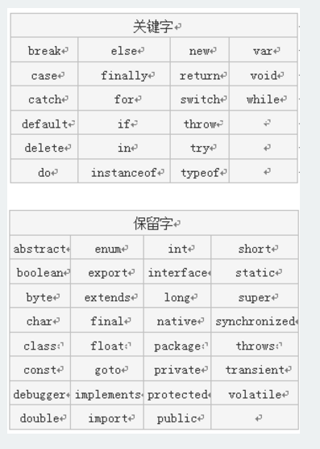
	
	* 变量赋值
	```
	1. 使用"="号给变量存储内容:  var mynum = 5 ; //声明变量mynum并赋值。
	2. 
		var num1 = 123;       // 123是数值
		var num2 = "一二三";    //"一二三"是字符串
		var num3=true;    //布尔值true（真），false(假)
		num1变量存储的内容是数值；num2变量存储的内容是字符串，字符串需要用一对引号""括起来，num3变量存储的内容是布尔值(true、false)。
	```

2. 表达式

	> 表达式与数学中的定义相似，表达式是指具有一定的值、用操作符把常数和变量连接起来的代数式。一个表达式可以包含常数或变量。
	
	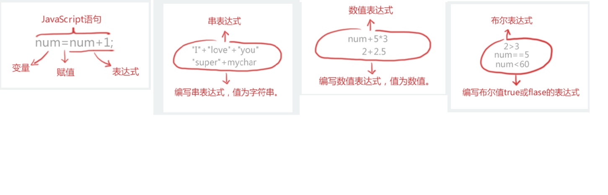
	
3. 操作符

	>JavaScript中还有很多这样的操作符，例如，算术操作符(+、-、*、/等)，比较操作符(<、>、>=、<=等)，逻辑操作符(&&、||、！)。
	
	>注意: “=” 操作符是赋值，不是等于。
	
	* +号操作符:算术运算符主要用来完成类似加减乘除的工作，在JavaScript中，“+”不只代表加法，还可以连接两个字符串，例如：mystring = "Java" + "Script"; // mystring的值“JavaScript”这个字符串
	
	* 自加++，自减- - 

	```javascript
	//mynum++使mynum值在原基础上增加1，mynum--使mynum在原基础上减去1
	mynum = mynum + 1;//等同于mynum++
	mynum = mynum - 1;//等同于mynum--
	```
	
	* 比较操作符
	
	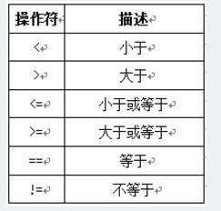
	
	* 逻辑与操作符
	> “&&”是逻辑与操作符，只有“&&”两边值同时满足(同时为真)，整个表达式值才为真。
	
	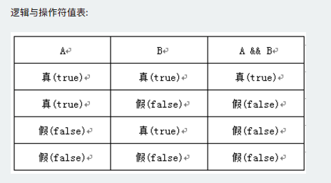
	
	注意: 如果A为假，A && B为假，不会在执行B; 反之，如果A为真，要由 B 的值来决定 A && B 的值。
	
	* 逻辑或操作符
	>"||"逻辑或操作符，相当于生活中的“或者”，当两个条件中有任一个条件满足，“逻辑或”的运算结果就为“真”。
	
	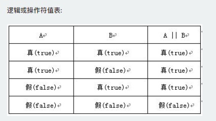
	
	注意: 如果A为真，A || B为真，不会在执行B; 反之，如果A为假，要由 B 的值来决定 A || B 的值。
	* 逻辑非操作符
	>"!"是逻辑非操作符，也就是"不是"的意思,非真即假，非假即真。
	
	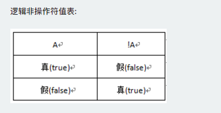
	
	>操作符之间的优先级（高到低）:算术操作符 → 比较操作符 → 逻辑操作符 → "="赋值符号;如果同级的运算是按从左到右次序进行,多层括号由里向外。
	
4. 数组

	>数组是一个值的集合，每个值都有一个索引号，从0开始，每个索引都有一个相应的值，根据需要添加更多数值。
	
	* 创建数组
	
	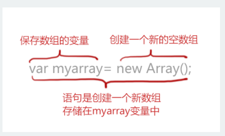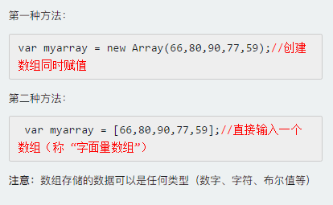
	
	还可以为数组指定长度，长度可任意指定,数组每个值有一个索引号，从0开始:   var myarray= new Array(8); //创建数组，存储8个数据。
	* 数组赋值
	
	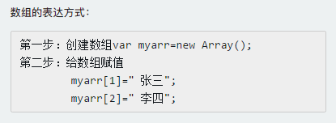
	
	* 向数组添加一个新元素
	
	使用下一个未用的索引，任何时刻可以不断向数组增加新元素。
	
	eg:
    myarray[5]=88; //使用一个新索引，为数组增加一个新元素
    
	* 使用数组元素
	
	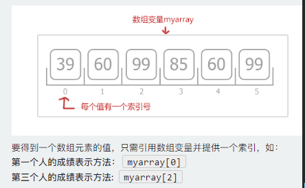
	
	* 数组属性length
	
	```javascript
	myarray.length; //获得数组myarray的长度;
	//因为数组的索引总是由0开始，所以一个数组的上下限分别是：0和length-1。
	var arr=[55,32,5,90,60,98,76,54];//包含8个数值的数组arr 
	document.write(arr.length); //显示数组长度8
	document.write(arr[7]); //显示第8个元素的值54
	//JavaScript数组的length属性是可变的
	arr.length=10; //增大数组的长度
	document.write(arr.length); //数组长度已经变为10
	//数组随元素的增加，长度也会改变
	var arr=[98,76,54,56,76]; // 包含5个数值的数组
	document.write(arr.length); //显示数组的长度5
	arr[15]=34;  //增加元素，使用索引为15,赋值为34
	alert(arr.length); //显示数组的长度16
	```
	
	* 二维数组
	
	```javascript
	//一维数组的表示: myarray[ ]
	//二维数组的表示: myarray[ ][ ]
	//二维数组的两个维度的索引值也是从0开始，两个维度的最后一个索引值为长度-1
	//二维数组的定义方法一
	var myarr=new Array();  //先声明一维 
	for(var i=0;i<2;i++){   //一维长度为2
	   myarr[i]=new Array();  //再声明二维 
	   for(var j=0;j<3;j++){   //二维长度为3
	   myarr[i][j]=i+j;   // 赋值，每个数组元素的值为i+j
	   }
	 }
	 // 二维数组的定义方法二
	 var Myarr = [[0 , 1 , 2 ],[1 , 2 , 3]]
	 //赋值
	myarr[0][1]=5; //将5的值传入到数组中，覆盖原有值。
	//说明: myarr[0][1] ,0 表示表的行，1表示表的列。
	```
	
5. 流程控制语句

	* if语句
	
	```
	语法
	if(条件){调件成立时执行代码}
	***if为小写
	```
	
	* if...else语句
	```
	if...else语句是在指定的条件成立时执行代码，在条件不成立时执行else后的代码。
	if(条件)
	{ 条件成立时执行的代码}
	else
	{条件不成立时执行的代码}
	```
	* if..else嵌套语句
	```
	if(条件1)
	{ 条件1成立时执行的代码}
	else  if(条件2)
	{ 条件2成立时执行的代码}
	...
	else  if(条件n)
	{ 条件n成立时执行的代码}
	else
	{ 条件1、2至n不成立时执行的代码}
	```
	* Switch语句
	```
	当有很多种选项的时候，switch比if else使用更方便。
	语法:
	switch(表达式)
	{
	case值1:
	  执行代码块 1
	  break;
	case值2:
	  执行代码块 2
	  break;
	...
	case值n:
	  执行代码块 n
	  break;
	default:
	  与 case值1 、 case值2...case值n 不同时执行的代码
	}
	语法说明:
	Switch必须赋初始值，值与每个case值匹配。满足执行该 case 后的所有语句，并用break语句来阻止运行下一个case。如所有case值都不匹配，执行default后的语句。
	```
	* for循环
	```
	for语句结构：
	for(初始化变量;循环条件;循环迭代)
	{     
	    循环语句 
	 }
	```
	* while循环
	```
	while语句结构：
	while(判断条件)
	{
	    循环语句
	 }
	```
	* Do...while循环
	```
	do...while语句结构：
	do
	{
	    循环语句
	 }
	while(判断条件)
	```
	* 退出循环break
	```
	在while、for、do...while、while循环中使用break语句退出当前循环，直接执行后面的代码。
	格式如下：
	for(初始条件;判断条件;循环后条件值更新)
	{
	  if(特殊情况)
	  {break;}
	  循环代码
	}
	```
	eg:
	```javascript
	//当num=5的时候循环就会结束，不会输出后面循环的内容。
	for(var num=0;num<10;num++){
		if(num==5){
			break;
		}
		document.write("数值："+num+"<br>")
	}
	```
	* 继续循环continue
	```
	continue的作用是仅仅跳过本次循环，而整个循环体继续执行。
	语句结构：
	for(初始条件;判断条件;循环后条件值更新)
	{
	  if(特殊情况)
	  { continue; }
	 循环代码
	}
	```
	eg:
	```
	//num=5的那次循环将被跳过。
	for(var num=0;num<10;num++){
		if(num==5){
			continue;
		}
		document.write("数值："+num+"<br>")
	}	
	```
	
6. 函数

    >函数的作用，可以写一次代码，然后反复地重用这个代码。
    
	* 定义函数
	
	```
	function  函数名( ){  函数体; }
	```
	* 函数调用
	```html
	//函数定义好后，是不能自动执行的，需要调用它,直接在需要的位置写函数名。
	//第一种情况:在<script>标签内调用。
	<script type="text/javascript">
	    function add2()
	    {
	         sum = 1 + 1;
	         alert(sum);
	    }
	    add2();//调用函数，直接写函数名。
	</script>
	//第二种情况:在HTML文件中调用，如通过点击按钮后调用定义好的函数。
	<html>
	<head>
		<script type="text/javascript">
		   function add2()
		   {
		         sum = 5 + 6;
		         alert(sum);
		   }
		</script>
	</head>
	<body>
		<form>
			<input type="button" value="click it" onclick="add2()">  //按钮,onclick点击事件，直接写函数名
		</form>
	</body>
	</html>
	```
	* 有参数的函数
	```javascript
	function 函数名(参数1,参数2)//注意:参数可以多个，根据需要增减参数个数。参数之间用(逗号，）隔开。
	{
	     函数代码
	}
	//按照这个格式，函数实现任意两个数的和应该写成：
	function add2(x,y)
	{
	   sum = x + y;
	   document.write(sum);
	}
	//x和y则是函数的两个参数，调用函数的时候，我们可通过这两个参数把两个实际的加数传递给函数了。
	//例如，add2(3，4)会求3+4的和，add2(60,20)则会求出60和20的和。
	```
	* 返回值的函数
	```javascript
	function add2(x,y)
	{
	   sum = x + y;
	   return sum; //返回函数值,return后面的值叫做返回值。
	}
	//还可以通过变量存储调用函数的返回值:result = add2(3,4);//语句执行后,result变量中的值为7。
	//函数中参数和返回值不只是数字，还可以是字符串等其它类型。
	```

7. 事件

	> 主要事件表：
	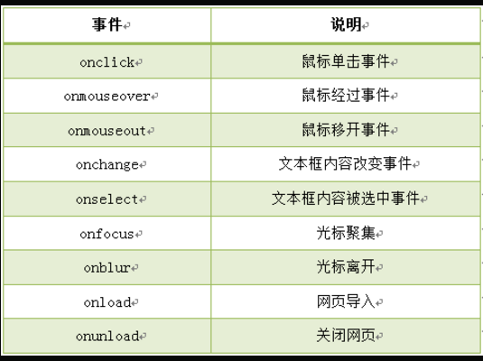
	
	* 鼠标单击事件( onclick ）
	
	```html
	//onclick是鼠标单击事件，当在网页上单击鼠标时，就会发生该事件。同时onclick事件调用的程序块就会被执行，通常与按钮一起使用。
	//比如，我们单击按钮时，触发 onclick 事件，并调用两个数和的函数add2()。代码如下：
	<html>
	<head>
	   <script type="text/javascript">
	      function add2(){
	        var numa,numb,sum;
	        numa=6;
	        numb=8;
	        sum=numa+numb;
	        document.write("两数和为:"+sum);  }
	   </script>
	</head>
	<body>
	   <form>
	      <input name="button" type="button" value="点击提交" onclick="add2()" />
	   </form>
	</body>
	</html>
	```
	
	* 鼠标经过事件（onmouseover）
	
	```html
	//鼠标经过事件，当鼠标移到一个对象上时，该对象就触发onmouseover事件，并执行onmouseover事件调用的程序。
	//现实鼠标经过"确定"按钮时，触发onmouseover事件，调用函数info():
	<input name="确定" type="button" value="确定" onmouseover="info()"/>
	```
	
	* 鼠标移开事件（onmouseout）
	
	```html
	//鼠标移开事件，当鼠标移开当前对象时，执行onmouseout调用的程序。
	//当把鼠标移动到"确定"按钮上，然后再移开时，触发onmouseout事件，调用函数message():
	<input name="确定" type="button" value="确定" onmouseout="message()"/>
	```
	
	* 光标聚焦事件（onfocus）
	
	```html
	//当网页中的对象获得聚点时，执行onfocus调用的程序就会被执行。
	//当将光标移到文本框内时，即焦点在文本框内，触发onfocus 事件，并调用函数message()。
	<input type="text" onfocus="message()"/>
	```
	
	* 失焦事件（onblur）
	
	```html
	//onblur事件与onfocus是相对事件，当光标离开当前获得聚焦对象的时候，触发onblur事件，同时执行被调用的程序。
	//在光标离开该文本框后（即失焦时），触发onblur事件，并调用函数message()。
	<input type="text" onblur="message()"/>
	```
	
	* 内容选中事件（onselect）
	
	```html
	//选中事件，当文本框或者文本域中的文字被选中时，触发onselect事件，同时调用的程序就会被执行。
	//当选中文本框内的文字时，触发onselect 事件，并调用函数message()。
	<textarea name="summary" cols="60" rows="5" onselect="message()">请写入个人简介，不少于200字！</textarea>
	```
	
	* 文本框内容改变事件（onchange）
	
	```html
	//通过改变文本框的内容来触发onchange事件，同时执行被调用的程序。
	//当用户将文本框内的文字改变后，触发onchange事件。
	<textarea name="summary" cols="60" rows="5" onchange="message()">请写入个人简介，不少于200字！</textarea>
	```
	
	* 加载事件（onload）
	
	```
	事件会在页面加载完成后，立即发生，同时执行被调用的程序。
	注意：1. 加载页面时，触发onload事件，事件写在<body>标签内。
	      2. 此节的加载页面，可理解为打开一个新页面时。
	```

8. JavaScript内置对象

	```
	JavaScript 中的所有事物都是对象，如:字符串、数值、数组、函数等，每个对象带有属性和方法。
	对象的属性：反映该对象某些特定的性质的，如：字符串的长度、图像的长宽等；
	对象的方法：能够在对象上执行的动作。例如，表单的“提交”(Submit)，时间的“获取”(getYear)等；
	JavaScript 提供多个内建对象，比如 String、Date、Array 等等，使用对象前先定义
	```
	* Date 日期对象
	```
	定义一个时间对象 :
	var Udate=new Date(); 
	注意:使用关键字new，Date()的首字母必须大写。 
	```
	
	
	* 返回/设置年份方法
	```javascript
	//get/setFullYear() 返回/设置年份，用四位数表示。
	var mydate=new Date();//当前时间2014年3月6日
	document.write(mydate+"<br>");//输出当前时间
	document.write(mydate.getFullYear()+"<br>");//输出当前年份
	mydate.setFullYear(81); //设置年份
	document.write(mydate+"<br>"); //输出年份被设定为 0081年。
	```
	* 返回星期方法
	```javascript
	//getDay() 返回星期，返回的是0-6的数字，0 表示星期天。如果要返回相对应“星期”，通过数组完成
	<script type="text/javascript">
	  var mydate=new Date();//定义日期对象
	  var weekday=["星期日","星期一","星期二","星期三","星期四","星期五","星期六"];//定义数组对象,给每个数组项赋值
	  var mynum=mydate.getDay();//返回值存储在变量mynum中
	  document.write(mydate.getDay());//输出getDay()获取值
	  document.write("今天是："+ weekday[mynum]);//输出星期几
	</script>
	```
	* 返回/设置时间方法
	```javascript
	//get/setTime() 返回/设置时间，单位毫秒数，计算从 1970 年 1 月 1 日零时到日期对象所指的日期的毫秒数。
	//如果将目前日期对象的时间推迟1小时，代码如下:
	<script type="text/javascript">
	  var mydate=new Date();
	  document.write("当前时间："+mydate+"<br>");
	  mydate.setTime(mydate.getTime() + 60 * 60 * 1000);
	  document.write("推迟一小时时间：" + mydate);
	</script>
	```
	* String 字符串对象
	```javascript
	//定义字符串
	var mystr = "I love JavaScript!"
	//定义mystr字符串后，我们就可以访问它的属性和方法。
	//访问字符串对象的属性length:
	stringObject.length; //返回该字符串的长度。
	var mystr="Hello World!";
	var myl=mystr.length;//myl 的值将是：12
	//访问字符串对象的方法：
	//使用 String 对象的 toUpperCase() 方法来将字符串小写字母转换为大写：
	var mystr="Hello world!";
	var mynum=mystr.toUpperCase();//mynum 的值是：HELLO WORLD!
	```
	* 返回指定位置的字符
	```javascript
	//charAt() 方法可返回指定位置的字符。返回的字符是长度为 1 的字符串。
	//语法:
	//stringObject.charAt(index)
	//参数说明：
	//index  --->  必需，表示字符串中某个位置的数字，即字符串中的下标
	//注意：1.字符串中第一个字符的下标是 0。最后一个字符的下标为字符串长度减一（string.length-1）。
	//      2.如果参数 index 不在 0 与 string.length-1 之间，该方法将返回一个空字符串。
	//在字符串 "I love JavaScript!" 中，返回位置2的字符：
	<script type="text/javascript">
	  var mystr="I love JavaScript!"
	  document.write(mystr.charAt(2));
	</script>
	//注意：一个空格也算一个字符。
	```
	* 返回指定的字符串首次出现的位置
	```javascript
	//indexOf() 方法可返回某个指定的字符串值在字符串中首次出现的位置。
	/*
	 * 语法:stringObject.indexOf(substring, startpos)
	 * 说明：
	 * 1.该方法将从头到尾地检索字符串 stringObject，看它是否含有子串 substring。
	 * 2.可选参数，从stringObject的startpos位置开始查找substring，如果没有此参数将从stringObject的开始位置查找。
	 * 3.如果找到一个 substring，则返回 substring 的第一次出现的位置。stringObject 中的字符位置是从 0 开始的。
	 * 注意：1.indexOf() 方法区分大小写。
	 *       2.如果要检索的字符串值没有出现，则该方法返回 -1。
	 */
	//例如: 对 "I love JavaScript!" 字符串内进行不同的检索：
	<script type="text/javascript">
	  var str="I love JavaScript!"
	  document.write(str.indexOf("I") + "<br />");//0
	  document.write(str.indexOf("v") + "<br />");//4
	  document.write(str.indexOf("v",8));//9
	</script>
	```
	* 字符串分割split()
	```javascript
	//split() 方法将字符串分割为字符串数组，并返回此数组。
	//语法：stringObject.split(separator,limit)
	/*  
	 * 参数说明
	 * separator   必需，从该参数指定的地方分割   stringObject
	 * limit   可选参数，分割的次数，如设置该参数，返回的子串不会多于这个参数指定的数组，如无此参数则不限制次数
	 */
	//如果把空字符串 ("") 用作 separator，那么 stringObject 中的每个字符之间都会被分割。
	var mystr = "www.imooc.com";
	document.write(mystr.split(".")+"<br>");//www,imooc,com
	document.write(mystr.split(".", 2)+"<br>");//www,imooc
	```
	* 提取字符串substring()
	```javascript
	//substring() 方法用于提取字符串中介于两个指定下标之间的字符。
	//语法:stringObject.substring(startPos,stopPos) 
	//参数说明:
	//startPos  必需，一个非负的整数，开始位置
	//stopPos   可选，一个非负的整数，结束位置，如果省略该参数，返回的子串会一直到字符串对象的结尾
	/*
	 * 1. 返回的内容是从 start开始(包含start位置的字符)到 stop-1 处的所有字符，其长度为 stop 减start。
	 * 2. 如果参数 start 与 stop 相等，那么该方法返回的就是一个空串（即长度为 0 的字符串）。
	 * 3. 如果 start 比 stop 大，那么该方法在提取子串之前会先交换这两个参数。
	 */
	eg:
	<script type="text/javascript">
	  var mystr="I love JavaScript";
	  document.write(mystr.substring(7));//JavaScript
	  document.write(mystr.substring(2,6));//love
	</script>
	```
	* 提取指定数目的字符substr()
	```javascript
	//substr() 方法从字符串中提取从 startPos位置开始的指定数目的字符串。
	//语法:stringObject.substr(startPos,length)
	/*
	 * 参数说明 
	 *  startPos   必需，要提取的子串的起始位置，必需是数值
	 *  length     可选，提取字符串长度，如果省略，返回从stringObject的开始位置startPOS到stringObject的结尾的字符
	 */
	//注意：如果参数startPos是负数，从字符串的尾部开始算起的位置。也就是说，-1 指字符串中最后一个字符，-2 指倒数第二个字符，以此类推。
	//如果startPos为负数且绝对值大于字符串长度，startPos为0。
	<script type="text/javascript">
	  var mystr="I love JavaScript!";
	  document.write(mystr.substr(7)); //JavaScript!
	  document.write(mystr.substr(2,4)); //love
	</script>
	```
	* Math 对象
	
	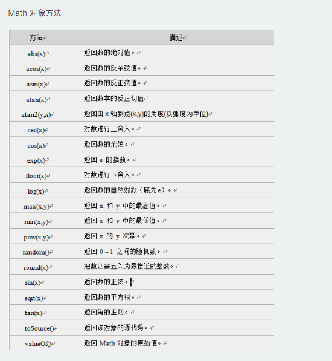
	
	* 向上取整: ceil() 方法可对一个数进行向上取整。 Math.ceil(x)  //x必需是一个数值
	* 向下取整：floor() 方法可对一个数进行向下取整。Math.floor(x)
	* 四舍五入：round() 方法可把一个数字四舍五入为最接近的整数。Math.round(x)
	* 随机数 ：random() 方法可返回介于 0 ~ 1（大于或等于 0 但小于 1 )之间的一个随机数。Math.random();
	* Array 数组对象
	```
	数组对象是一个对象的集合，里边的对象可以是不同类型的。数组的每一个成员对象都有一个“下标”，用来表示它在数组中的位置，是从零开始的
	数组定义的方法：
	1. 定义了一个空数组:
	var  数组名= new Array();
	2. 定义时指定有n个空元素的数组：
	var 数组名 =new Array(n);
	3.定义数组的时候，直接初始化数据：
	var  数组名 = [<元素1>, <元素2>, <元素3>...];
	我们定义myArray数组，并赋值，代码如下：
	var myArray = [2, 8, 6]; 
	说明：定义了一个数组 myArray，里边的元素是：myArray[0] = 2; myArray[1] = 8; myArray[2] = 6。
	数组元素使用：
	数组名[下标] = 值;
	注意: 数组的下标用方括号括起来，从0开始。
	数组属性：
	length 用法：<数组对象>.length；返回：数组的长度，即数组里有多少个元素。它等于数组里最后一个元素的下标加一。
	```
	数组方法：
	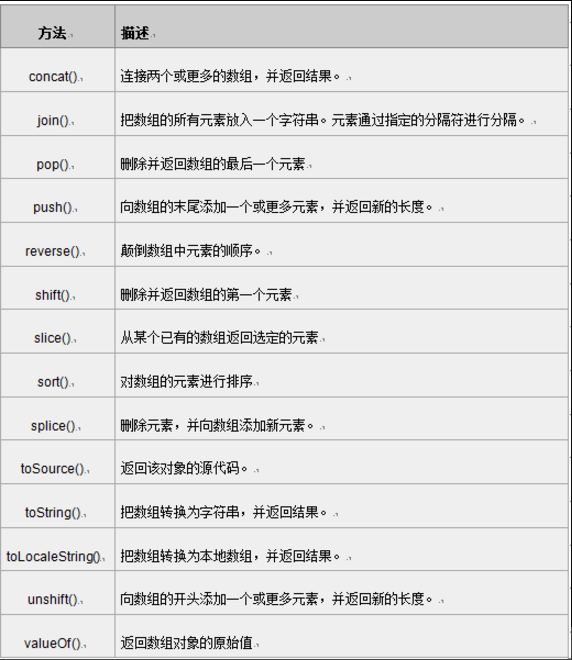
	
	* 数组连接concat()
	```javascript
	//concat() 方法用于连接两个或多个数组。此方法返回一个新数组，不改变原来的数组。arrayObject.concat(array1,array2,...,arrayN)
	<script type="text/javascript">
	    var myarr1= new Array("010")
	    var myarr2= new Array("-","84697581");
	   document.write(myarr1.concat(myarr2));//010,-,84697581
	</script>
	```
	* 指定分隔符连接数组元素join()
	```
	join()方法用于把数组中的所有元素放入一个字符串。元素是通过指定的分隔符进行分隔的。语法：arrayObject.join(分隔符)
	```
	* 颠倒数组元素顺序reverse()
	```
	reverse() 方法用于颠倒数组中元素的顺序。语法：arrayObject.reverse()
	```
	* 选定元素slice()
	```
	slice() 方法可从已有的数组中返回选定的元素。语法arrayObject.slice(start,end)
	```
	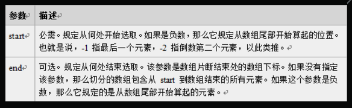
	
	* 数组排序sort()
	```javascript
	//sort()方法使数组中的元素按照一定的顺序排列。语法:arrayObject.sort(方法函数)
	/*1.如果不指定<方法函数>，则按unicode码顺序排列。
	2.如果指定<方法函数>，则按<方法函数>所指定的排序方法排序。
	 myArray.sort(sortMethod);
	  该函数要比较两个值，然后返回一个用于说明这两个值的相对顺序的数字。比较函数应该具有两个参数 a 和 b，其返回值如下： 
	  若返回值<=-1，则表示 A 在排序后的序列中出现在 B 之前。
	  若返回值>-1 && <1，则表示 A 和 B 具有相同的排序顺序。
	  若返回值>=1，则表示 A 在排序后的序列中出现在 B 之后。
	  */
	 <script type="text/javascript">
	  function sortNum(a,b) {
	  return a - b;
	 //升序，如降序，把“a - b”该成“b - a”
	}
	 var myarr = new Array("80","16","50","6","100","1");
	  document.write(myarr + "<br>");
	  document.write(myarr.sort(sortNum));
	</script>
	```


