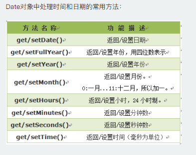
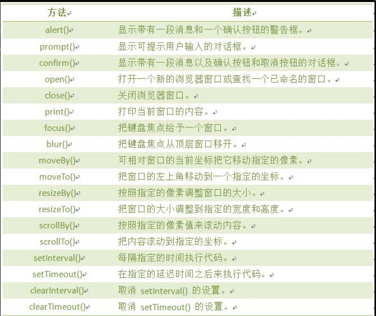
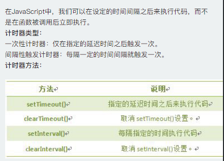
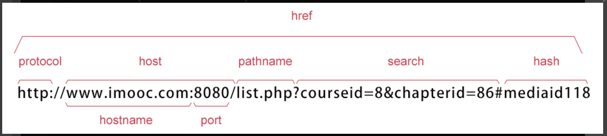
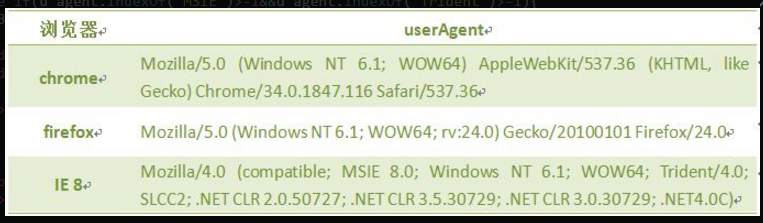

###js在页面中的位置

```
	我们可以将JavaScript代码放在html文件中任何位置，但是我们一般放在网页的head或者body部分。
	1. 放在<head>部分
	最常用的方式是在页面中head部分放置<script>元素，浏览器解析head部分就会执行这个代码，然后才解析页面的其余部分。
	2. 放在<body>部分
	JavaScript代码在网页读取到该语句的时候就会执行。
	*** javascript作为一种脚本语言可以放在html页面中任何位置，但是浏览器解释html时是按先后顺序的，所以前面的script就先被执行。比如进行页面显示初始化的js必须放在head里面，因为初始化都要求提前进行（如给页面body设置css等）；而如果是通过事件调用执行的function那么对位置没什么要求的。
```
###js基础语法

1. 变量
	
	> 从编程角度讲，变量是用于存储某种/某些数值的存储器。我们可以把变量看做一个盒子,盒子用来存放物品,物品可以是衣服、玩具、水果...等。
	
	变量名字可以任意取，只不过取名字要遵循一些规则:
	* 必须以字母、下划线或美元符号开头，后面可以跟字母、下划线、美元符号和数字。
	* 变量名区分大小写，如:A与a是两个不同变量。
	*  不允许使用JavaScript关键字和保留字做变量名。
	
	
	
	* 变量赋值
	```
	1. 使用"="号给变量存储内容:  var mynum = 5 ; //声明变量mynum并赋值。
	2. 
		var num1 = 123;       // 123是数值
		var num2 = "一二三";    //"一二三"是字符串
		var num3=true;    //布尔值true（真），false(假)
		num1变量存储的内容是数值；num2变量存储的内容是字符串，字符串需要用一对引号""括起来，num3变量存储的内容是布尔值(true、false)。
	```

2. 表达式

	> 表达式与数学中的定义相似，表达式是指具有一定的值、用操作符把常数和变量连接起来的代数式。一个表达式可以包含常数或变量。
	
	
	
3. 操作符

	>JavaScript中还有很多这样的操作符，例如，算术操作符(+、-、*、/等)，比较操作符(<、>、>=、<=等)，逻辑操作符(&&、||、！)。
	
	>注意: “=” 操作符是赋值，不是等于。
	
	* +号操作符:算术运算符主要用来完成类似加减乘除的工作，在JavaScript中，“+”不只代表加法，还可以连接两个字符串，例如：mystring = "Java" + "Script"; // mystring的值“JavaScript”这个字符串
	
	* 自加++，自减- - 

	```javascript
	//mynum++使mynum值在原基础上增加1，mynum--使mynum在原基础上减去1
	mynum = mynum + 1;//等同于mynum++
	mynum = mynum - 1;//等同于mynum--
	```
	
	* 比较操作符
	
	
	
	* 逻辑与操作符
	> “&&”是逻辑与操作符，只有“&&”两边值同时满足(同时为真)，整个表达式值才为真。
	
	
	
	注意: 如果A为假，A && B为假，不会在执行B; 反之，如果A为真，要由 B 的值来决定 A && B 的值。
	
	* 逻辑或操作符
	>"||"逻辑或操作符，相当于生活中的“或者”，当两个条件中有任一个条件满足，“逻辑或”的运算结果就为“真”。
	
	
	
	注意: 如果A为真，A || B为真，不会在执行B; 反之，如果A为假，要由 B 的值来决定 A || B 的值。
	* 逻辑非操作符
	>"!"是逻辑非操作符，也就是"不是"的意思,非真即假，非假即真。
	
	
	
	>操作符之间的优先级（高到低）:算术操作符 → 比较操作符 → 逻辑操作符 → "="赋值符号;如果同级的运算是按从左到右次序进行,多层括号由里向外。
	
4. 数组

	>数组是一个值的集合，每个值都有一个索引号，从0开始，每个索引都有一个相应的值，根据需要添加更多数值。
	
	* 创建数组
	
	
	
	还可以为数组指定长度，长度可任意指定,数组每个值有一个索引号，从0开始:   var myarray= new Array(8); //创建数组，存储8个数据。
	* 数组赋值
	
	
	
	* 向数组添加一个新元素
	
	使用下一个未用的索引，任何时刻可以不断向数组增加新元素。
	
	eg:
    myarray[5]=88; //使用一个新索引，为数组增加一个新元素
    
	* 使用数组元素
	
	
	
	* 数组属性length
	
	```javascript
	myarray.length; //获得数组myarray的长度;
	//因为数组的索引总是由0开始，所以一个数组的上下限分别是：0和length-1。
	var arr=[55,32,5,90,60,98,76,54];//包含8个数值的数组arr 
	document.write(arr.length); //显示数组长度8
	document.write(arr[7]); //显示第8个元素的值54
	//JavaScript数组的length属性是可变的
	arr.length=10; //增大数组的长度
	document.write(arr.length); //数组长度已经变为10
	//数组随元素的增加，长度也会改变
	var arr=[98,76,54,56,76]; // 包含5个数值的数组
	document.write(arr.length); //显示数组的长度5
	arr[15]=34;  //增加元素，使用索引为15,赋值为34
	alert(arr.length); //显示数组的长度16
	```
	
	* 二维数组
	
	```javascript
	//一维数组的表示: myarray[ ]
	//二维数组的表示: myarray[ ][ ]
	//二维数组的两个维度的索引值也是从0开始，两个维度的最后一个索引值为长度-1
	//二维数组的定义方法一
	var myarr=new Array();  //先声明一维 
	for(var i=0;i<2;i++){   //一维长度为2
	   myarr[i]=new Array();  //再声明二维 
	   for(var j=0;j<3;j++){   //二维长度为3
	   myarr[i][j]=i+j;   // 赋值，每个数组元素的值为i+j
	   }
	 }
	 // 二维数组的定义方法二
	 var Myarr = [[0 , 1 , 2 ],[1 , 2 , 3]]
	 //赋值
	myarr[0][1]=5; //将5的值传入到数组中，覆盖原有值。
	//说明: myarr[0][1] ,0 表示表的行，1表示表的列。
	```
	
5. 流程控制语句

	* if语句
	
	```
	语法
	if(条件){调件成立时执行代码}
	***if为小写
	```
	
	* if...else语句
	```
	if...else语句是在指定的条件成立时执行代码，在条件不成立时执行else后的代码。
	if(条件)
	{ 条件成立时执行的代码}
	else
	{条件不成立时执行的代码}
	```
	* if..else嵌套语句
	```
	if(条件1)
	{ 条件1成立时执行的代码}
	else  if(条件2)
	{ 条件2成立时执行的代码}
	...
	else  if(条件n)
	{ 条件n成立时执行的代码}
	else
	{ 条件1、2至n不成立时执行的代码}
	```
	* Switch语句
	```
	当有很多种选项的时候，switch比if else使用更方便。
	语法:
	switch(表达式)
	{
	case值1:
	  执行代码块 1
	  break;
	case值2:
	  执行代码块 2
	  break;
	...
	case值n:
	  执行代码块 n
	  break;
	default:
	  与 case值1 、 case值2...case值n 不同时执行的代码
	}
	语法说明:
	Switch必须赋初始值，值与每个case值匹配。满足执行该 case 后的所有语句，并用break语句来阻止运行下一个case。如所有case值都不匹配，执行default后的语句。
	```
	* for循环
	```
	for语句结构：
	for(初始化变量;循环条件;循环迭代)
	{     
	    循环语句 
	 }
	```
	* while循环
	```
	while语句结构：
	while(判断条件)
	{
	    循环语句
	 }
	```
	* Do...while循环
	```
	do...while语句结构：
	do
	{
	    循环语句
	 }
	while(判断条件)
	```
	* 退出循环break
	```
	在while、for、do...while、while循环中使用break语句退出当前循环，直接执行后面的代码。
	格式如下：
	for(初始条件;判断条件;循环后条件值更新)
	{
	  if(特殊情况)
	  {break;}
	  循环代码
	}
	```
	eg:
	```javascript
	//当num=5的时候循环就会结束，不会输出后面循环的内容。
	for(var num=0;num<10;num++){
		if(num==5){
			break;
		}
		document.write("数值："+num+"<br>")
	}
	```
	* 继续循环continue
	```
	continue的作用是仅仅跳过本次循环，而整个循环体继续执行。
	语句结构：
	for(初始条件;判断条件;循环后条件值更新)
	{
	  if(特殊情况)
	  { continue; }
	 循环代码
	}
	```
	eg:
	```
	//num=5的那次循环将被跳过。
	for(var num=0;num<10;num++){
		if(num==5){
			continue;
		}
		document.write("数值："+num+"<br>")
	}	
	```
	
6. 函数

    >函数的作用，可以写一次代码，然后反复地重用这个代码。
    
	* 定义函数
	
	```
	function  函数名( ){  函数体; }
	```
	* 函数调用
	```html
	//函数定义好后，是不能自动执行的，需要调用它,直接在需要的位置写函数名。
	//第一种情况:在<script>标签内调用。
	<script type="text/javascript">
	    function add2()
	    {
	         sum = 1 + 1;
	         alert(sum);
	    }
	    add2();//调用函数，直接写函数名。
	</script>
	//第二种情况:在HTML文件中调用，如通过点击按钮后调用定义好的函数。
	<html>
	<head>
		<script type="text/javascript">
		   function add2()
		   {
		         sum = 5 + 6;
		         alert(sum);
		   }
		</script>
	</head>
	<body>
		<form>
			<input type="button" value="click it" onclick="add2()">  //按钮,onclick点击事件，直接写函数名
		</form>
	</body>
	</html>
	```
	* 有参数的函数
	```javascript
	function 函数名(参数1,参数2)//注意:参数可以多个，根据需要增减参数个数。参数之间用(逗号，）隔开。
	{
	     函数代码
	}
	//按照这个格式，函数实现任意两个数的和应该写成：
	function add2(x,y)
	{
	   sum = x + y;
	   document.write(sum);
	}
	//x和y则是函数的两个参数，调用函数的时候，我们可通过这两个参数把两个实际的加数传递给函数了。
	//例如，add2(3，4)会求3+4的和，add2(60,20)则会求出60和20的和。
	```
	* 返回值的函数
	```javascript
	function add2(x,y)
	{
	   sum = x + y;
	   return sum; //返回函数值,return后面的值叫做返回值。
	}
	//还可以通过变量存储调用函数的返回值:result = add2(3,4);//语句执行后,result变量中的值为7。
	//函数中参数和返回值不只是数字，还可以是字符串等其它类型。
	```

7. 事件

	> 主要事件表：
	
	
	* 鼠标单击事件( onclick ）
	
	```html
	//onclick是鼠标单击事件，当在网页上单击鼠标时，就会发生该事件。同时onclick事件调用的程序块就会被执行，通常与按钮一起使用。
	//比如，我们单击按钮时，触发 onclick 事件，并调用两个数和的函数add2()。代码如下：
	<html>
	<head>
	   <script type="text/javascript">
	      function add2(){
	        var numa,numb,sum;
	        numa=6;
	        numb=8;
	        sum=numa+numb;
	        document.write("两数和为:"+sum);  }
	   </script>
	</head>
	<body>
	   <form>
	      <input name="button" type="button" value="点击提交" onclick="add2()" />
	   </form>
	</body>
	</html>
	```
	
	* 鼠标经过事件（onmouseover）
	
	```html
	//鼠标经过事件，当鼠标移到一个对象上时，该对象就触发onmouseover事件，并执行onmouseover事件调用的程序。
	//现实鼠标经过"确定"按钮时，触发onmouseover事件，调用函数info():
	<input name="确定" type="button" value="确定" onmouseover="info()"/>
	```
	
	* 鼠标移开事件（onmouseout）
	
	```html
	//鼠标移开事件，当鼠标移开当前对象时，执行onmouseout调用的程序。
	//当把鼠标移动到"确定"按钮上，然后再移开时，触发onmouseout事件，调用函数message():
	<input name="确定" type="button" value="确定" onmouseout="message()"/>
	```
	
	* 光标聚焦事件（onfocus）
	
	```html
	//当网页中的对象获得聚点时，执行onfocus调用的程序就会被执行。
	//当将光标移到文本框内时，即焦点在文本框内，触发onfocus 事件，并调用函数message()。
	<input type="text" onfocus="message()"/>
	```
	
	* 失焦事件（onblur）
	
	```html
	//onblur事件与onfocus是相对事件，当光标离开当前获得聚焦对象的时候，触发onblur事件，同时执行被调用的程序。
	//在光标离开该文本框后（即失焦时），触发onblur事件，并调用函数message()。
	<input type="text" onblur="message()"/>
	```
	
	* 内容选中事件（onselect）
	
	```html
	//选中事件，当文本框或者文本域中的文字被选中时，触发onselect事件，同时调用的程序就会被执行。
	//当选中文本框内的文字时，触发onselect 事件，并调用函数message()。
	<textarea name="summary" cols="60" rows="5" onselect="message()">请写入个人简介，不少于200字！</textarea>
	```
	
	* 文本框内容改变事件（onchange）
	
	```html
	//通过改变文本框的内容来触发onchange事件，同时执行被调用的程序。
	//当用户将文本框内的文字改变后，触发onchange事件。
	<textarea name="summary" cols="60" rows="5" onchange="message()">请写入个人简介，不少于200字！</textarea>
	```
	
	* 加载事件（onload）
	
	```
	事件会在页面加载完成后，立即发生，同时执行被调用的程序。
	注意：1. 加载页面时，触发onload事件，事件写在<body>标签内。
	      2. 此节的加载页面，可理解为打开一个新页面时。
	```

8. JavaScript内置对象

	```
	JavaScript 中的所有事物都是对象，如:字符串、数值、数组、函数等，每个对象带有属性和方法。
	对象的属性：反映该对象某些特定的性质的，如：字符串的长度、图像的长宽等；
	对象的方法：能够在对象上执行的动作。例如，表单的“提交”(Submit)，时间的“获取”(getYear)等；
	JavaScript 提供多个内建对象，比如 String、Date、Array 等等，使用对象前先定义
	```
	* Date 日期对象
	```
	定义一个时间对象 :
	var Udate=new Date(); 
	注意:使用关键字new，Date()的首字母必须大写。 
	```
	
	
	* 返回/设置年份方法
	```javascript
	//get/setFullYear() 返回/设置年份，用四位数表示。
	var mydate=new Date();//当前时间2014年3月6日
	document.write(mydate+"<br>");//输出当前时间
	document.write(mydate.getFullYear()+"<br>");//输出当前年份
	mydate.setFullYear(81); //设置年份
	document.write(mydate+"<br>"); //输出年份被设定为 0081年。
	```
	* 返回星期方法
	```javascript
	//getDay() 返回星期，返回的是0-6的数字，0 表示星期天。如果要返回相对应“星期”，通过数组完成
	<script type="text/javascript">
	  var mydate=new Date();//定义日期对象
	  var weekday=["星期日","星期一","星期二","星期三","星期四","星期五","星期六"];//定义数组对象,给每个数组项赋值
	  var mynum=mydate.getDay();//返回值存储在变量mynum中
	  document.write(mydate.getDay());//输出getDay()获取值
	  document.write("今天是："+ weekday[mynum]);//输出星期几
	</script>
	```
	* 返回/设置时间方法
	```javascript
	//get/setTime() 返回/设置时间，单位毫秒数，计算从 1970 年 1 月 1 日零时到日期对象所指的日期的毫秒数。
	//如果将目前日期对象的时间推迟1小时，代码如下:
	<script type="text/javascript">
	  var mydate=new Date();
	  document.write("当前时间："+mydate+"<br>");
	  mydate.setTime(mydate.getTime() + 60 * 60 * 1000);
	  document.write("推迟一小时时间：" + mydate);
	</script>
	```
	* String 字符串对象
	```javascript
	//定义字符串
	var mystr = "I love JavaScript!"
	//定义mystr字符串后，我们就可以访问它的属性和方法。
	//访问字符串对象的属性length:
	stringObject.length; //返回该字符串的长度。
	var mystr="Hello World!";
	var myl=mystr.length;//myl 的值将是：12
	//访问字符串对象的方法：
	//使用 String 对象的 toUpperCase() 方法来将字符串小写字母转换为大写：
	var mystr="Hello world!";
	var mynum=mystr.toUpperCase();//mynum 的值是：HELLO WORLD!
	```
	* 返回指定位置的字符
	```javascript
	//charAt() 方法可返回指定位置的字符。返回的字符是长度为 1 的字符串。
	//语法:
	//stringObject.charAt(index)
	//参数说明：
	//index  --->  必需，表示字符串中某个位置的数字，即字符串中的下标
	//注意：1.字符串中第一个字符的下标是 0。最后一个字符的下标为字符串长度减一（string.length-1）。
	//      2.如果参数 index 不在 0 与 string.length-1 之间，该方法将返回一个空字符串。
	//在字符串 "I love JavaScript!" 中，返回位置2的字符：
	<script type="text/javascript">
	  var mystr="I love JavaScript!"
	  document.write(mystr.charAt(2));
	</script>
	//注意：一个空格也算一个字符。
	```
	* 返回指定的字符串首次出现的位置
	```javascript
	//indexOf() 方法可返回某个指定的字符串值在字符串中首次出现的位置。
	/*
	 * 语法:stringObject.indexOf(substring, startpos)
	 * 说明：
	 * 1.该方法将从头到尾地检索字符串 stringObject，看它是否含有子串 substring。
	 * 2.可选参数，从stringObject的startpos位置开始查找substring，如果没有此参数将从stringObject的开始位置查找。
	 * 3.如果找到一个 substring，则返回 substring 的第一次出现的位置。stringObject 中的字符位置是从 0 开始的。
	 * 注意：1.indexOf() 方法区分大小写。
	 *       2.如果要检索的字符串值没有出现，则该方法返回 -1。
	 */
	//例如: 对 "I love JavaScript!" 字符串内进行不同的检索：
	<script type="text/javascript">
	  var str="I love JavaScript!"
	  document.write(str.indexOf("I") + "<br />");//0
	  document.write(str.indexOf("v") + "<br />");//4
	  document.write(str.indexOf("v",8));//9
	</script>
	```
	* 字符串分割split()
	```javascript
	//split() 方法将字符串分割为字符串数组，并返回此数组。
	//语法：stringObject.split(separator,limit)
	/*  
	 * 参数说明
	 * separator   必需，从该参数指定的地方分割   stringObject
	 * limit   可选参数，分割的次数，如设置该参数，返回的子串不会多于这个参数指定的数组，如无此参数则不限制次数
	 */
	//如果把空字符串 ("") 用作 separator，那么 stringObject 中的每个字符之间都会被分割。
	var mystr = "www.imooc.com";
	document.write(mystr.split(".")+"<br>");//www,imooc,com
	document.write(mystr.split(".", 2)+"<br>");//www,imooc
	```
	* 提取字符串substring()
	```javascript
	//substring() 方法用于提取字符串中介于两个指定下标之间的字符。
	//语法:stringObject.substring(startPos,stopPos) 
	//参数说明:
	//startPos  必需，一个非负的整数，开始位置
	//stopPos   可选，一个非负的整数，结束位置，如果省略该参数，返回的子串会一直到字符串对象的结尾
	/*
	 * 1. 返回的内容是从 start开始(包含start位置的字符)到 stop-1 处的所有字符，其长度为 stop 减start。
	 * 2. 如果参数 start 与 stop 相等，那么该方法返回的就是一个空串（即长度为 0 的字符串）。
	 * 3. 如果 start 比 stop 大，那么该方法在提取子串之前会先交换这两个参数。
	 */
	eg:
	<script type="text/javascript">
	  var mystr="I love JavaScript";
	  document.write(mystr.substring(7));//JavaScript
	  document.write(mystr.substring(2,6));//love
	</script>
	```
	* 提取指定数目的字符substr()
	```javascript
	//substr() 方法从字符串中提取从 startPos位置开始的指定数目的字符串。
	//语法:stringObject.substr(startPos,length)
	/*
	 * 参数说明 
	 *  startPos   必需，要提取的子串的起始位置，必需是数值
	 *  length     可选，提取字符串长度，如果省略，返回从stringObject的开始位置startPOS到stringObject的结尾的字符
	 */
	//注意：如果参数startPos是负数，从字符串的尾部开始算起的位置。也就是说，-1 指字符串中最后一个字符，-2 指倒数第二个字符，以此类推。
	//如果startPos为负数且绝对值大于字符串长度，startPos为0。
	<script type="text/javascript">
	  var mystr="I love JavaScript!";
	  document.write(mystr.substr(7)); //JavaScript!
	  document.write(mystr.substr(2,4)); //love
	</script>
	```
	* Math 对象
	
	
	
	* 向上取整: ceil() 方法可对一个数进行向上取整。 Math.ceil(x)  //x必需是一个数值
	* 向下取整：floor() 方法可对一个数进行向下取整。Math.floor(x)
	* 四舍五入：round() 方法可把一个数字四舍五入为最接近的整数。Math.round(x)
	* 随机数 ：random() 方法可返回介于 0 ~ 1（大于或等于 0 但小于 1 )之间的一个随机数。Math.random();
	* Array 数组对象
	```
	数组对象是一个对象的集合，里边的对象可以是不同类型的。数组的每一个成员对象都有一个“下标”，用来表示它在数组中的位置，是从零开始的
	数组定义的方法：
	1. 定义了一个空数组:
	var  数组名= new Array();
	2. 定义时指定有n个空元素的数组：
	var 数组名 =new Array(n);
	3.定义数组的时候，直接初始化数据：
	var  数组名 = [<元素1>, <元素2>, <元素3>...];
	我们定义myArray数组，并赋值，代码如下：
	var myArray = [2, 8, 6]; 
	说明：定义了一个数组 myArray，里边的元素是：myArray[0] = 2; myArray[1] = 8; myArray[2] = 6。
	数组元素使用：
	数组名[下标] = 值;
	注意: 数组的下标用方括号括起来，从0开始。
	数组属性：
	length 用法：<数组对象>.length；返回：数组的长度，即数组里有多少个元素。它等于数组里最后一个元素的下标加一。
	```
	数组方法：
	
	
	* 数组连接concat()
	```javascript
	//concat() 方法用于连接两个或多个数组。此方法返回一个新数组，不改变原来的数组。arrayObject.concat(array1,array2,...,arrayN)
	<script type="text/javascript">
	    var myarr1= new Array("010")
	    var myarr2= new Array("-","84697581");
	   document.write(myarr1.concat(myarr2));//010,-,84697581
	</script>
	```
	* 指定分隔符连接数组元素join()
	```
	join()方法用于把数组中的所有元素放入一个字符串。元素是通过指定的分隔符进行分隔的。语法：arrayObject.join(分隔符)
	```
	* 颠倒数组元素顺序reverse()
	```
	reverse() 方法用于颠倒数组中元素的顺序。语法：arrayObject.reverse()
	```
	* 选定元素slice()
	```
	slice() 方法可从已有的数组中返回选定的元素。语法arrayObject.slice(start,end)
	```
	
	
	* 数组排序sort()
	```javascript
	//sort()方法使数组中的元素按照一定的顺序排列。语法:arrayObject.sort(方法函数)
	/*1.如果不指定<方法函数>，则按unicode码顺序排列。
	2.如果指定<方法函数>，则按<方法函数>所指定的排序方法排序。
	 myArray.sort(sortMethod);
	  该函数要比较两个值，然后返回一个用于说明这两个值的相对顺序的数字。比较函数应该具有两个参数 a 和 b，其返回值如下： 
	  若返回值<=-1，则表示 A 在排序后的序列中出现在 B 之前。
	  若返回值>-1 && <1，则表示 A 和 B 具有相同的排序顺序。
	  若返回值>=1，则表示 A 在排序后的序列中出现在 B 之后。
	  */
	 <script type="text/javascript">
	  function sortNum(a,b) {
	  return a - b;
	 //升序，如降序，把“a - b”该成“b - a”
	}
	 var myarr = new Array("80","16","50","6","100","1");
	  document.write(myarr + "<br>");
	  document.write(myarr.sort(sortNum));
	</script>
	```

9. window对象

	>window对象是BOM的核心，window对象指当前的浏览器窗口。
	
	window对象方法：
	
	
	
	* javascript计时器
	
	
	
	* 计时器setInterval()
	
	```html
	/*
	在执行时,从载入页面后每隔指定的时间执行代码。
	语法:setInterval(代码,交互时间);
	参数说明：
	1. 代码：要调用的函数或要执行的代码串。
	2. 交互时间：周期性执行或调用表达式之间的时间间隔，以毫秒计（1s=1000ms）。
	返回值:
	一个可以传递给 clearInterval() 从而取消对"代码"的周期性执行的值。
	调用函数格式(假设有一个clock()函数):
	setInterval("clock()",1000)或setInterval(clock,1000)
	*/
	//我们设置一个计时器，每隔100毫秒调用clock()函数，并将时间显示出来，代码如下:
	<!DOCTYPE HTML>
	<html>
	<head>
	<meta http-equiv="Content-Type" content="text/html; charset=utf-8">
	<title>计时器</title>
		<script type="text/javascript">
			var int=setInterval(clock, 100)
			function clock(){
			    var time=new Date();
			    document.getElementById("clock").value = time;
			}
		</script>
	</head>
	<body>
		<form>
		    <input type="text" id="clock" size="50"  />
		</form>
	</body>
	</html>
	```
	
	* 取消计时器clearInterval()
	
	```html
	/*
	clearInterval() 方法可取消由 setInterval() 设置的交互时间。
	语法：clearInterval(id_of_setInterval)
	参数说明:
	id_of_setInterval：由 setInterval() 返回的 ID 值。
	*/
	//每隔 100 毫秒调用 clock() 函数,并显示时间。当点击按钮时，停止时间,代码如下:
	<!DOCTYPE HTML>
	<html>
	<head>
	<meta http-equiv="Content-Type" content="text/html; charset=utf-8">
	<title>计时器</title>
	<script type="text/javascript">
	   function clock(){
	      var time=new Date();                     
	      document.getElementById("clock").value = time;
	   }
	// 每隔100毫秒调用clock函数，并将返回值赋值给i
	     var i=setInterval("clock()",100);
	</script>
	</head>
	<body>
	  <form>
	    <input type="text" id="clock" size="50"  />
	    <input type="button" value="Stop" onclick="clearInterval(i)"  />
	  </form>
	</body>
	</html>
	```
	
	* 计时器setTimeout()
	
	```html
	/*
	setTimeout()计时器，在载入后延迟指定时间后,去执行一次表达式,仅执行一次。
	语法:setTimeout(代码,延迟时间);
	参数说明：
	1. 要调用的函数或要执行的代码串。
	2. 延时时间：在执行代码前需等待的时间，以毫秒为单位（1s=1000ms)。
	*/
	//当我们打开网页3秒后，在弹出一个提示框，代码如下:
	<!DOCTYPE HTML>
	<html>
	<head>
		<script type="text/javascript">
		    setTimeout("alert('Hello!')", 3000 );
		</script>
	</head>
	<body>
	</body>
	</html>
	当按钮start被点击时，setTimeout()调用函数，在5秒后弹出一个提示框。
	<!DOCTYPE HTML>
	<html>
	<head>
	<script type="text/javascript">
		function tinfo(){
		  var t=setTimeout("alert('Hello!')",5000);
		 }
	</script>
	</head>
	<body>
	<form>
	  <input type="button" value="start" onClick="tinfo()">
	</form>
	</body>
	</html>
	要创建一个运行于无穷循环中的计数器，我们需要编写一个函数来调用其自身。在下面的代码，当按钮被点击后，输入域便从0开始计数。
	<!DOCTYPE HTML>
	<html>
	<head>
	<script type="text/javascript">
		var num=0;
		function numCount(){
			 document.getElementById('txt').value=num;
			 num=num+1;
			 setTimeout("numCount()",1000);
		 }
	</script>
	</head>
	<body>
		<form>
			<input type="text" id="txt" />
			<input type="button" value="Start" onClick="numCount()" />
		</form>
	</body>
	</html>
	```

	* 取消计时器clearTimeout()
	
	```html
	/*
	setTimeout()和clearTimeout()一起使用，停止计时器。
	语法:clearTimeout(id_of_setTimeout)
	参数说明:id_of_setTimeout：由 setTimeout() 返回的 ID 值。该值标识要取消的延迟执行代码块。
	*/
	//eg:
	<!DOCTYPE HTML>
	<html>
	<head>
	<script type="text/javascript">
	  var num=0,i;
	  function timedCount(){
	    document.getElementById('txt').value=num;
	    num=num+1;
	    i=setTimeout(timedCount,1000);
	  }
	    setTimeout(timedCount,1000);
	  function stopCount(){
	    clearTimeout(i);
	  }
	</script>
	</head>
	<body>
	  <form>
	    <input type="text" id="txt">
	    <input type="button" value="Stop" onClick="stopCount()">
	  </form>
	</body>
	</html>
	```
	
	* History 对象
	
	```
	history对象记录了用户曾经浏览过的页面(URL)，并可以实现浏览器前进与后退相似导航的功能。
	语法：window.history.[属性|方法]
	window可以省略
	```
	
	<table>
	    <tr>
	        <td colspan="2">history对象属性</td> 
	   </tr>
	    <tr>
	        <td>属性</td>
	        <td>描述</td>    
	    </tr>
	    <tr>
	        <td>length</td>  
	        <td>返回浏览器历史列表中的URL数量</td>   
	    </tr>
	    <tr>
	        <td>使用length属性，当前窗口的浏览历史总长度</td>  
	        <td>
	        	var HL = window.history.length;
	        </td>   
	    </tr>
	    <tr>
	        <td colspan="2">history对象方法</td> 
	   </tr>
	    <tr>
	        <td>方法</td>
	        <td>描述</td>    
	    </tr>
	    <tr>
	        <td>black()</td>  
	        <td>加载history列表中的前一个URL</td>   
	    </tr>
	    <tr>
	        <td>forward()</td>  
	        <td>加载history列表中的下一个URL</td>   
	    </tr>
	    <tr>
	        <td>go()</td>  
	        <td>加载history列表中的某个具体的页面</td>   
	    </tr>
	</table>

	* 返回前一个浏览页面
	
	```
	back()方法，加载history列表中的前一个URL，语法：window.history.back() == window.history.go(-1)
	```
	
	* 返回下一个浏览页面
	
	```
	forward()方法，加载history列表中的下一个URL，语法：window.history.forward() == window.history.go(1)
	```
	
	* 返回浏览历史中的其他页面
	
	```
	go()方法，根据当前所处页面，加载history列表中的某个具体的页面，语法：window.history.go(number)；
	```
	参数：
	<table>
		<tr>
			<td>number</td>
			<td>参数说明</td>
		</tr>
		<tr>
			<td>1</td>
			<td>前一个，go(1)等价于forward()；返回当前页面之后浏览的第三个历史页面（window.history.go(3)）</td>
		</tr>
		<tr>
			<td>()</td>
			<td>当前页面</td>
		</tr>
		<tr>
			<td>-1</td>
			<td>后一个，go(-1)等价于back()；返回当前页面之前浏览过的第二个历史页面（window.history.go(-2)）</td>
		</tr>
		<tr>
			<td>其他数值</td>
			<td>要访问的URL在history的URL列表中的相对位置</td>
		</tr>
	</table>
	
	* location对象
	
	```
	location用于获取或设置窗体的URL，并且可以用于解析URL，语法：location.[属性|方法]
	```
	location对象属性图：
	
	
	
	<table>
		<tr>
			<td colspan="2">location对象属性：</td>
		</tr>
		<tr>
			<td>属性</td>
			<td>描述</td>
		</tr>
		<tr>
			<td>hash</td>
			<td>设置或返回从(#)开始的URL（锚）</td>
		</tr>
		<tr>
			<td>host</td>
			<td>设置或返回主机名和当前URL的端口号</td>
		</tr>
		<tr>
			<td>hostname</td>
			<td>设置或返回当前URL主机名</td>
		</tr>
		<tr>
			<td>href</td>
			<td>设置或返回完整的URL</td>
		</tr>
		<tr>
			<td>pathname</td>
			<td>设置或返回当前URL的路径部分</td>
		</tr>
		<tr>
			<td>port</td>
			<td>设置或返回当前URL的端口号</td>
		</tr>
		<tr>
			<td>protocol</td>
			<td>设置或返回当前URL的协议</td>
		</tr>
		<tr>
			<td>search</td>
			<td>设置或返回从问号（？）开始的URL（查询部分）</td>
		</tr>
		<tr>
			<td colspan="2">location对象方法：</td>
		</tr>
		<tr>
			<td>属性</td>
			<td>描述</td>
		</tr>
		<tr>
			<td>assign()</td>
			<td>加载新的文档</td>
		</tr>
		<tr>
			<td>reload()</td>
			<td>重新加载当前文档</td>
		</tr>
		<tr>
			<td>replace()</td>
			<td>用新的文档替换当前文档</td>
		</tr>
	</table>
	
	* Navigator对象  ：Navigator 对象包含有关浏览器的信息，通常用于检测浏览器与操作系统的版本。

	<table>
		<tr>
			<td colspan="2">对象属性：</td>
		</tr>
		<tr>
			<td>属性</td>
			<td>描述</td>
		</tr>
		<tr>
			<td>appCodeName</td>
			<td>浏览器代码名字的字符串表示</td>
		</tr>
		<tr>
			<td>appName</td>
			<td>返回浏览器的名称</td>
		</tr>
		<tr>
			<td>appVersion</td>
			<td>返回浏览器的平台和版本信息</td>
		</tr>
		<tr>
			<td>platform</td>
			<td>返回运行浏览器的操作系统平台</td>
		</tr>
		<tr>
			<td>userAgent</td>
			<td>返回有客户机发送服务的user-agent头部的值</td>
		</tr>
	</table>
	
	```javascript
	//查看浏览器的名称和版本，代码如下:
	<script type="text/javascript">
	   var browser=navigator.appName;
	   var b_version=navigator.appVersion;
	   document.write("Browser name"+browser);
	   document.write("<br>");
	   document.write("Browser version"+b_version);
	</script>
	```
	
	* userAgent
	
	```
	返回用户代理头的字符串表示(就是包括浏览器版本信息等的字符串)
	语法: navigator.userAgent
	```
	几种浏览的user_agent.，像360的兼容模式用的是IE、极速模式用的是chrom的内核。
	
	
	
	* screen对象：用于获取用户的屏幕信息；语法：window.screen.属性
	
	<table>
		<tr>
			<td colspan="2">对象属性：</td>
		</tr>
		<tr>
			<td>属性</td>
			<td>描述</td>
		</tr>
		<tr>
			<td>avaiHeight</td>
			<td>窗口可以使用的屏幕高度，单位像素</td>
		</tr>
		<tr>
			<td>avaiWidth</td>
			<td>窗口可以使用的屏幕宽度，单位像素</td>
		</tr>
		<tr>
			<td>colorDepth</td>
			<td>用户浏览器表示的颜色位数，通常为32位（每像素的位数）</td>
		</tr>
		<tr>
			<td>pixelDepth</td>
			<td>用户浏览器表示的颜色位数，通常为32位（每像素的位数）IE不支持此属性</td>
		</tr>
		<tr>
			<td>height</td>
			<td>屏幕的高度，单位像素</td>
		</tr>
		<tr>
			<td>width</td>
			<td>屏幕的宽度，单位像素</td>
		</tr>
	</table>	
	
	* 屏幕分辨率的高和宽
	
	```javascript
	/*
	window.screen 对象包含有关用户屏幕的信息。
	1. screen.height 返回屏幕分辨率的高
	2. screen.width 返回屏幕分辨率的宽
	注意:
	1.单位以像素计。
	2. window.screen 对象在编写时可以不使用 window 这个前缀。
	*/
	//获取屏幕的高和宽:
	<script type="text/javascript">
	  document.write( "屏幕宽度："+screen.width+"px<br />" );
	  document.write( "屏幕高度："+screen.height+"px<br />" );
	</script>
	```
	
	* 屏幕可用高和宽度
	
	```javascript
	/*
	1. screen.availWidth 属性返回访问者屏幕的宽度，以像素计，减去界面特性，比如任务栏。
	2. screen.availHeight 属性返回访问者屏幕的高度，以像素计，减去界面特性，比如任务栏。
	注意:不同系统的任务栏默认高度不一样，及任务栏的位置可在屏幕上下左右任何位置，所以有可能可用宽度和高度不一样。
	*/
	//获取屏幕的可用高和宽度：
	<script type="text/javascript">
	document.write("可用宽度：" + screen.availWidth);
	document.write("可用高度：" + screen.availHeight);
	</script>
	//注意:根据屏幕的不同显示值不同。
	```

10. DOM对象，控制HTML元素

	```
	文档对象模型DOM（Document Object Model）定义访问和处理HTML文档的标准方法。DOM 将HTML文档呈现为带有元素、属性和文本的树结构（节点树）。
	HTML文档可以说由节点构成的集合，DOM节点有:
	1. 元素节点：上图中<html>、<body>、<p>等都是元素节点，即标签。
	2. 文本节点:向用户展示的内容，如<li>...</li>中的JavaScript、DOM、CSS等文本。
	3. 属性节点:元素属性，如<a>标签的链接属性href="http://www.xxxx.com"。
	```
	
	<table>
		<tr>
			<td colspan="2">节点属性：</td>
		</tr>
		<tr>
			<td>方法</td>
			<td>说明</td>
		</tr>
		<tr>
			<td>nodeName</td>
			<td>返回一个字符串，其内容是给节点的名字</td>
		</tr>
		<tr>
			<td>nodeType</td>
			<td>返回一个整数，这个数值代表给定节点的类型</td>
		</tr>
		<tr>
			<td>nodeValue</td>
			<td>返回给定节点的当前值</td>
		</tr>
		<tr>
			<td colspan="2">节点属性：</td>
		</tr>
		<tr>
			<td>方法</td>
			<td>说明</td>
		</tr>
		<tr>
			<td>childNodes</td>
			<td>返回一个数组，这个数组由给定元素节点的子节点构成</td>
		</tr>
		<tr>
			<td>firstChild</td>
			<td>返回第一个子节点</td>
		</tr>
		<tr>
			<td>lastChild</td>
			<td>返回最后一个子节点</td>
		</tr>
		<tr>
			<td>parentNode</td>
			<td>返回一个给定节点的父节点</td>
		</tr>
		<tr>
			<td>nextSibling</td>
			<td>返回给定节点的下一个子节点</td>
		</tr>
		<tr>
			<td>previousSibling</td>
			<td>返回返回给定节点的上一个子节点</td>
		</tr>
		<tr>
			<td colspan="2">节点属性：</td>
		</tr>
		<tr>
			<td>方法</td>
			<td>说明</td>
		</tr>
		<tr>
			<td>createElement(element)</td>
			<td>创建一个新的元素节点</td>
		</tr>
		<tr>
			<td>createTextNode()</td>
			<td>创建一个包含着给定文本的新文本节点</td>
		</tr>
		<tr>
			<td>appendChild()</td>
			<td>指定节点的最后一个子节点列表之后添加一个新的子节点</td>
		</tr>
		<tr>
			<td>insertBefore()</td>
			<td>将一个给定节点插入到一个给定元素节点的给定子节点的前面</td>
		</tr>
		<tr>
			<td>removeChild()</td>
			<td>从一个给定元素中删除一个子节点</td>
		</tr>
		<tr>
			<td>replaceChild</td>
			<td>把一个给定父元素里的一个子节点替换为另外一个节点</td>
		</tr>
	</table>	
	
	* getElementsByName()方法
	
	```
	返回带有指定名称的节点对象的集合。
	语法：document.getElementsByName(name)
	与getElementById() 方法不同的是，通过元素的 name 属性查询元素，而不是通过 id 属性。
	注意:
	1. 因为文档中的 name 属性可能不唯一，所有 getElementsByName() 方法返回的是元素的数组，而不是一个元素。
	2. 和数组类似也有length属性，可以和访问数组一样的方法来访问，从0开始。
	```
	
	* getElementsByTagName()方法
	
	```
	返回带有指定标签名的节点对象的集合。返回元素的顺序是它们在文档中的顺序。
	语法: document.getElementsByTagName(Tagname)
	说明:
	1. Tagname是标签的名称，如p、a、img等标签名。
	2. 和数组类似也有length属性，可以和访问数组一样的方法来访问，所以从0开始。
	```
	
	* 区别getElementByID,getElementsByName,getElementsByTagName
	
	```
	以人来举例说明，人有能标识身份的身份证，有姓名，有类别(大人、小孩、老人)等。
	1. ID 是一个人的身份证号码，是唯一的。所以通过getElementById获取的是指定的一个人。
	2. Name 是他的名字，可以重复。所以通过getElementsByName获取名字相同的人集合。
	3. TagName可看似某类，getElementsByTagName获取相同类的人集合。如获取小孩这类人，getElementsByTagName("小孩")。
	把上面的例子转换到HTML中，如下:
	<input type="checkbox" name="hobby" id="hobby1">  音乐
	input标签就像人的类别。
	name属性就像人的姓名。
	id属性就像人的身份证。
	```
	
	|方法|说明|获得|
	|----|----|----|
	|getElementByID|通过指定ID获得元素|一个|
	|getElementsByName|通过元素名称name属性获得元素|一组|
	|getElementsByTagName|通过标签名称获得元素|一组|
	
	* getAttribute()方法
	
	```
	通过元素节点的属性名称获取属性的值。
	语法： elementNode.getAttribute(name)
	说明:
	1. elementNode：使用getElementById()、getElementsByTagName()等方法，获取到的元素节点。
	2. name：要想查询的元素节点的属性名字
	```
	
	* setAttribute()方法
	```
	setAttribute() 方法增加一个指定名称和值的新属性，或者把一个现有的属性设定为指定的值。
	语法： elementNode.setAttribute(name,value)
	说明：
	1.name: 要设置的属性名。
	2.value: 要设置的属性值。
	注意：
	1.把指定的属性设置为指定的值。如果不存在具有指定名称的属性，该方法将创建一个新属性。
	2.类似于getAttribute()方法，setAttribute()方法只能通过元素节点对象调用的函数。
	```
	
	* 节点属性
	
	```
	在文档对象模型 (DOM) 中，每个节点都是一个对象。DOM 节点有三个重要的属性 ：
	1. nodeName : 节点的名称
	2. nodeValue ：节点的值
	3. nodeType ：节点的类型
	一、nodeName 属性: 节点的名称，是只读的。
	1. 元素节点的 nodeName 与标签名相同
	2. 属性节点的 nodeName 是属性的名称
	3. 文本节点的 nodeName 永远是 #text
	4. 文档节点的 nodeName 永远是 #document
	二、nodeValue 属性：节点的值
	1. 元素节点的 nodeValue 是 undefined 或 null
	2. 文本节点的 nodeValue 是文本自身
	3. 属性节点的 nodeValue 是属性的值
	三、nodeType 属性: 节点的类型，是只读的。以下常用的几种结点类型:
	元素类型    节点类型
	  元素          1
	  属性          2
	  文本          3
	  注释          8
	  文档          9
	```
	
	* 访问子节点childNodes
	
	```
	访问选定元素节点下的所有子节点的列表，返回的值可以看作是一个数组，他具有length属性。
	语法： elementNode.childNodes
	注意： 如果选定的节点没有子节点，则该属性返回不包含节点的 NodeList。
	```
	
	
	* 访问子节点的第一和最后项
	```
	一、firstChild 属性返回‘childNodes’数组的第一个子节点。如果选定的节点没有子节点，则该属性返回 NULL。
	语法： node.firstChild
	说明：与elementNode.childNodes[0]是同样的效果。 
	二、 lastChild 属性返回‘childNodes’数组的最后一个子节点。如果选定的节点没有子节点，则该属性返回 NULL。
	语法： node.lastChild
	说明：与elementNode.childNodes[elementNode.childNodes.length-1]是同样的效果。 
	注意: Internet Explorer 会忽略节点之间生成的空白文本节点，而其它浏览器不会。我们可以通过检测节点类型，过滤子节点。
	```
	
	* 访问父节点parentNode
	
	```html
	//获取指定节点的父节点
	//语法：elementNode.parentNode
	//eg:获取 P 节点的父节点
	<div id="text">
	  <p id="con"> parentNode 获取指点节点的父节点</p>
	</div> 
	<script type="text/javascript">
	  var mynode= document.getElementById("con");
	  document.write(mynode.parentNode.nodeName);
	</script>
	```
	
	* 访问兄弟节点
	```
	1. nextSibling 属性可返回某个节点之后紧跟的节点（处于同一树层级中）。
	语法：nodeObject.nextSibling
	说明：如果无此节点，则该属性返回 null。
	2. previousSibling 属性可返回某个节点之前紧跟的节点（处于同一树层级中）。
	语法： nodeObject.previousSibling  
	说明：如果无此节点，则该属性返回 null。
	注意: 两个属性获取的是节点。Internet Explorer 会忽略节点间生成的空白文本节点（例如，换行符号），而其它浏览器不会忽略。
	解决问题方法: 判断节点nodeType是否为1, 如是为元素节点，跳过。
	```
	
	* 插入节点appendChild()
	```
	在指定节点的最后一个子节点列表之后添加一个新的子节点。
	语法:appendChild(newnode)
	参数:newnode：指定追加的节点。
	```
	
	* 插入节点insertBefore()
	```
	insertBefore() 方法可在已有的子节点前插入一个新的子节点。
	语法:insertBefore(newnode,node);
	参数:
	newnode: 要插入的新节点。
	node: 指定此节点前插入节点。   --->  node也可以改为: x.childNodes[0]; 
	```
	
	* 删除节点removeChild()
	```
	removeChild() 方法从子节点列表中删除某个节点。如删除成功，此方法可返回被删除的节点，如失败，则返回 NULL。
	语法:nodeObject.removeChild(node)
	参数:node ：必需，指定需要删除的节点。
	```
	
	* 替换元素节点replaceChild()
	```html
	replaceChild 实现子节点(对象)的替换。返回被替换对象的引用。 
	语法：node.replaceChild (newnode,oldnew ) 
	参数：
	newnode : 必需，用于替换 oldnew 的对象。 
	oldnew : 必需，被 newnode 替换的对象。
	<div><b id="oldnode">JavaScript</b>是一个很常用的技术，为网页添加动态效果。</div>
	<a href="javascript:replaceMessage()"> 将加粗改为斜体</a>
	<script type="text/javascript">
	      function replaceMessage(){
	          var b = document.getElementById("oldnode");
			   var i = document.createElement("i");
			   i.innerHTML = b.innerHTML;
			   b.parentNode.replaceChild(i,b)
	       }     
	  </script>
	```


