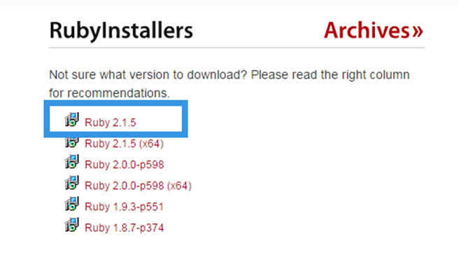
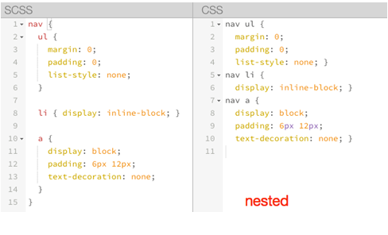
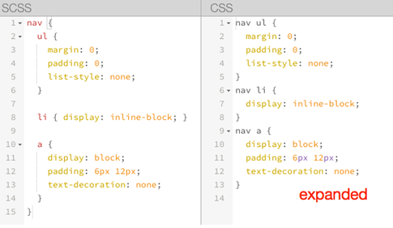

内容来源于：http://www.imooc.com/learn/311
### sass安装

*  在 Windows 平台下安装 Ruby 需要先有 Ruby 安装包，大家可以到 Ruby 的官网（http://rubyinstaller.org/downloads）下载对应需要的 Ruby 版本。



* Ruby 安装文件下载好后，可以按应用软件安装步骤进行安装 Ruby。在安装过程中，个人建议将其安装在 C 盘下，在安装过程中选择第二个选项（不选中，就会出现编译时找不到Ruby环境的情况），如下图所示：


* Ruby 安装完成后，在开始菜单中找到新安装的 Ruby，并启动 Ruby 的 Command 控制面板，如下图所示：


* 当你的电脑中安装好 Ruby 之后，接下来就可以安装 Sass 了。同样的在windows下安装 Sass 有多种方法。但这几种方法都是非常的简单，只需要在你的命令终端输入一行命令即可。

	```
	1. 通过命令安装sass（电脑的命令终端）：gem insatll sass
	2. 通过compass来安装sass：gem install sass
	3. 本地安装sass
		由于有时候直接使用上面的命令安装会让你无法正常实现安装（网络受限原因），当碰到这种情况之时，那么安装需要特殊去处理，可以通过下面的方法来实现 Sass 的正常安装：
		可以到 Rubygems(http://rubygems.org/) 网站上将 Sass 的安装包（http://rubygems.org/gems/sass）下载下来，然后在命令终端输入：
		gem install <把下载的安装包拖到这里>
		直接回车即可安装成功。
	4. 淘宝 RubyGems 镜像安装 Sass
	除了下载 Sass 安装包到本地安装之外，碰到网络原因无法安装时还可以使用淘宝 RubyGems 镜像安装 Sass。只是我们需要通过 gem sources 命令来配置源，先移除默认的 https://rubygems.org 源，然后添加淘宝的源 https://ruby.taobao.org：
	第一步：移动默认的源：gem sources --remove https://rubygems.org/
	第二步：指定淘宝的源：gem sources -a https://ruby.taobao.org/
	第三步：查看指定的源是不是淘宝源：gem sources -l
	返回结果如下：
	*** CURRENT SOURCES ***
	https://ruby.taobao.org
	请确保只有 ruby.taobao.org。如果无误之后，执行下面的命令：
	gem install sass
	5. 查看版 本: sass -v
	6. 更新           : gem update sass
	7. 卸载	   : gem uninstall sass
	```
	
### sass 命令编译

```
命令编译是指使用你电脑中的命令终端，通过输入 Sass 指令来编译 Sass。
这种编译方式是最直接也是最简单的一种方式。因为只需要在你的命令终端输入：
1. 单文件编译：sass <要编译的Sass文件路径>/style.scss:<要输出CSS文件路径>/style.css
2. 多文件编译：多文件编译：sass sass/:css/
上面的命令表示将项目中“sass”文件夹中所有“.scss”(“.sass”)文件编译成“.css”文件，
并且将这些 CSS 文件都放在项目中“css”文件夹中。
3. “watch”功能，这样只要你的代码进行任保修改，都能自动监测到代码的变化，并且给你直接编译出来：
sass --watch <要编译的Sass文件路径>/style.scss:<要输出CSS文件路径>/style.css
4. [Sass]GUI 界面工具编译
	Koala (http://koala-app.com/)
	Compass.app（http://compass.kkbox.com/）
	Scout（http://mhs.github.io/scout-app/）
	CodeKit（https://incident57.com/codekit/index.html）
	Prepros（https://prepros.io/）
```

### [Sass]自动化编译

```javascript
//1、Grunt 配置 Sass 编译的示例代码
module.exports = function(grunt) {
    grunt.initConfig({
        pkg: grunt.file.readJSON('package.json'),
        sass: {
            dist: {
                files: {
                    'style/style.css' : 'sass/style.scss'
                }
            }
        },
        watch: {
            css: {
                files: '**/*.scss',
                tasks: ['sass']
            }
        }
    });
    grunt.loadNpmTasks('grunt-contrib-sass');
    grunt.loadNpmTasks('grunt-contrib-watch');
    grunt.registerTask('default',['watch']);
}
//2、Gulp 配置 Sass 编译的示例代码
var gulp = require('gulp');
var sass = require('gulp-sass');

gulp.task('sass', function () {
    gulp.src('./scss/*.scss')
        .pipe(sass())
        .pipe(gulp.dest('./css'));
});

gulp.task('watch', function() {
    gulp.watch('scss/*.scss', ['sass']);
});

gulp.task('default', ['sass','watch']);
```

### [Sass]嵌套输出方式 nested

```css
1、嵌套输出方式 nested
Sass 提供了一种嵌套显示 CSS 文件的方式。例如
nav {
  ul {
    margin: 0;
    padding: 0;
    list-style: none;
  }

  li { display: inline-block; }

  a {
    display: block;
    padding: 6px 12px;
    text-decoration: none;
  }
}
在编译的时候带上参数“ --style nested”:
sass --watch test.scss:test.css --style nested
编译出来的 CSS 样式风格：
nav ul {
  margin: 0;
  padding: 0;
  list-style: none; }
nav li {
  display: inline-block; }
nav a {
  display: block;
  padding: 6px 12px;
  text-decoration: none; }
```

如图所示：

### [Sass]展开输出方式 expanded

```css

1、嵌套输出方式 expanded
nav {
  ul {
    margin: 0;
    padding: 0;
    list-style: none;
  }

  li { display: inline-block; }

  a {
    display: block;
    padding: 6px 12px;
    text-decoration: none;
  }
}
在编译的时候带上参数“ --style expanded”:
sass --watch test.scss:test.css --style expanded
这个输出的 CSS 样式风格和 nested 类似，只是大括号在另起一行，同样上面的代码，编译出来：
nav ul {
  margin: 0;
  padding: 0;
  list-style: none;
}
nav li {
  display: inline-block;
}
nav a {
  display: block;
  padding: 6px 12px;
  text-decoration: none;
}
```
如图所示：

### [Sass]紧凑输出方式 compact

```css

1、嵌套输出方式 compact
nav {
  ul {
    margin: 0;
    padding: 0;
    list-style: none;
  }

  li { display: inline-block; }

  a {
    display: block;
    padding: 6px 12px;
    text-decoration: none;
  }
}
在编译的时候带上参数“ --style compact”:
sass --watch test.scss:test.css --style compact
该方式适合那些喜欢单行 CSS 样式格式的朋友，编译后的代码如下：
nav ul { margin: 0; padding: 0; list-style: none; }
nav li { display: inline-block; }
nav a { display: block; padding: 6px 12px; text-decoration: none; }
```

如图所示：

### [Sass]压缩输出方式 compressed

```css

1、压缩输出方式 compressed
nav {
  ul {
    margin: 0;
    padding: 0;
    list-style: none;
  }

  li { display: inline-block; }

  a {
    display: block;
    padding: 6px 12px;
    text-decoration: none;
  }
}
在编译的时候带上参数“ --style compressed”:
sass --watch test.scss:test.css --style compressed
压缩输出方式会去掉标准的 Sass 和 CSS 注释及空格。也就是压缩好的 CSS 代码样式风格：
nav ul{margin:0;padding:0;list-style:none}nav li{display:inline-block}nav a{display:block;padding:6px 12px;text-decoration:none}
```

### Sass 的调试

```
Sass 调试一直以来都是一件头痛的事情，使用 Sass 的同学都希望能在浏览器中直接调试 Sass 文件，能找到对应的行数。
值得庆幸的是，现在实现并不是一件难事，只要你的浏览器支持“sourcemap”功能即可。早一点的版本，需要在编译的时候添加“--sourcemap”  
参数：
sass --watch --scss --sourcemap style.scss:style.css
在 Sass3.3 版本之上（我测试使用的版本是 3.4.7），不需要添加这个参数也可以：
sass --watch style.scss:style.css
在命令终端，你将看到一个信息：
>>> Change detected to: style.scss
  write style.css
  write style.css.map
```

### [Sass]普通变量与默认变量

```css
普通变量
定义之后可以在全局范围内使用。
$fontSize: 12px;
body{
    font-size:$fontSize;
}
编译后的css代码：
body{
    font-size:12px;
}

默认变量
sass 的默认变量仅需要在值后面加上 !default 即可。
$baseLineHeight:1.5 !default;
body{
    line-height: $baseLineHeight; 
}
编译后的css代码：
body{
    line-height:1.5;
}

sass 的默认变量一般是用来设置默认值，然后根据需求来覆盖的，覆盖的方式也很简单，只需要在默认变量之前重新声明下变量即可。
 
$baseLineHeight: 2;
$baseLineHeight: 1.5 !default;
body{
    line-height: $baseLineHeight; 
}
编译后的css代码：
body{
    line-height:2;
}
```

### [Sass]变量的调用

```css
在 Sass 中声明了变量之后，就可以在需要的地方调用变量。调用变量的方法也非常的简单。
比如在定义了变量
$brand-primary : darken(#428bca, 6.5%) !default; // #337ab7
$btn-primary-color: #fff !default;
$btn-primary-bg : $brand-primary !default;
$btn-primary-border : darken($btn-primary-bg, 5%) !default;

在按钮 button 中调用，可以按下面的方式调用
.btn-primary {
   background-color: $btn-primary-bg;
   color: $btn-primary-color;
   border: 1px solid $btn-primary-border;
}
编译出来的CSS:
.btn-primary {
  background-color: #337ab7;
  color: #fff;
  border: 1px solid #2e6da4;
}
```

### [Sass]局部变量和全局变量

```css
Sass 中变量的作用域在过去几年已经发生了一些改变。直到最近，规则集和其他范围内声明变量的作用域才默认为本地。如果已经存在同名的全局变量，从 3.4 版本开始，Sass 已经可以正确处理作用域的概念，并通过创建一个新的局部变量来代替。
全局变量与局部变量
先来看一下代码例子：
//SCSS
$color: orange !default;//定义全局变量(在选择器、函数、混合宏...的外面定义的变量为全局变量)
.block {
  color: $color;//调用全局变量
}
em {
  $color: red;//定义局部变量
  a {
    color: $color;//调用局部变量
  }
}
span {
  color: $color;//调用全局变量
}
css 的结果：
//CSS
.block {
  color: orange;
}
em a {
  color: red;
}
span {
  color: orange;
}
上面的示例演示可以得知，在元素内部定义的变量不会影响其他元素。如此可以简单的理解成，全局变量就是定义在元素外面的变量，如下代码：
$color:orange !default;
$color 就是一个全局变量，而定义在元素内部的变量，比如 $color:red; 是一个局部变量。
除此之外，Sass 现在还提供一个 !global 参数。!global 和 !default 对于定义变量都是很有帮助的。我们之后将会详细介绍这两个参数的使用以及其功能。
全局变量的影子
当在局部范围（选择器内、函数内、混合宏内...）声明一个已经存在于全局范围内的变量时，局部变量就成为了全局变量的影子。基本上，局部变量只会在局部范围内覆盖全局变量。
上面例子中的 em 选择器内的变量 $color 就是一个全局变量的影子。
//SCSS
$color: orange !default;//定义全局变量
.block {
  color: $color;//调用全局变量
}
em {
  $color: red;//定义局部变量（全局变量 $color 的影子）
  a {
    color: $color;//调用局部变量
  }
}
```

### [Sass]嵌套-选择器嵌套

```css
Sass 中还提供了选择器嵌套功能，但这也并不意味着你在 Sass 中的嵌套是无节制的，因为你嵌套的层级越深，编译出来的 CSS 代码的选择器层级将越深，这往往是大家不愿意看到的一点。这个特性现在正被众多开发者滥用。
选择器嵌套为样式表的作者提供了一个通过局部选择器相互嵌套实现全局选择的方法，Sass 的嵌套分为三种：
	选择器嵌套
	属性嵌套
	伪类嵌套
1、选择器嵌套
假设我们有一段这样的结构：
<header>
<nav>
    <a href=“##”>Home</a>
    <a href=“##”>About</a>
    <a href=“##”>Blog</a>
</nav>
<header>
想选中 header 中的 a 标签，在写 CSS 会这样写：
nav a {
  color:red;
}
header nav a {
  color:green;
}
那么在 Sass 中，就可以使用选择器的嵌套来实现：
nav {
  a {
    color: red;

    header & {
      color:green;
    }
  }  
}
```

### [Sass]嵌套-伪类嵌套

```css
其实伪类嵌套和属性嵌套非常类似，只不过他需要借助`&`符号一起配合使用。我们就拿经典的“clearfix”为例吧：
.clearfix{
&:before,
&:after {
    content:"";
    display: table;
  }
&:after {
    clear:both;
    overflow: hidden;
  }
}
编译出来的 CSS：
clearfix:before, .clearfix:after {
  content: "";
  display: table;
}
.clearfix:after {
  clear: both;
  overflow: hidden;
}
避免选择器嵌套：
选择器嵌套最大的问题是将使最终的代码难以阅读。开发者需要花费巨大精力计算不同缩进级别下的选择器具体的表现效果。
选择器越具体则声明语句越冗长，而且对最近选择器的引用(&)也越频繁。在某些时候，出现混淆选择器路径和探索下一级选择器的错误率很高，这非常不值得。
```

### [Sass]混合宏

1. 声明混合宏

	```css
	1、声明混合宏
	不带参数混合宏：
	在 Sass 中，使用“@mixin”来声明一个混合宏。如：
	@mixin border-radius{
	    -webkit-border-radius: 5px;
	    border-radius: 5px;
	}
	其中 @mixin 是用来声明混合宏的关键词，有点类似 CSS 中的 @media、@font-face 一样。border-radius 是混合宏的名称。大括号里面是复用的样式代码。
	带参数混合宏：
	除了声明一个不带参数的混合宏之外，还可以在定义混合宏时带有参数，如：
	@mixin border-radius($radius:5px){
	    -webkit-border-radius: $radius;
	    border-radius: $radius;
	}
	复杂的混合宏：
	上面是一个简单的定义混合宏的方法，当然， Sass 中的混合宏还提供更为复杂的，你可以在大括号里面写上带有逻辑关系，帮助更好的做你想做的事情,如：
	@mixin box-shadow($shadow...) {
	  @if length($shadow) >= 1 {
	    @include prefixer(box-shadow, $shadow);
	  } @else{
	    $shadow:0 0 4px rgba(0,0,0,.3);
	    @include prefixer(box-shadow, $shadow);
	  }
	}
	这个 box-shadow 的混合宏，带有多个参数，这个时候可以使用“ … ”来替代。简单的解释一下，当 $shadow 的参数数量值大于或等于“ 1 ”时，表示有多个阴影值，反之调用默认的参数值“ 0 0 4px rgba(0,0,0,.3) ”。
	```

2. 调用混合宏

	```css
	在 Sass 中通过 @mixin 关键词声明了一个混合宏，那么在实际调用中，其匹配了一个关键词“@include”来调用声明好的混合宏。例如在你的样式中定义了一个圆角的混合宏“border-radius”:
	@mixin border-radius{
	    -webkit-border-radius: 3px;
	    border-radius: 3px;
	}
	在一个按钮中要调用定义好的混合宏“border-radius”，可以这样使用：
	button {
	    @include border-radius;
	}
	这个时候编译出来的 CSS:
	button {
	  -webkit-border-radius: 3px;
	  border-radius: 3px;
	}
	```
	
3. [Sass]混合宏的参数--传一个不带值的参数

	```css
	Sass 的混合宏有一个强大的功能，可以传参，那么在 Sass 中传参主要有以下几种情形：
	A) 传一个不带值的参数
	在混合宏中，可以传一个不带任何值的参数，比如：
	@mixin border-radius($radius){
	  -webkit-border-radius: $radius;
	  border-radius: $radius;
	}
	在混合宏“border-radius”中定义了一个不带任何值的参数“$radius”。
	在调用的时候可以给这个混合宏传一个参数值：
	.box {
	  @include border-radius(3px);
	}
	这里表示给混合宏传递了一个“border-radius”的值为“3px”。
	编译出来的 CSS:
	.box {
	  -webkit-border-radius: 3px;
	  border-radius: 3px;
	}
	```
	
4. [Sass]混合宏的参数--传一个带值的参数

	```css
	在 Sass 的混合宏中，还可以给混合宏的参数传一个默认值，例如：
	@mixin border-radius($radius:3px){
	  -webkit-border-radius: $radius;
	  border-radius: $radius;
	}
	在混合宏“border-radius”传了一个参数“$radius”，而且给这个参数赋予了一个默认值“3px”。
	在调用类似这样的混合宏时，会多有一个机会，假设你的页面中的圆角很多地方都是“3px”的圆角，那么这个时候只需要调用默认的混合宏“border-radius”:
	.btn {
	  @include border-radius;
	}
	编译出来的 CSS:
	.btn {
	  -webkit-border-radius: 3px;
	  border-radius: 3px;
	}
	但有的时候，页面中有些元素的圆角值不一样，那么可以随机给混合宏传值，如：
	.box {
	  @include border-radius(50%);
	}
	编译出来的 CSS:
	.box {
	  -webkit-border-radius: 50%;
	  border-radius: 50%;
	}
	```
	
5. [Sass]混合宏的参数--传多个参数

	```css
	Sass 混合宏除了能传一个参数之外，还可以传多个参数，如：
	@mixin center($width,$height){
	  width: $width;
	  height: $height;
	  position: absolute;
	  top: 50%;
	  left: 50%;
	  margin-top: -($height) / 2;
	  margin-left: -($width) / 2;
	}
	在混合宏“center”就传了多个参数。在实际调用和其调用其他混合宏是一样的：
	.box-center {
	  @include center(500px,300px);
	}
	编译出来 CSS:
	.box-center {
	  width: 500px;
	  height: 300px;
	  position: absolute;
	  top: 50%;
	  left: 50%;
	  margin-top: -150px;
	  margin-left: -250px;
	}
	  有一个特别的参数“…”。当混合宏传的参数过多之时，可以使用参数来替代，如：
	@mixin box-shadow($shadows...){
	  @if length($shadows) >= 1 {
	    -webkit-box-shadow: $shadows;
	    box-shadow: $shadows;
	  } @else {
	    $shadows: 0 0 2px rgba(#000,.25);
	    -webkit-box-shadow: $shadow;
	    box-shadow: $shadow;
	  }
	}
	在实际调用中：
	.box {
	  @include box-shadow(0 0 1px rgba(#000,.5),0 0 2px rgba(#000,.2));
	}
	编译出来的CSS:
	.box {
	  -webkit-box-shadow: 0 0 1px rgba(0, 0, 0, 0.5), 0 0 2px rgba(0, 0, 0, 0.2);
	  box-shadow: 0 0 1px rgba(0, 0, 0, 0.5), 0 0 2px rgba(0, 0, 0, 0.2);
	}
	```
	
6. [Sass]混合宏的参数--混合宏的不足

	```css
	混合宏在实际编码中给我们带来很多方便之处，特别是对于复用重复代码块。但其最大的不足之处是会生成冗余的代码块。比如在不同的地方调用一个相同的混合宏时。如：
	@mixin border-radius{
	  -webkit-border-radius: 3px;
	  border-radius: 3px;
	}
	.box {
	  @include border-radius;
	  margin-bottom: 5px;
	}
	.btn {
	  @include border-radius;
	}
	示例在“.box”和“.btn”中都调用了定义好的“border-radius”混合宏。先来看编译出来的 CSS：
	.box {
	  -webkit-border-radius: 3px;
	  border-radius: 3px;
	  margin-bottom: 5px;
	}
	.btn {
	  -webkit-border-radius: 3px;
	  border-radius: 3px;
	}
	上例明显可以看出，Sass 在调用相同的混合宏时，并不能智能的将相同的样式代码块合并在一起。这也是 Sass 的混合宏最不足之处。
	```
	
7. [Sass]扩展/继承

	```css
	在 Sass 中是通过关键词 “@extend”来继承已存在的类样式块，从而实现代码的继承。如下所示：
	//SCSS
	.btn {
	  border: 1px solid #ccc;
	  padding: 6px 10px;
	  font-size: 14px;
	}
	.btn-primary {
	  background-color: #f36;
	  color: #fff;
	  @extend .btn;
	}
	.btn-second {
	  background-color: orange;
	  color: #fff;
	  @extend .btn;
	}
	编译出来之后：
	//CSS
	.btn, .btn-primary, .btn-second {
	  border: 1px solid #ccc;
	  padding: 6px 10px;
	  font-size: 14px;
	}
	.btn-primary {
	  background-color: #f36;
	  color: #fff;
	}
	.btn-second {
	  background-clor: orange;
	  color: #fff;
	}
	从示例代码可以看出，在 Sass 中的继承，可以继承类样式块中所有样式代码，而且编译出来的 CSS 会将选择器合并在一起，形成组合选择器：
	.btn, .btn-primary, .btn-second {
	  border: 1px solid #ccc;
	  padding: 6px 10px;
	  font-size: 14px;
	}
	```
	
8. [Sass]占位符 %placeholder

	```css
	Sass 中的占位符 %placeholder 功能是一个很强大，很实用的一个功能。
	他可以取代以前 CSS 中的基类造成的代码冗余的情形。
	因为 %placeholder 声明的代码，如果不被 @extend 调用的话，不会产生任何代码。
	%mt5 {
	  margin-top: 5px;
	}
	%pt5{
	  padding-top: 5px;
	}
	这段代码没有被 @extend 调用，他并没有产生任何代码块，只是静静的躺在你的某个 SCSS 文件中。
	只有通过 @extend 调用才会产生代码：
	//SCSS
	%mt5 {
	  margin-top: 5px;
	}
	%pt5{
	  padding-top: 5px;
	}
	
	.btn {
	  @extend %mt5;
	  @extend %pt5;
	}
	
	.block {
	  @extend %mt5;
	
	  span {
	    @extend %pt5;
	  }
	}
	编译出来的CSS
	//CSS
	.btn, .block {
	  margin-top: 5px;
	}
	
	.btn, .block span {
	  padding-top: 5px;
	}
	从编译出来的 CSS 代码可以看出，通过 @extend 调用的占位符，编译出来的代码会将相同的代码合并在一起。
	```
	
9. [Sass]插值#{}

	```css
	使用 CSS 预处理器语言的一个主要原因是想使用 Sass 获得一个更好的结构体系。比如说你想写更干净的、高效的和面向对象的 CSS。Sass 中的插值(Interpolation)就是重要的一部分。
	$properties: (margin, padding);
	@mixin set-value($side, $value) {
	    @each $prop in $properties {
	        #{$prop}-#{$side}: $value;
	    }
	}
	.login-box {
	    @include set-value(top, 14px);
	}
	上面的代码编译成 CSS：
	.login-box {
	    margin-top: 14px;
	    padding-top: 14px;
	}
	这是 Sass 插值中一个简单的实例。当你想设置属性值的时候你可以使用字符串插入进来。另一个有用的用法是构建一个选择器。可以这样使用：
	@mixin generate-sizes($class, $small, $medium, $big) {
	    .#{$class}-small { font-size: $small; }
	    .#{$class}-medium { font-size: $medium; }
	    .#{$class}-big { font-size: $big; }
	}
	@include generate-sizes("header-text", 12px, 20px, 40px);
	编译出来的 CSS:
	.header-text-small { font-size: 12px; }
	.header-text-medium { font-size: 20px; }
	.header-text-big { font-size: 40px; }
	第一个限制，这可能会很删除用于 Sass 变量的插值。
	$margin-big: 40px;
	$margin-medium: 20px;
	$margin-small: 12px;
	@mixin set-value($size) {
	    margin-top: $margin-#{$size};
	}
	.login-box {
	    @include set-value(big);
	}
	上面的 Sass 代码编译出来，你会得到下面的信息：
	error style.scss (Line 5: Undefined variable: “$margin-".)
	所以，#{}语法并不是随处可用，你也不能在 mixin 中调用：
	@mixin updated-status {
	    margin-top: 20px;
	    background: #F00;
	}
	$flag: "status";
	.navigation {
	    @include updated-#{$flag};
	}
	上面的代码在编译成 CSS 时同样会报错：
	error style.scss (Line 7: Invalid CSS after "...nclude updated-": expected "}", was "#{$flag};")
	幸运的是，可以使用 @extend 中使用插值。例如：
	%updated-status {
	    margin-top: 20px;
	    background: #F00;
	}
	.selected-status {
	    font-weight: bold;
	}
	$flag: "status";
	.navigation {
	    @extend %updated-#{$flag};
	    @extend .selected-#{$flag};
	}
	
	上面的 Sass 代码是可以运行的，因为他给了我们力量，可以动态的插入 .class 和 %placeholder。
	当然他们不能接受像 mixin 这样的参数，上面的代码编译出来的 CSS:
	.navigation {
	    margin-top: 20px;
	    background: #F00;
	}
	.selected-status, .navigation {
	    font-weight: bold;
	}
	```
	
10. [Sass]注释

	```css
	在 Sass 中注释有两种方式
	1、类似 CSS 的注释方式，使用 ”/* ”开头，结属使用 ”*/ ”
	2、类似 JavaScript 的注释方式，使用“//”
	两者区别，前者会在编译出来的 CSS 显示，后者在编译出来的 CSS 中不会显示，来看一个示例：
	//定义一个占位符
	
	%mt5 {
	  margin-top: 5px;
	}
	
	/*调用一个占位符*/
	
	.box {
	  @extend %mt5;
	}
	编译出来的CSS
	.box {
	  margin-top: 5px;
	}
	
	/*调用一个占位符*/
	
	```
	
11. [Sass]数据类型

	```
	 Sass 和 JavaScript 语言类似，也具有自己的数据类型，在 Sass 中包含以下几种数据类型：
	 数字: 如，1、 2、 13、 10px；
	 字符串：有引号字符串或无引号字符串，如，"foo"、 'bar'、 baz；
	 颜色：如，blue、 #04a3f9、 rgba(255,0,0,0.5)；
	 布尔型：如，true、 false；
	 空值：如，null；
	 值列表：用空格或者逗号分开，如，1.5em 1em 0 2em 、 Helvetica, Arial, sans-serif。
	
	SassScript 也支持其他 CSS 属性值（property value），比如 Unicode 范围，或 !important 声明。然而，Sass 不会特殊对待这些属性值，一律视为无引号字符串 (unquoted strings)。
	```
	
12. [Sass]字符串

	```css
	SassScript 支持 CSS 的两种字符串类型：
	有引号字符串 (quoted strings)，如 "Lucida Grande" 、'http://sass-lang.com'；
	无引号字符串 (unquoted strings)，如 sans-serifbold。
	在编译 CSS 文件时不会改变其类型。只有一种情况例外，使用 #{ }插值语句 (interpolation) 时，有引号字符串将被编译为无引号字符串，这样方便了在混合指令 (mixin) 中引用选择器名。
	@mixin firefox-message($selector) {
	  body.firefox #{$selector}:before {
	    content: "Hi, Firefox users!";
	  }
	}
	@include firefox-message(".header");
	编译为：
	body.firefox .header:before {
	  content: "Hi, Firefox users!"; }
	需要注意的是：当 deprecated = property syntax 时 （暂时不理解是怎样的情况），所有的字符串都将被编译为无引号字符串，不论是否使用了引号。
	```
	
### sass运算

1. [Sass运算]加法

	```css
	程序中的运算是常见的一件事情，但在 CSS 中能做运算的，到目前为止仅有 calc() 函数可行。
	但在 Sass 中，运算只是其基本特性之一。在 Sass 中可以做各种数学计算。
	（一）、加法
	加法运算是 Sass 中运算中的一种，在变量或属性中都可以做加法运算。如：
	.box {
	  width: 20px + 8in;
	}
	编译出来的 CSS:
	.box {
	  width: 788px;
	}
	但对于携带不同类型的单位时，在 Sass 中计算会报错，如下例所示：
	.box {
	  width: 20px + 1em;
	}
	编译的时候，编译器会报错：“Incompatible units: 'em' and ‘px'.”
	```
	
2. [Sass运算]减法

	```css
	Sass 的减法运算和加法运算类似：
	$full-width: 960px;
	$sidebar-width: 200px;
	
	.content {
	  width: $full-width -  $sidebar-width;
	}
	编译出来的 CSS 如下：
	.content {
	  width: 760px;
	}
	同样的，运算时碰到不同类型的单位时，编译也会报错，如：
	$full-width: 960px;
	
	.content {
	  width: $full-width -  1em;
	}
	编译的时候，编译器报“Incompatible units: 'em' and ‘px’.”错误。
	```
	
3. [Sass运算]乘法

	```css
	Sass 中的乘法运算和前面介绍的加法与减法运算还略有不同。虽然他也能够支持多种单位（比如 em ,px , %），
	但当一个单位同时声明两个值时会有问题。
	.box {
	  width:10px * 2px;  
	}
	编译的时候报“20px*px isn't a valid CSS value.”错误信息。
	如果进行乘法运算时，两个值单位相同时，只需要为一个数值提供单位即可。
	.box {
	  width: 10px * 2;
	}
	编译出来的 CSS:
	.box {
	  width: 20px;
	}
	Sass 的乘法运算和加法、减法运算一样，在运算中有不同类型的单位时，也将会报错。
	.box {
	  width: 20px * 2em;
	}
	编译时报“40em*px isn't a valid CSS value.”错误信息。
	```
	
4. [Sass运算]除法

	```css
	Sass 的乘法运算规则也适用于除法运算。不过除法运算还有一个特殊之处。
	众所周知“/”符号在 CSS 中已做为一种符号使用。因此在 Sass 中做除法运算时，直接使用“/”符号做为除号时，将不会生效，
	编译时既得不到我们需要的效果，也不会报错。
	.box {
	  width: 100px / 2;  
	}
	编译出来的 CSS 如下：
	.box {
	  width: 100px / 2;
	}
	要修正这个问题，只需要给运算的外面添加一个小括号( )即可：
	.box {
	  width: (100px / 2);  
	}
	编译出来的 CSS 如下：
	.box {
	  width: 50px;
	}
	除了上面情况带有小括号，“/”符号会当作除法运算符之外，如果“/”符号在已有的数学表达式中时，也会被认作除法符号。
	.box {
	  width: 100px / 2 + 2in;  
	}
	编译出来的CSS：
	.box {
	  width: 242px;
	}
	另外，在 Sass 除法运算中，当用变量进行除法运算时，“/”符号也会自动被识别成除法
	$width: 1000px;
	$nums: 10;
	
	.item {
	  width: $width / 10;  
	}
	
	.list {
	  width: $width / $nums;
	}
	编译出来的CSS:
	.item {
	  width: 100px;
	}
	
	.list {
	  width: 100px;
	}
	综合上述，”/  ”符号被当作除法运算符时有以下几种情况：
	•    如果数值或它的任意部分是存储在一个变量中或是函数的返回值。
	•    如果数值被圆括号包围。
	•    如果数值是另一个数学表达式的一部分。
	如下所示：
	//SCSS
	p {
	  font: 10px/8px;             // 纯 CSS，不是除法运算
	  $width: 1000px;
	  width: $width/2;            // 使用了变量，是除法运算
	  width: round(1.5)/2;        // 使用了函数，是除法运算
	  height: (500px/2);          // 使用了圆括号，是除法运算
	  margin-left: 5px + 8px/2px; // 使用了加（+）号，是除法运算
	}
	编译出来的CSS
	p {
	  font: 10px/8px;
	  width: 500px;
	  height: 250px;
	  margin-left: 9px;
	 }
	
	Sass 的除法运算还有一个情况。如果两个值带有相同单位时，做乘法运算时，出来的结果并不是我们需要的结果。
	但在除法运算时，如果两个值带有相同的单位值时，除法运算之后会得到一个不带单位的数值。
	.box {
	  width: (1000px / 100px);
	}
	编译出来的CSS如下：
	.box {
	  width: 10;
	}
	```
	
5. [Sass运算]变量计算

	```css
	在 Sass 中除了可以使用数值进行运算之外，还可以使用变量进行计算。在 Sass 中使用变量进行计算，这使得 Sass 的数学运算功能变得更加实用。
	$content-width: 720px;
	$sidebar-width: 220px;
	$gutter: 20px;
	
	.container {
	  width: $content-width + $sidebar-width + $gutter;
	  margin: 0 auto;
	}
	编译出来的CSS
	.container {
	  width: 960px;
	  margin: 0 auto;
	}
	```

6. [Sass运算]数字运算

	```css
	在 Sass 运算中数字运算是较为常见的，数字运算包括前面介绍的：加法、减法、乘法和除法等运算。而且还可以通过括号来修改他们的运算先后顺序。
	.box {
	  width: ((220px + 720px) - 11 * 20 ) / 12 ;  
	}
	编译出来的 CSS:
	.box {
	  width: 60px;
	}
	```
	
7. [Sass运算]颜色运算

	```css
	所有算数运算都支持颜色值，并且是分段运算的。也就是说，红、绿和蓝各颜色分段单独进行运算。
	p {
	  color: #010203 + #040506;
	}
	计算公式为 01 + 04 = 05、02 + 05 = 07 和 03 + 06 = 09， 并且被合成为：
	如此编译出来的 CSS 为：
	p {
	  color: #050709;
	}
	算数运算也能将数字和颜色值 一起运算，同样也是分段运算的。
	p {
	  color: #010203 * 2;
	}
	计算公式为 01 * 2 = 02、02 * 2 = 04 和 03 * 2 = 06， 并且被合成为：
	p {
	  color: #020406;
	}
	```
	
8. [Sass运算]字符运算

	```css
	在 Sass 中可以通过加法符号“+”来对字符串进行连接。例如：
	$content: "Hello" + "" + "Sass!";
	.box:before {
	  content: " #{$content} ";
	}
	编译出来的CSS：
	.box:before {
	  content: " Hello Sass! ";
	}
	除了在变量中做字符连接运算之外，还可以直接通过 +，把字符连接在一起：
	div {
	  cursor: e + -resize;
	}
	编译出来的CSS:
	div {
	  cursor: e-resize;
	}
	注意，如果有引号的字符串被添加了一个没有引号的字符串 （也就是，带引号的字符串在 + 符号左侧）， 结果会是一个有引号的字符串。 
	同样的，如果一个没有引号的字符串被添加了一个有引号的字符串 （没有引号的字符串在 + 符号左侧）， 结果将是一个没有引号的字符串。 
	p:before {
	  content: "Foo " + Bar;
	  font-family: sans- + "serif";
	}
	编译出来的 CSS：
	p:before {
	  content: "Foo Bar";
	  font-family: sans-serif; }
	  
	```
	
### @if

	```css
	@if
	@if 指令是一个 SassScript，它可以根据条件来处理样式块，如果条件为 true 返回一个样式块，
	反之 false 返回另一个样式块。在 Sass 中除了 @if 之，还可以配合 @else if 和 @else 一起使用。
	假设要控制一个元素隐藏或显示，我们就可以定义一个混合宏，
	通过 @if...@else... 来判断传进参数的值来控制 display 的值。
	//SCSS
	@mixin blockOrHidden($boolean:true) {
	  @if $boolean {
	      @debug "$boolean is #{$boolean}";
	      display: block;
	    }
	  @else {
	      @debug "$boolean is #{$boolean}";
	      display: none;
	    }
	}
	
	.block {
	  @include blockOrHidden;
	}
	
	.hidden{
	  @include blockOrHidden(false);
	}
	编译出来的CSS:
	.block {
	  display: block;
	}
	
	.hidden {
	  display: none;
	}
	```
	
### @for循环

	```css
	在 Sass 的 @for 循环中有两种方式：
	@for $i from <start> through <end>
	@for $i from <start> to <end>
	$i 表示变量
	start 表示起始值
	end 表示结束值
	这两个的区别是关键字 through 表示包括 end 这个数，而 to 则不包括 end 这个数。
	如下代码，先来个使用 through 关键字的例子：
	@for $i from 1 through 3 {
	  .item-#{$i} { width: 2em * $i; }
	}
	编译出来的 CSS:
	.item-1 { width: 2em; }
	.item-2 { width: 4em; }
	.item-3 { width: 6em; }
	再来个 to 关键字的例子：
	@for $i from 1 to 3 {
	  .item-#{$i} { width: 2em * $i; }
	}
	编译出来的 CSS:
	.item-1 { width: 2em; }
	.item-2 { width: 4em; }
	@for应用在网格系统生成各个格子 class 的代码：
	//SCSS 
	$grid-prefix: span !default;
	$grid-width: 60px !default;
	$grid-gutter: 20px !default;
	
	%grid {
	  float: left;
	  margin-left: $grid-gutter / 2;
	  margin-right: $grid-gutter / 2;
	}
	@for $i from 1 through 12 {
	  .#{$grid-prefix}#{$i}{
	    width: $grid-width * $i + $grid-gutter * ($i - 1);
	    @extend %grid;
	  }  
	}
	编译出来的 CSS:
	.span1, .span2, .span3, .span4, .span5, .span6, .span7, .span8, .span9, .span10, .span11, .span12 {
	  float: left;
	  margin-left: 10px;
	  margin-right: 10px;
	}
	.span1 { width: 60px; }
	.span2 { width: 140px; }
	.span3 { width: 220px; }
	.span4 { width: 300px; }
	.span5 { width: 380px; }
	.span6 { width: 460px; }
	.span7 { width: 540px; }
	.span8 { width: 620px; }
	.span9 { width: 700px; }
	.span10 { width: 780px; }
	.span11 { width: 860px; }
	.span12 { width: 940px; }
	将上面的示例稍做修改，将 @for through 方式换成 @for to:：
	//SCSS
	@for $i from 1 to 13 {
	  .#{$grid-prefix}#{$i}{
	    width: $grid-width * $i + $grid-gutter * ($i - 1);
	    @extend %grid;
	  }  
	}
	```
	
### @while循环

	```css
	@while 指令也需要 SassScript 表达式（像其他指令一样），并且会生成不同的样式块，直到表达式值为 false 时停止循环。
	这个和 @for 指令很相似，只要 @while 后面的条件为 true 就会执行。
	这里有一个 @while 指令的简单用例：
	//SCSS
	$types: 4;
	$type-width: 20px;
	
	@while $types > 0 {
	    .while-#{$types} {
	        width: $type-width + $types;
	    }
	    $types: $types - 1;
	}
	编译出来的 CSS
	.while-4 { width: 24px; }
	.while-3 { width: 23px; }
	.while-2 { width: 22px; }
	.while-1 { width: 21px; }
	```
	
### @each循环

	```css
	@each 循环就是去遍历一个列表，然后从列表中取出对应的值。
	@each 循环指令的形式：
	@each $var in <list>
	如果你没有接触过列表，也不要紧，他也非常简单。
	在下面的例子中你可以看到，$var 就是一个变量名，<list> 是一个 SassScript 表达式，他将返回一个列表值。
	变量 $var 会在列表中做遍历，并且遍历出与 $var 对应的样式块。
	这有一个 @each 指令的简单示例：
	$list: adam john wynn mason kuroir;//$list 就是一个列表
	
	@mixin author-images {
	    @each $author in $list {
	        .photo-#{$author} {
	            background: url("/images/avatars/#{$author}.png") no-repeat;
	        }
	    }
	}
	.author-bio {
	    @include author-images;
	}
	编译出 CSS:
	.author-bio .photo-adam {
	  background: url("/images/avatars/adam.png") no-repeat; }
	.author-bio .photo-john {
	  background: url("/images/avatars/john.png") no-repeat; }
	.author-bio .photo-wynn {
	  background: url("/images/avatars/wynn.png") no-repeat; }
	.author-bio .photo-mason {
	  background: url("/images/avatars/mason.png") no-repeat; }
	.author-bio .photo-kuroir {
	  background: url("/images/avatars/kuroir.png") no-repeat; }
	  
	```
	
### 字符串函数-unquote()函数

```css
字符串函数顾名思意是用来处理字符串的函数。Sass 的字符串函数主要包括两个函数：
unquote($string)：删除字符串中的引号；
quote($string)：给字符串添加引号。
1、unquote()函数
unquote() 函数主要是用来删除一个字符串中的引号，如果这个字符串没有带有引号，将返回原始的字符串。简单的使用终端来测试这个函数的运行结果：
//SCSS
.test1 { content:  unquote('Hello Sass!') ; }
.test2 { content: unquote("'Hello Sass!"); }
.test3 { content: unquote("I'm Web Designer"); }
.test4 { content: unquote("'Hello Sass!'"); }
.test5 { content: unquote('"Hello Sass!"'); }
.test6 { content: unquote(Hello Sass); }
编译后的 css 代码：
//CSS
.test1 { content: Hello Sass!; }
.test2 { content: 'Hello Sass!; }
.test3 { content: I'm Web Designer; }
.test4 { content: 'Hello Sass!'; }
.test5 { content: "Hello Sass!"; }
.test6 { content: Hello Sass; }
```

### 字符串函数-quote()函数

```css
quote() 函数刚好与 unquote() 函数功能相反，主要用来给字符串添加引号。如果字符串，自身带有引号会统一换成双引号 ""。如：
//SCSS
.test1 { content:  quote('Hello Sass!'); }
.test2 { content: quote("Hello Sass!"); }
.test3 { content: quote(ImWebDesigner); }
.test4 { content: quote(' '); }
编译出来的 css 代码：
//CSS
.test1 { content: "Hello Sass!"; }
.test2 { content: "Hello Sass!"; }
.test3 { content: "ImWebDesigner"; }
.test4 { content: ""; }
使用 quote() 函数只能给字符串增加双引号，而且字符串中间有单引号或者空格时，需要用单引号或双引号括起，否则编译的时候将会报错。
.test1 { content:  quote(Hello Sass); }
这样使用，编译器马上会报错：
error style.scss (Line 13: $string: ("Hello""Sass") is not a string for `quote')
解决方案就是去掉空格，或者加上引号：
.test1 { content:  quote(HelloSass); }
.test1 { content:  quote("Hello Sass"); }
同时 quote() 碰到特殊符号，比如： !、?、> 等，除中折号 - 和 下划线_ 都需要使用双引号括起，否则编译器在进行编译的时候同样会报错：
error style.scss (Line 13: Invalid CSS after "...quote(HelloSass": expected ")", was "!);")
error style.scss (Line 16: Invalid CSS after "...t:  quote(Hello": expected ")", was “?);")
```

### 字符串函数-To-upper-case()、To-lower-case()

```css
1、To-upper-case()
To-upper-case() 函数将字符串小写字母转换成大写字母。如：
//SCSS
.test {
  text: to-upper-case(aaaaa);
  text: to-upper-case(aA-aAAA-aaa);
}
编译出来的 css 代码：
//CSS
.test {
  text: AAAAA;
  text: AA-AAAA-AAA;
}
2、To-lower-case()
To-lower-case() 函数 与 To-upper-case() 刚好相反，将字符串转换成小写字母：
//SCSS
.test {
  text: to-lower-case(AAAAA);
  text: to-lower-case(aA-aAAA-aaa);
}
编译出来的 css 代码：
//CSS
.test {
  text: aaaaa;
  text: aa-aaaa-aaa;
}
```

### 数字函数

	```css
		Sass 中的数字函数提要针对数字方面提供一系列的函数功能：
	    percentage($value)：将一个不带单位的数转换成百分比值；
	    round($value)：将数值四舍五入，转换成一个最接近的整数；
	    ceil($value)：将大于自己的小数转换成下一位整数；
	    floor($value)：将一个数去除他的小数部分；
	    abs($value)：返回一个数的绝对值；
	    min($numbers…)：找出几个数值之间的最小值；
	    max($numbers…)：找出几个数值之间的最大值；
	    random(): 获取随机数
	```
	
1. 数字函数-percentage()

	```css
	1、percentage()
	percentage()函数主要是将一个不带单位的数字转换成百分比形式：
	>> percentage(.2)
	20%
	>> percentage(2px / 10px)
	20%
	>> percentage(2em / 10em)
	20%
	>>
	 
	.footer{
	    width : percentage(.2)
	}
	编译后的 css 代码：
	.footer{
	    width : 20%
	}
	如果您转换的值是一个带有单位的值，那么在编译的时候会报错误信息：
	>> percentage(2px / 10em)
	SyntaxError: $value: 0.2px/em is not a unitless number for `percentage'
	```
	
2. 数字函数-round()函数

	```css
	round() 函数可以将一个数四舍五入为一个最接近的整数：
	>> round(12.3)
	12
	>> round(12.5)
	13
	>> round(1.49999)
	1
	>> round(2.0)
	2
	>> round(20%)
	20%
	>> round(2.2%)
	2%
	>> round(3.9em)
	4em
	>> round(2.3px)
	2px
	>> round(2px / 3px)
	1
	>> round(1px / 3px)
	0
	>> round(3px / 2em)
	2px/em
	 
	.footer {
	   width:round(12.3px)
	}
	编译后的 css 代码：
	.footer {
	  width: 12px;
	}
	```
	
3. 数字函数-ceil()函数

	```css
	ceil() 函数将一个数转换成最接近于自己的整数，会将一个大于自身的任何小数转换成大于本身 1 的整数。
	也就是只做入，不做舍的计算：
	>> ceil(2.0)
	2
	>> ceil(2.1)
	3
	>> ceil(2.6)
	3
	>> ceil(2.3%)
	3%
	>> ceil(2.3px)
	3px
	>> ceil(2.5px)
	3px
	>> ceil(2px / 3px)
	1
	>> ceil(2% / 3px)
	1%/px
	>> ceil(1em / 5px)
	1em/px
	 
	.footer {
	   width:ceil(12.3px);
	}
	编译后的 css 代码：
	.footer {
	  width: 13px;
	}
	```
	
4. 数字函数-floor()函数

	```css
	floor() 函数刚好与 ceil() 函数功能相反，其主要将一个数去除其小数部分，并且不做任何的进位。也就是只做舍，不做入的计算：
	>> floor(2.1)
	2
	>> floor(2.5)
	2
	>> floor(3.5%)
	3%
	>> floor(10.2px)
	10px
	>> floor(10.8em)
	10em
	>> floor(2px / 10px)
	0
	>> floor(3px / 1em)
	3px/em
	 
	.footer {
	   width:floor(12.3px);
	}
	编译后的 css 代码：
	.footer {
	  width: 12px;
	}
	```
	
5. 数字函数-abs()函数

	```css
	abs( ) 函数会返回一个数的绝对值。
	>> abs(10)
	10
	>> abs(-10)
	10
	>> abs(-10px)
	10px
	>> abs(-2em)
	2em
	>> abs(-.5%)
	0.5%
	>> abs(-1px / 2px)
	0.5
	.footer {
	   width:abs(-12.3px);
	}
	编译后的 css 代码：
	.footer {
	  width: 12.3px;
	}
	```
	
6. 数字函数-min()函数、max()函数

	```css
	min()函数
	min() 函数功能主要是在多个数之中找到最小的一个，这个函数可以设置任意多个参数：
	>> min(1,2,1%,3,300%)
	1%
	>> min(1px,2,3px)
	1px
	>> min(1em,2em,6em)
	1em
	不过在 min() 函数中同时出现两种不同类型的单位，将会报错误信息：
	>> min(1px,1em)
	SyntaxError: Incompatible units: 'em' and 'px'.
	max()函数
	max() 函数和 min() 函数一样，不同的是，max() 函数用来获取一系列数中的最大那个值：
	>> max(1,5)
	5
	>> max(1px,5px)
	5px
	同样的，如果在 max() 函数中有不同单位，将会报错：
	>> max(1,3px,5%,6)
	SyntaxError: Incompatible units: '%' and ‘px'.
	```
	
7. 数字函数-random()函数

	```css
	random() 函数是用来获取一个随机数：
	>> random()
	0.03886
	>> random()
	0.66527
	>> random()
	0.8125
	>> random()
	0.26839
	>> random()
	0.85063
	```
	
### 列表函数简介

```
列表函数主要包括一些对列表参数的函数使用，主要包括以下几种：
  length($list)：返回一个列表的长度值；
  nth($list, $n)：返回一个列表中指定的某个标签值
  join($list1, $list2, [$separator])：将两个列给连接在一起，变成一个列表；
  append($list1, $val, [$separator])：将某个值放在列表的最后；
  zip($lists…)：将几个列表结合成一个多维的列表；
  index($list, $value)：返回一个值在列表中的位置值。
```

1. length()函数

	```css
	length() 函数主要用来返回一个列表中有几个值，简单点说就是返回列表清单中有多少个值：
	>> length(10px)
	1
	>> length(10px 20px (border 1px solid) 2em)
	4
	>> length(border 1px solid)
	3
	length() 函数中的列表参数之间使用空格隔开，不能使用逗号，否则函数将会出错：
	>> length(10px,20px,(border 1px solid),2em)
	SyntaxError: wrong number of arguments (4 for 1) for `length'
	>> length(1,2px)
	SyntaxError: wrong number of arguments (2 for 1) for `length'
	```
	
2. nth()函数

	```css
	语法:
	nth($list,$n)
	nth() 函数用来指定列表中某个位置的值。不过在 Sass 中，nth() 函数和其他语言不同，1 是指列表中的第一个标签值，2 是指列给中的第二个标签值，依此类推。如：
	>> nth(10px 20px 30px,1)
	10px
	>> nth((Helvetica,Arial,sans-serif),2)
	"Arial"
	>> nth((1px solid red) border-top green,1)
	(1px "solid" #ff0000)
	注：在 nth($list,$n) 函数中的 $n 必须是大于 0 的整数：
	>> nth((1px solid red) border-top green 1 ,0)
	SyntaxError: List index 0 must be a non-zero integer for `nth'
	```
	
3. join()函数

	```css
	join() 函数是将两个列表连接合并成一个列表。
	>> join(10px 20px, 30px 40px)
	(10px 20px 30px 40px)
	>> join((blue,red),(#abc,#def))
	(#0000ff, #ff0000, #aabbcc, #ddeeff)
	>> join((blue,red),(#abc #def))
	(#0000ff, #ff0000, #aabbcc, #ddeeff)
	不过 join() 只能将两个列表连接成一个列表，如果直接连接两个以上的列表将会报错：
	>> join((blue red),(#abc, #def),(#dee #eff))
	SyntaxError: $separator: (#ddeeee #eeffff) is not a string for `join'
	但很多时候不只碰到两个列表连接成一个列表，这个时候就需要将多个 join() 函数合并在一起使用：
	>> join((blue red), join((#abc #def),(#dee #eff)))
	(#0000ff #ff0000 #aabbcc #ddeeff #ddeeee #eeffff)
	
	在 join() 函数中还有一个很特别的参数 $separator，这个参数主要是用来给列表函数连接列表值是，使用的分隔符号，默认值为 auto。
	join() 函数中 $separator 除了默认值 auto 之外，还有 comma 和 space 两个值，其中 comma 值指定列表中的列表项值之间使用逗号（,）分隔，space 值指定列表中的列表项值之间使用空格（ ）分隔。
	在 join() 函数中除非明确指定了 $separator值，否则将会有多种情形发生：
	如果列表中的第一个列表中每个值之间使用的是逗号（,），那么 join() 函数合并的列表中每个列表项之间使用逗号,分隔：
	>> join((blue, red, #eff),(green orange))
	(#0000ff, #ff0000, #eeffff, #008000, #ffa500)
	但当第一个列表中只有一个列表项，那么 join() 函数合并的列表项目中每个列表项目这间使用的分隔符号会根据第二个列表项中使用的，如果第二列表项中使用是,分隔，则使用逗号分隔；如果第二列项之间使用的空格符，则使用空格分隔：
	>> join(blue,(green, orange))
	(#0000ff, #008000, #ffa500)
	>> join(blue,(green orange))
	(#0000ff #008000 #ffa500)
	如果列表中的第一个列表中每个值之间使用的是空格，那么 join() 函数合并的列表中每个列表项之间使用空格分隔：
	>> join((blue green),(red,orange))
	(#0000ff #008000 #ff0000 #ffa500)
	>> join((blue green),(red orange))
	(#0000ff #008000 #ff0000 #ffa500)
	如果当两个列表中的列表项小于1时，将会以空格分隔：
	>> join(blue,red)
	(#0000ff #ff0000)
	如此一来，会有多种情形发生，造成使用混乱的情形，如果你无法记得，什么时候会是用逗号分隔合并的列表项，什么时候是使用空格分隔合并 的列表项，在些建议大家使用 join() 函数合并列表项的时候就明确指定 $separator 参数，用来指定合并的列表中使用什么方式来分隔列表项：
	>> join(blue,red,comma)
	(#0000ff, #ff0000)
	>> join(blue,red,space)
	(#0000ff #ff0000)
	>> join((blue green),(red,orange),comma)
	(#0000ff, #008000, #ff0000, #ffa500)
	>> join((blue green),(red,orange),space)
	(#0000ff #008000 #ff0000 #ffa500)
	>> join((blue, green),(red,orange),comma)
	(#0000ff, #008000, #ff0000, #ffa500)
	>> join((blue, green),(red,orange),space)
	(#0000ff #008000 #ff0000 #ffa500)
	>> join(blue,(red,orange),comma)
	(#0000ff, #ff0000, #ffa500)
	>> join(blue,(red,orange),space)
	(#0000ff #ff0000 #ffa500)
	>> join(blue,(red orange),comma)
	(#0000ff, #ff0000, #ffa500)
	>> join(blue,(red orange),space)
	(#0000ff #ff0000 #ffa500)
	```
	
4. append()函数

	```css
	append() 函数是用来将某个值插入到列表中，并且处于最末位。
	>> append(10px 20px ,30px)
	(10px 20px 30px)
	>> append((10px,20px),30px)
	(10px, 20px, 30px)
	>> append(green,red)
	(#008000 #ff0000)
	>> append(red,(green,blue))
	(#ff0000 (#008000, #0000ff))
	如果没有明确的指定 $separator 参数值，其默认值是 auto。
	如果列表只有一个列表项时，那么插入进来的值将和原来的值会以空格的方式分隔。
	如果列表中列表项是以空格分隔列表项，那么插入进来的列表项也将以空格分隔；
	如果列表中列表项是以逗号分隔列表项，那么插入进来的列表项也将以逗号分隔。
	当然，在 append() 函数中，可以显示的设置 $separator 参数，
	如果取值为 comma 将会以逗号分隔列表项
	如果取值为 space 将会以空格分隔列表项
	>> append((blue green),red,comma)
	(#0000ff, #008000, #ff0000)
	>> append((blue green),red,space)
	(#0000ff #008000 #ff0000)
	>> append((blue, green),red,comma)
	(#0000ff, #008000, #ff0000)
	>> append((blue, green),red,space)
	(#0000ff #008000 #ff0000)
	>> append(blue,red,comma)
	(#0000ff, #ff0000)
	>> append(blue,red,space)
	(#0000ff #ff0000)
	```
	
5. zip()函数

	```css
	zip()函数将多个列表值转成一个多维的列表：
	>> zip(1px 2px 3px,solid dashed dotted,green blue red)
	((1px "solid" #008000), (2px "dashed" #0000ff), (3px "dotted" #ff0000))
	在使用zip()函数时，每个单一的列表个数值必须是相同的：
	>> zip(1px 2px 3px, solid , green blue red)
	NoMethodError: undefined method `options=' for nil:NilClass
	  Use --trace for backtrace.
	否则将会出错。
	zip()函数中每个单一列表的值对应的取其相同位置值：
	
	|List|nth(1)| nth(2) | nth(3) |
	|------------|--------------|--------------|--------------|
	|    List1   |      1px     |      2px     |      3px     |
	|    List2   |      solid   |      dashed  |     dotted   |
	|    List3   |      green   |      blue    |      red     |
	
	zip()函数组合出来就成了：
	1px solid green, 2px dashed blue, 3px dotted red
	```
	
6. index()函数

	```css
	index() 函数类似于索引一样，主要让你找到某个值在列表中所处的位置。在 Sass 中，第一个值就是1，第二个值就是 2，依此类推：
	>> index(1px solid red, 1px)
	1
	>> index(1px solid red, solid)
	2
	>> index(1px solid red, red)
	3
	在 index() 函数中，如果指定的值不在列表中（没有找到相应的值），那么返回的值将是 false，相反就会返回对应的值在列表中所处的位置。
	>> index(1px solid red,dotted) //列表中没有找到 dotted
	false
	>> index(1px solid red,solid) //列表中找到 solid 值，并且返回他的位置值 2
	2
	```
	
### Introspection函数

```
Introspection 函数包括了几个判断型函数：
type-of($value)：返回一个值的类型
unit($number)：返回一个值的单位
unitless($number)：判断一个值是否带有单位
comparable($number-1, $number-2)：判断两个值是否可以做加、减和合并
这几个函数主要用来对值做一个判断的作用，我们来依次看每个函数的功能。
```

1. type-of()

	```css
	type-of() 函数主要用来判断一个值是属于什么类型：
	返回值：
	number 为数值型。
	string 为字符串型。
	bool 为布尔型。
	color 为颜色型。
	>> type-of(100)
	"number"
	>> type-of(100px)
	"number"
	>> type-of("asdf")
	"string"
	>> type-of(asdf)
	"string"
	>> type-of(true)
	"bool"
	>> type-of(false)
	"bool"
	>> type-of(#fff)
	"color"
	>> type-of(blue)
	"color"
	>> type-of(1 / 2 = 1)
	"string"
	```
	
2. unit()函数

	```css
	unit() 函数主要是用来获取一个值所使用的单位，碰到复杂的计算时，其能根据运算得到一个“多单位组合”的值，不过只充许乘、除运算：
	>> unit(100)
	""
	>> unit(100px)
	"px"
	>> unit(20%)
	"%"
	>> unit(1em)
	"em"
	>> unit(10px * 3em)
	"em*px"
	>> unit(10px / 3em)
	"px/em"
	>> unit(10px * 2em / 3cm / 1rem)
	"em/rem"
	但加、减碰到不同单位时，unit() 函数将会报错，除 px 与 cm、mm 运算之外：
	>> unit(1px + 1cm)
	"px"
	>> unit(1px - 1cm)
	"px"
	>> unit(1px + 1mm)
	"px"
	>> unit(10px * 2em - 3cm / 1rem)
	SyntaxError: Incompatible units: 'cm' and 'px*em'.
	>> unit(10px * 2em - 1px / 1rem)
	SyntaxError: Incompatible units: '' and 'em'.
	>> unit(1px - 1em)
	SyntaxError: Incompatible units: 'em' and 'px'.
	>> unit(1px - 1rem)
	SyntaxError: Incompatible units: 'rem' and 'px'.
	>> unit(1px - 1%)
	SyntaxError: Incompatible units: '%' and 'px'.
	>> unit(1cm + 1em)
	SyntaxError: Incompatible units: 'em' and 'cm'.
	unit() 函数对于单位运算相对来说也没有规律，而且有些单位也无法整合成一个单位，对于我们在 CSS 中运用中并不适合，比如：
	>> unit(10px * 3em)
	"em*px"
	>> unit(10px / 3em)
	"px/em"
	>> unit(10px * 2em / 3cm / 1rem)
	"em/rem"
	```
	
3. unitless()函数

	```css
	unitless() 函数相对来说简单明了些，只是用来判断一个值是否带有单位，如果不带单位返回的值为 true，带单位返回的值为 false：
	>> unitless(100)
	true
	>> unitless(100px)
	false
	>> unitless(100em)
	false
	>> unitless(100%)
	false
	>> unitless(1 /2 )
	true
	>> unitless(1 /2 + 2 )
	true
	>> unitless(1px /2 + 2 )
	false
	```
	
4. comparable()函数

	```css
	comparable() 函数主要是用来判断两个数是否可以进行“加，减”以及“合并”。
	如果可以返回的值为 true，如果不可以返回的值是 false：
	>> comparable(2px,1px)
	true
	>> comparable(2px,1%)
	false
	>> comparable(2px,1em)
	false
	>> comparable(2rem,1em)
	false
	>> comparable(2px,1cm)
	true
	>> comparable(2px,1mm)
	true
	>> comparable(2px,1rem)
	false
	>> comparable(2cm,1mm)
	true
	```
	
### Miscellaneous函数

```
在这里把 Miscellaneous 函数称为三元条件函数，主要因为他和 JavaScript 中的三元判断非常的相似。
他有两个值，当条件成立返回一种值，当条件不成立时返回另一种值：
if($condition,$if-true,$if-false)
上面表达式的意思是当 $condition 条件成立时，返回的值为 $if-true，否则返回的是 $if-false 值。
>> if(true,1px,2px)
1px
>> if(false,1px,2px)
2px
```

### Map

```css
Sass 的 map 常常被称为数据地图，也有人称其为数组，因为他总是以 key:value 成对的出现，但其更像是一个 JSON 数据。
{
"employees": [
	{ "firstName":"John" , "lastName":"Doe" },
	{ "firstName":"Anna" , "lastName":"Smith" },
	{ "firstName":"Peter" , "lastName":"Jones" }
	]
}

那么 Sass 的 map 长得与 JSON 极其相似：
$map: (
    $key1: value1,
    $key2: value2,
    $key3: value3
)

首先有一个类似于 Sass 的变量一样，用个 $ 加上命名空间来声明 map。后面紧接是一个小括号 ()，
将数据以 key:value 的形式赋予，其中 key 和 value 是成对出现，并且每对之间使用逗号 (,) 分隔，其中最后一组后面没有逗号。
其中键 key 是用来查找相关联的值 value。使用 map 可以很容易收集键的值和动态插入。我们来回忆一下，在 Sass 中常用下面的方式定义变量：
$default-color: #fff !default;
$primary-color: #22ae39 !default;
我们使用 map 可以更好的进行管理：
$color: (
    default: #fff,
    primary: #22ae39
);
如果哪一天，你需要新增加颜色变量值，在 map 中可以非常随意的添加：
$color: (
    default: #fff,
    primary: #22ae39,
    negative: #d9534f
);
对于 Sass 的 map，还可以让 map 嵌套 map。其实就是 map 的某一个 key 当成 map，里面可以继续放一对或者多对 key:value：
$map: (
    key1: value1,
    key2: (
        key-1: value-1,
        key-2: value-2,
    ),
    key3: value3
);
map 的嵌套实用性也非常的强，大家可能有碰到过换皮肤的项目，可能每一套皮肤对应的颜色蛮多的，那么使用此功能来管理颜色的变量就非常的有条理性，便于维护与管理。你可以这样使用：
$theme-color: (
    default: (
        bgcolor: #fff,
        text-color: #444,
        link-color: #39f
    ),
    primary:(
        bgcolor: #000,
        text-color:#fff,
        link-color: #93f
    ),
    negative: (
        bgcolor: #f36,
        text-color: #fefefe,
        link-color: #d4e
    )
);
```

### Sass Maps的函数

```
在 Sass 中 map 自身带了七个函数：
map-get($map,$key)：根据给定的 key 值，返回 map 中相关的值。
map-merge($map1,$map2)：将两个 map 合并成一个新的 map。
map-remove($map,$key)：从 map 中删除一个 key，返回一个新 map。
map-keys($map)：返回 map 中所有的 key。
map-values($map)：返回 map 中所有的 value。
map-has-key($map,$key)：根据给定的 key 值判断 map 是否有对应的 value 值，如果有返回 true，否则返回 false。
keywords($args)：返回一个函数的参数，这个参数可以动态的设置 key 和 value。
```

1. map-get($map,$key)

	```css
	map-get($map,$key) 函数的作用是根据 $key 参数，返回 $key 在 $map 中对应的 value 值。
	如果 $key 不存在 $map中，将返回 null 值。此函数包括两个参数：
	$map：定义好的 map。
	$key：需要遍历的 key。
	假设定义了一个 $social-colors 的 map:
	$social-colors: (
	    dribble: #ea4c89,
	    facebook: #3b5998,
	    github: #171515,
	    google: #db4437,
	    twitter: #55acee
	);
	假设要获取 facebook 键值对应的值 #3b5998，我们就可以使用 map-get() 函数来实现：
	.btn-dribble{
	  color: map-get($social-colors,facebook);
	}
	编译出来的CSS：
	.btn-dribble {
	  color: #3b5998;
	}
	假设 $social-colors 这个 map 没有 $weibo 这个 key:
	.btn-weibo{
	  font-size: 12px;
	  color: map-get($social-colors,weibo);
	}
	此时编译出来的是CSS：
	.btn-weibo {
	  font-size: 12px;
	}
	```
	
2. map-has-key($map,$key)

	```css
	map-has-key($map,$key) 函数将返回一个布尔值。当 $map 中有这个 $key，则函数返回 true，否则返回 false。
	前面的示例，当 $key 不在 $map 中时，使用 map-get($map,$key) 函数将返回一个 null 值。
	但对于开发人员，并看不到任何提示信息。如果使用 map-has-key($map,$key) 函数就可以改变这一状态。
	@if map-has-key($social-colors,facebook){
	    .btn-facebook {
	        color: map-get($social-colors,facebook);
	    }
	} @else {
	    @warn "No color found for faceboo in $social-colors map. Property ommitted."
	}
	编译出来：
	.btn-fackbook{
	    color: #3b5998;
	}
	上面看到的示例是 facebook 这个 key 已存在 $social-colors 这个 map 当中。所以能正常编译。如果你手误，将 facebook 输错了：
	@if map-has-key($social-colors,faceboo){
	    .btn-facebook {
	        color: map-get($social-colors,facebook);
	    }
	} @else {
	    @warn "No color found for faceboo in $social-colors map. Property ommitted."
	}
	这个时候，你编译出来的 CSS 代码中，不会有新代码添加，但在命令终端可以看到提示信息：
	WARNING: No color found for faceboo in $social-colors map. Property ommitted.
	         on line 25 of test.scss
	我们可以自定义一个函数，比如 colors():
	@function colors($color){
	    @if not map-has-key($social-colors,$color){
	        @warn "No color found for `#{$color}` in $social-colors map. Property omitted.";
	    }
	    @return map-get($social-colors,$color);
	}
	有了这个函数之后，我们就可以这样使用
	.btn-dribble {
	    color: colors(dribble);
	}
	.btn-facebook {
	    color: colors(facebook);
	}
	.btn-github {
	    color: colors(github);
	}
	.btn-google {
	    color: colors(google);
	}
	.btn-twitter {
	    color: colors(twitter);
	}
	.btn-weibo {
	    color: colors(weibo);
	}
	编译出来的 CSS:
	.btn-dribble {
	  color: #ea4c89;
	}
	
	.btn-facebook {
	  color: #3b5998;
	}
	
	.btn-github {
	  color: #171515;
	}
	
	.btn-google {
	  color: #db4437;
	}
	
	.btn-twitter {
	  color: #55acee;
	}
	```
	
3. map-keys($map)

	```css
	map-keys($map) 函数将会返回 $map 中的所有 key。这些值赋予给一个变量，那他就是一个列表。如：
	map-keys($social-colors);
	其返回的值为：
	"dribble","facebook","github","google","twitter"
	换句话说：
	$list: map-keys($social-colors);
	相当于：
	$list:"dribble","facebook","github","google","twitter";
	这个时候，就可以配合 Sass 的 list 做很多事情。
	上面的示例，可以做通过 map-keys($map) 来做一个修改：
	@function colors($color){
	    $names: map-keys($social-colors);
	    @if not index($names,$color){
	        @warn "Waring: `#{$color} is not a valid color name.`";
	    }
	    @return map-get($social-colors,$color);
	}
	上面代码中最不同之处，我们使 用map-key s将 $social-colors 这个 map 的所有 key 取出，并赋予给一个名 为 $names 的列表。然后通过 index($names,$color) 返回 $color 在 $names 位置，如果这个位置不存在，将返回提示信息，如果存在将返回正确的值。
	.btn-weibo{
	    color: colors(weibo);
	}
	例如，weibo 不在 $social-color s中，那么不会编译出 CSS，而且在命令终端同样会有提示信息：
	WARNING: Waring: `weibo is not a valid color name.`
	         on line 27 of test.scss
	同样，也可以通过 @each 或者 @for 遍历出所有值：
	@each:
		@each $name in map-keys($social-colors){
		    .btn-#{$name}{
		        color: colors($name);
		    }
		}
	@for:
		@for $i from 1 through length(map-keys($social-colors)){
		    .btn-#{nth(map-keys($social-colors),$i)} {
		        color: colors(nth(map-keys($social-colors),$i));
		    }
		}
	虽然使用的方法不一样，但最终得到的 CSS 是一样的：
	.btn-dribble { color: #ea4c89; }
	.btn-facebook { color: #3b5998; }
	.btn-github { color: #171515; }
	.btn-google { color: #db4437; }
	.btn-twitter { color: #55acee; }
	```
	
4. map-values($map)、map-merge($map1,$map2)

	```css
	map-values($map)
	map-values($map) 函数类似于 map-keys($map) 功能，不同的是 map-values($map )获取的是 $map 的所有 value 值，可以说也将是一个列表。而且，map-values($map) 中如果有相同的 value 也将会全部获取出来。
	如前面的示例，使用：
	map-values($social-colors)
	将会返回：
	#ea4c89,#3b5998,#171515,#db4437,#55acee
	值与值之前同样用逗号分隔。
	map-merge($map1,$map2)
	map-merge($map1,$map2)
	map-merge($map1,$map2) 函数是将 $map1 和 $map2 合并，然后得到一个新的 $map。如果你要快速将新的值插入到 $map 中的话，这种方法是最佳方法。假设我们有两个 $map:
	$color: (
	    text: #f36,
	    link: #f63,
	    border: #ddd,
	    backround: #fff
	);
	$typo:(
	    font-size: 12px,
	    line-height: 1.6
	);
	如果希望将这两个 $map 合并成一个 map，我们只要这样做：
	$newmap: map-merge($color,$typo);
	将会生成一个新的 map:
	$newmap:(
	    text: #f36,
	    link: #f63,
	    border: #ddd,
	    background: #fff,
	    font-size: 12px,
	    line-height: 1.6
	);
	这样你就可以借助 map-get( ) 等函数做其他事情了。
	不过有一点需要注意，如果 $map1 和 $map2 中有相同的 $key 名，那么将 $map2 中的 $key 会取代 $map1 中的：
	$color: (
	    text: #f36,
	    link: #f63,
	    border: #ddd,
	    backround: #fff
	);
	$typo:(
	    font-size: 12px,
	    line-height: 1.6,
	    border: #ccc,
	    background: #000
	);
	执行：
	$newmap: map-merge($color,$typo);
	得到的新 map:
	$newmap:(
	    text: #f36,
	    link: #f63,
	    font-size: 12px,
	    line-height: 1.6,
	    border: #ccc,
	    background: #000
	);
	```
	
5. map-remove($map,$key)、keywords($args)

```css
map-remove($map,$key)
map-remove($map,$key) 函数是用来删除当前 $map 中的某一个 $key，从而得到一个新的 map。其返回的值还是一个 map。他并不能直接从一个 map 中删除另一个 map，仅能通过删除 map 中的某个 key 得到新 map。如：
$map:map-remove($social-colors,dribble);
返回的是一个新 map:
$map:(
    facebook: #3b5998,
    github: #171515,
    google: #db4437,
    twitter: #55acee
);
如果删除的 key 并不存在于 $map 中，那么 map-remove() 函数返回的新 map 和以前的 map 一样。
$map:map-remove($social-colors,weibo);
返回的值：
$map: (
    dribble: #ea4c89,
    facebook: #3b5998,
    github: #171515,
    google: #db4437,
    twitter: #55acee
);
keywords($args)
keywords($args)
keywords($args) 函数可以说是一个动态创建 map 的函数。可以通过混合宏或函数的参数变创建 map。参数也是成对出现，其中 $args 变成 key(会自动去掉$符号)，而 $args 对应的值就是value。
@mixin map($args...){
    @debug keywords($args);
}

@include map(
  $dribble: #ea4c89,
  $facebook: #3b5998,
  $github: #171515,
  $google: #db4437,
  $twitter: #55acee
);
在命令终端可以看到一个输入的 @debug 信息：
 DEBUG: (dribble: #ea4c89, facebook: #3b5998, github: #171515, google: #db4437, twitter: #55acee)
```
 
 

### RGB颜色函数-RGB()颜色函数

```
1、RGB颜色函数
RGB 颜色只是颜色中的一种表达式，其中 R 是 red 表示红色，G 是 green 表示绿色而 B 是 blue 表示蓝色。
在 Sass 中为 RGB 颜色提供六种函数：
rgb($red,$green,$blue)：根据红、绿、蓝三个值创建一个颜色；
rgba($red,$green,$blue,$alpha)：根据红、绿、蓝和透明度值创建一个颜色；
red($color)：从一个颜色中获取其中红色值；
green($color)：从一个颜色中获取其中绿色值；
blue($color)：从一个颜色中获取其中蓝色值；
mix($color-1,$color-2,[$weight])：把两种颜色混合在一起。

sass -i
在命令终端开启这个命令，相当于开启 Sass 的函数计算。
接下来，分别在终端使用 RGB 函数来进行计算，看其最终结果：
$ sass -i
>> rgb(200,40,88) //根据r:200,g:40,b:88计算出一个十六进制颜色值
#c82858
>> rgba(#c82858,.65) //根据#c82858的65%透明度计算出一个rgba颜色值
rgba(200, 40, 88, 0.65)
>> red(#c82858) //从#c82858颜色值中得到红色值 200
200
>> green(#c82858) //从#c82858颜色值中得到绿色值 40
40
>> blue(#c82858) //从#c82858颜色值中得到蓝色值 88
88
>> mix(#c82858,rgba(200,40,80,.65),.3) //把#c82858和rgba(200,40,88,.65) 两颜色按比例混合得到一个新颜色
rgba(200, 40, 80, 0.65105)
```

1. RGBA()函数

	```css
	1、rgba() 函数主要用来将一个颜色根据透明度转换成 rgba 颜色。
	其语法有两种格式：
	rgba($red,$green,$blue,$alpha)  //将一个rgba颜色转译出来，和未转译的值一样
	rgba($color,$alpha)  //将一个Hex颜色转换成rgba颜色
	其中 rgba($color,$alpha) 函数作用更大，主要运用在这样的情形之中：
	假设在实际中知道的颜色值是 #f36 或者 red，但在使用中，需要给他们配上一个透明度，这个时候在原来的 CSS 中，
	首先需要通过制图工具，得到 #f36 或 red 颜色的 R、G、B 值，而不能直接使用（注意 css3 是可以的，但是存在浏览器兼容问题）：
	//CSS
	color: rgba(#f36,.5); //在css中，这是无效的写法
	但在 Sass 中，RGBA() 函数就能解决这个问题。假设在变量中定义了一个基本的变量：
	$color: #f36;
	$bgColor: orange;
	$borderColor:green;
	同时给他们加上 .5 的透明度：
	//SCSS
	.rgba {
	    color: rgba(#f36,.5);
	    background: rgba(orange,.5);
	    border-color: rgba(green,.5);
	}
	语法：
	在这个实例中，我们使用了 Sass 的 rgba 函数，在括号是函数的参数，第一个参数是需要转换的颜色，他可以是任何颜色的表达方式，也可以是一个颜色变量；第二个参数是颜色的透明度，其值是 0~1 之间。上面的代码转译出来：
	.rgba {
	  color: rgba(255, 51, 102, 0.5);
	  background: rgba(255, 165, 0, 0.5);
	  border-color: rgba(0, 128, 0, 0.5);
	}
	在来看一个调用前面定义的变量：
	//SCSS
	.rgba {
	    color: rgba($color,.5);
	    background: rgba($bgColor,.5);
	    border-color: rgba($borderColor,.5);
	}
	编译出来的 css 代码：
	//CSS
	.rgba {
	  color: rgba(255, 51, 102, 0.5);
	  background: rgba(255, 165, 0, 0.5);
	  border-color: rgba(0, 128, 0, 0.5);
	}
	```
	
2. RGB颜色函数-Red()、Green()、Blue()函数

	```css
	1、Red() 函数
	red() 函数非常简单，其主要用来获取一个颜色当中的红色值。假设有一个 #f36 的颜色，如果你想得到 #f36 中的 red 值是多少，这个时候使用 red() 函数就能很简单获取。
	>> red(#f36)
	255
	得到的值是”255”。（注意：在命令终端要先输入sass -i 命令）
	2、Green() 函数
	green() 函数和 red() 函数一样，用来获取某一个颜色值中 green 的值。同样拿 ”#f36“ 颜色为例：
	>> green(#f36)
	51
	3、Blue() 函数
	同理，blue() 函数是用来获取某一个颜色值中 blue 的值，如：
	>> blue(#f36)
	102
	```
	
3. Mix()函数

	```css
	Mix 函数是将两种颜色根据一定的比例混合在一起，生成另一种颜色。其使用语法如下：
	mix($color-1,$color-2,$weight);
	$color-1 和 $color-2 指的是你需要合并的颜色，颜色可以是任何表达式，也可以是颜色变量。
	$weight 为 合并的比例（选择权重），默认值为 50%，其取值范围是 0~1 之间。它是每个 RGB 的百分比来衡量，当然透明度也会有一定的权重。
	默认的比例是 50%，这意味着两个颜色各占一半，如果指定的比例是 25%，这意味着第一个颜色所占比例为 25%，第二个颜色所占比例为75%。
	其使用方法也很简单：
	mix(#f00, #00f) => #7f007f
	mix(#f00, #00f, 25%) => #3f00bf
	mix(rgba(255, 0, 0, 0.5), #00f) => rgba(63, 0, 191, 0.75)
	在前面的基础上，做一个修改：
	//SCSS
	$color1: #a63;
	$color2: #fff;
	$bgColor1: #f36;
	$bgColor2: #e36;
	$borderColor1:#c36;
	$borderColor2:#b36;
	
	.mix {
	    background: mix($bgColor1,$bgColor2,.75);
	    color: mix($color1,$color2,.25);
	    border-color: mix($borderColor1,$bgColor2,.05);
	}
	编译的 css 代码：
	//CSS
	.mix {
	    background: #ee3366;
	    color: #fefefe;
	    border-color: #ed33
	}
	```
	
4. HSL函数简介

```
在 Sass 中提供了一系列有关于 HSL 的颜色函数,其中常用的有 saturation、lightness、adjust-hue、lighten、darken 等等。
hsl($hue,$saturation,$lightness)：通过色相（hue）、饱和度(saturation)和亮度（lightness）的值创建一个颜色；
hsla($hue,$saturation,$lightness,$alpha)：通过色相（hue）、饱和度(saturation)、亮度（lightness）和透明（alpha）的值创建一个颜色；
hue($color)：从一个颜色中获取色相（hue）值；
saturation($color)：从一个颜色中获取饱和度（saturation）值；
lightness($color)：从一个颜色中获取亮度（lightness）值；
adjust-hue($color,$degrees)：通过改变一个颜色的色相值，创建一个新的颜色；
lighten($color,$amount)：通过改变颜色的亮度值，让颜色变亮，创建一个新的颜色；
darken($color,$amount)：通过改变颜色的亮度值，让颜色变暗，创建一个新的颜色；
saturate($color,$amount)：通过改变颜色的饱和度值，让颜色更饱和，从而创建一个新的颜色
desaturate($color,$amount)：通过改变颜色的饱和度值，让颜色更少的饱和，从而创建出一个新的颜色；
grayscale($color)：将一个颜色变成灰色，相当于desaturate($color,100%);
complement($color)：返回一个补充色，相当于adjust-hue($color,180deg);
invert($color)：反回一个反相色，红、绿、蓝色值倒过来，而透明度不变。

同样在你的终端，通过 sass -i 来对上面的各个函数做一个简单测试：
>> hsl(200,30%,60%) //通过h200,s30%，l60%创建一个颜色
#7aa3b8
 
>> hsla(200,30%,60%,.8)//通过h200,s30%，l60%,a80%创建一个颜色
rgba(122, 163, 184, 0.8)
 
>> hue(#7ab)//得到#7ab颜色的色相值
195deg
 
>> saturation(#7ab)//得到#7ab颜色的饱和度值
33.33333%
 
>> lightness(#7ab)//得到#7ab颜色的亮度值
60%
 
>> adjust-hue(#f36,150deg) //改变#f36颜色的色相值为150deg
#33ff66
 
>> lighten(#f36,50%) //把#f36颜色亮度提高50%
#ffffff
 
>> darken(#f36,50%) //把#f36颜色亮度降低50%
#33000d
 
>> saturate(#f36,50%) //把#f36颜色饱和度提高50%
#ff3366
 
>> desaturate(#f36,50%) //把#f36颜色饱和度降低50%
#cc667f
 
>> grayscale(#f36) //把#f36颜色变成灰色
#999999
 
>> complement(#f36)
#33ffcc
 
>> invert(#f36)
#00cc99
```

1. lighten()

	```css
	lighten() 和 darken() 两个函数都是围绕颜色的亮度值做调整的，其中 lighten() 函数会让颜色变得更亮，与之相反的 darken() 函数会让颜色变得更暗。
	这个亮度值可以是 0~1 之间，不过常用的一般都在 3%~20% 之间。
	首先定义一个颜色变量：
	$baseColor: #ad141e;
	使用 lighten() 和 darken() 函数来修改 10% 的亮度值：
	//SCSS
	.lighten {
	    background: lighten($baseColor,10%);
	}
	.darken{
	    background: darken($baseColor,10%);
	}
	编译出来的 css 代码：
	//CSS
	.lighten {
	  background: #db1926;
	}
	.darken {
	  background: #7f0f16;
	}
	```
	
2. saturate()

	```css
	saturate()、desaturate()这两个函数是通过改变颜色的饱和度来得到一个新的颜色，他们和前面介绍的修改亮度得到新颜色的方法非常相似。
	//SCSS
	$baseColor: #ad141e;
	.saturate {
	  background: saturate($baseColor,30%); //在原色饱和度基础上增加饱和度
	}
	.desaturate {
	  background: desaturate($baseColor,30%);//在原色饱和度基础上减少饱和度
	}
	编译出来的 css 代码：
	//CSS
	.saturate {
	  background: #c1000d;
	}
	.desaturate {
	  background: #903137;
	}
	```
	
3. adjust-hue()函数

	```css
	这个是通过调整颜色的色相换算一个新颜色。他需要一个颜色和色相度数值。通常这个度数值是在 -360deg 至 360deg 之间，当然了可以是百分数：
	//SCSS
	$baseColor: #ad141e;
	.adjust-hue-deg {
	  background: adjust-hue($baseColor,30deg);
	}
	.adjust-hue-per {
	  background: adjust-hue($baseColor,30%);
	}
	编译出的 css 代码：
	//CSS
	.adjust-hue-deg {
	  background: #ad5614;
	}
	.adjust-hue-per {
	  background: #ad5614;
	}
	```
	
4. grayscale()函数

	```css
	这个函数会颜色的饱和度值直接调至 0%，所以此函数与 desaturate($color,100%) 所起的功能是一样的。一般这个函数能将彩色颜色转换成不同程度的灰色。
	例如：
	//SCSS
	$baseColor: #ad141e;
	.grayscale {
	  background: grayscale($baseColor);
	}
	.desaturate {
	  background: desaturate($baseColor,100%);
	}
	编译出来的 css 代码：
	//CSS
	.grayscale {
	  background: #616161;
	}
	.desaturate {
	  background: #616161;
	}
	```
	
### Opacity函数简介

```css
在 CSS 中除了可以使用 rgba、hsla 和 transform 来控制颜色透明度之外，
还可以使用 opacity 来控制，只不过前两者只是针对颜色上的透明通道做处理，而后者是控制整个元素的透明度。
在 Sass 中，也提供了系列透明函数，只不过这系列的透明函数主要用来处理颜色透明度：
alpha($color) /opacity($color)：获取颜色透明度值；
rgba($color, $alpha)：改变颜色的透明度值；
opacify($color, $amount) / fade-in($color, $amount)：使颜色更不透明；
transparentize($color, $amount) / fade-out($color, $amount)：使颜色更加透明。 
```

1. alpha()、opacity()函数

	```css
	alphpa() 和 opacity() 函数很简单，与前面介绍的 red(),green() 等函数很类似。这个函数的主要功能是用来获取一个颜色的透明度值。
	如果颜色没有特别指定透明度，那么这两个函数得到的值都会是 1：
	>> alpha(red)
	1
	>> alpha(rgba(red,.8))
	0.8
	>> opacity(red)
	1
	>> opacity(rgba(red,.8))
	0.8
	```
	
2. rgba()函数

	```css
	在前面介绍 RGB 函数一节中，还记得吗？有一个 rgba() 函数可以创建一个颜色，同时还可以对颜色修改其透明度。
	其可以接受两个参数，第一个参数为颜色，第二个参数是你需要设置的颜色透明值。
	>> rgba(red,.5)
	rgba(255, 0, 0, 0.5)
	>> rgba(#dedede,.5)
	rgba(222, 222, 222, 0.5)
	>> rgba(rgb(34,45,44),.5)
	rgba(34, 45, 44, 0.5)
	>> rgba(rgba(33,45,123,.2),.5)
	rgba(33, 45, 123, 0.5)
	>> rgba(hsl(33,7%,21%),.5)
	rgba(57, 54, 50, 0.5)
	>> rgba(hsla(33,7%,21%,.9),.5)
	rgba(57, 54, 50, 0.5)
	```
	
3. opacify()、fade-in()函数

	```css
	这两个函数是用来对已有颜色的透明度做一个加法运算，会让颜色更加不透明。其
	接受两个参数，第一个参数是原始颜色，第二个参数是你需要增加的透明度值，其取值范围主要是在 0~1 之间。
	当透明度值增加到大于 1 时，会以 1 计算，表示颜色不具有任何透明度。
	>> opacify(rgba(22,34,235,.6),.2)
	rgba(22, 34, 235, 0.8)
	>> opacify(rgba(22,34,235,.6),.5)
	#1622eb
	>> opacify(hsla(22,34%,23%,.6),.15)
	rgba(79, 53, 39, 0.75)
	>> opacify(hsla(22,34%,23%,.6),.415)
	#4f3527
	>> opacify(red,.15)
	#ff0000
	>> opacify(#89adde,.15)
	#89adde
	>> fade-in(rgba(23,34,34,.5),.15)
	rgba(23, 34, 34, 0.65)
	>> fade-in(rgba(23,34,34,.5),.615)
	#172222
	```
	
4. transparentize()、 fade-out()函数

	```css
	transparentize() 和 fade-out() 函数所起作用刚好与 opacify() 和 fade-in() 函数相反，让颜色更加的透明。
	这两个函数会让透明值做减法运算，当计算出来的结果小于 0 时会以 0 计算，表示全透明。
	>> transparentize(red,.5)
	rgba(255, 0, 0, 0.5)
	>> transparentize(#fde,.9)
	rgba(255, 221, 238, 0.1)
	>> transparentize(rgba(98,233,124,.3),.11)
	rgba(98, 233, 124, 0.19)
	>> transparentize(rgba(98,233,124,.3),.51)
	rgba(98, 233, 124, 0)
	>> fade-out(red,.9)
	rgba(255, 0, 0, 0.1)
	>> fade-out(hsla(98,6%,23%,.5),.1)
	rgba(58, 62, 55, 0.4)
	>> fade-out(hsla(98,6%,23%,.5),.6)
	rgba(58, 62, 55, 0)
	```
	
### @import

```css
Sass 支持所有 CSS3 的 @ 规则， 以及一些 Sass 专属的规则，也被称为“指令（directives）”。 这些规则在 Sass 中具有不同的功效。

@import
Sass 扩展了 CSS 的 @import 规则，让它能够引入 SCSS 和 Sass 文件。 所有引入的 SCSS 和 Sass 文件都会被合并并输出一个单一的 CSS 文件。 另外，被导入的文件中所定义的变量或 mixins 都可以在主文件中使用。
Sass 会在当前目录下寻找其他 Sass 文件， 如果是 Rack、Rails 或 Merb 环境中则是 Sass 文件目录。 也可以通过 :load_paths 选项或者在命令行中使用 --load-path 选项来指定额外的搜索目录。

@import 根据文件名引入。 默认情况下，它会寻找 Sass 文件并直接引入， 但是，在少数几种情况下，它会被编译成 CSS 的 @import 规则：
如果文件的扩展名是 .css。
如果文件名以 http:// 开头。
如果文件名是 url()。
如果 @import 包含了任何媒体查询（media queries）。
如果上述情况都没有出现，并且扩展名是 .scss 或 .sass， 该名称的 Sass 或 SCSS 文件就会被引入。 如果没有扩展名， Sass 将试着找出具有 .scss 或 .sass 扩展名的同名文件并将其引入。

例如：
@import "foo.scss";
或
@import "foo";
两者都将引入 foo.scss 文件， 而
@import "foo.css";
@import "foo" screen;
@import "http://foo.com/bar";
@import url(foo);
将被编译为：
@import "foo.css";
@import "foo" screen;
@import "http://foo.com/bar";
@import url(foo);
也可以通过一个 @import 引入多个文件。例如：
@import "rounded-corners", "text-shadow";
将引入 rounded-corners 和 text-shadow 两个文件。
如果你有一个 SCSS 或 Sass 文件需要引入， 但是你又不希望它被编译为一个 CSS 文件， 这时，你就可以在文件名前面加一个下划线，就能避免被编译。 这将告诉 Sass 不要把它编译成 CSS 文件。 然后，你就可以像往常一样引入这个文件了，而且还可以省略掉文件名前面的下划线。
例如，你有一个文件叫做 _colors.scss。 这样就不会生成 _colors.css 文件了， 而且你还可以这样做：
@import "colors";//不用加下划线
来引入 _colors.scss 文件。
注意，在同一个目录不能同时存在带下划线和不带下划线的同名文件。 例如， _colors.scss 不能与 colors.scss 并存。

嵌套 @import
虽然大部分时间只需在顶层文件使用 @import 就行了， 但是，你还可以把他们包含在 CSS 规则 和 @media 规则中。
来看官网提供的一个简单示例：
假设要引入的样式文件`example.scss`文件中包含这样的代码：
.example {
  color: red;
}
然后这样引用：
#main {
  @import "example";
}
编译出来的 CSS：
#main .example {
  color: red;
}
```

### @media

```css
Sass 中的 @media 指令和 CSS 的使用规则一样的简单，但它有另外一个功能，可以嵌套在 CSS 规则中。
有点类似 JS 的冒泡功能一样，如果在样式中使用 @media 指令，它将冒泡到外面。
.sidebar {
  width: 300px;
  @media screen and (orientation: landscape) {
    width: 500px;
  }
}
编译出来：
.sidebar {
  width: 300px; }
  @media screen and (orientation: landscape) {
    .sidebar {
      width: 500px; } }
@media 也可以嵌套 @media：
@media screen {
  .sidebar {
    @media (orientation: landscape) {
      width: 500px;
    }
  }
}
此时编译出来：
@media screen and (orientation: landscape) {
  .sidebar {
    width: 500px; } }
在使用 @media 时，还可以使用插件#{}:
$media: screen;
$feature: -webkit-min-device-pixel-ratio;
$value: 1.5;

@media #{$media} and ($feature: $value) {
  .sidebar {
    width: 500px;
  }
}
编译出来的 CSS：
@media screen and (-webkit-min-device-pixel-ratio: 1.5) { .sidebar { width: 500px; } }

```

### @extend

```css
Sass 中的 @extend 是用来扩展选择器或占位符。比如：
.error {
  border: 1px #f00;
  background-color: #fdd;
}
.error.intrusion {
  background-image: url("/image/hacked.png");
}
.seriousError {
  @extend .error;
  border-width: 3px;
}
被编译为：
.error, .seriousError {
  border: 1px #f00;
  background-color: #fdd; }

.error.intrusion, .seriousError.intrusion {
  background-image: url("/image/hacked.png"); }

.seriousError {
  border-width: 3px; }
详细的可以回顾前面介绍的继承样式部分。
扩展选择器：
@extend 不止扩展类选择器，还可以扩展任何选择器，比如 .special.cool, a:hover, 或 a.user[href^=“http://“]，例如：
 
.hoverlink {
  @extend a:hover;
}
a:hover {
  text-decoration: underline;
}
编译出来：
a:hover, .hoverlink {
  text-decoration: underline; 
}
再来看一个复杂点的：
.hoverlink {
  @extend a:hover;
}
.comment a.user:hover {
  font-weight: bold;
}
编译出来的CSS
.comment a.user:hover, .comment .user.hoverlink {
  font-weight: bold;
}
多个扩展
所设某个样式要继承多个地方的样式，那么可以使用 @extend 来继承多个选择器或占位符的样式，如：
.error {
  border: 1px #f00;
  background-color: #fdd;
}
.attention {
  font-size: 3em;
  background-color: #ff0;
}
.seriousError {
  @extend .error;
  @extend .attention;
  border-width: 3px;
}
编译出来的CSS
.error, .seriousError {
  border: 1px #f00;
  background-color: #fdd; 
}
.attention, .seriousError {
  font-size: 3em;
  background-color: #ff0; 
}
.seriousError {
  border-width: 3px; 
}
扩展单一选择器
前面我们知道 %placeholder 不使用@extend显示调用是不会生成任何样式代码。那么在选择器中使用占位符一样。比如下面的代码：
#context a%extreme {
  color: blue;
  font-weight: bold;
  font-size: 2em;
}
这段代码在不调用之前不产生任何代码，只有能过@extend调用之后才生成代码：
.notice {
  @extend %extreme;
}
编译出来的CSS
#context a.notice {
  color: blue;
  font-weight: bold;
  font-size: 2em;
}
```

### @at-root

```css
@at-root 从字面上解释就是跳出根元素。当你选择器嵌套多层之后，想让某个选择器跳出，此时就可以使用 @at-root。来看一个简单的示例：
.a {
  color: red;
  .b {
    color: orange;
    .c {
      color: yellow;
      @at-root .d {
        color: green;
      }
    }
  }
}
编译出来的CSS
.a {
  color: red;
}
.a .b {
  color: orange;
}
.a .b .c {
  color: yellow;
}
.d {
  color: green;
}
```

### @debug

```
@debug 在 Sass 中是用来调试的，当你的在 Sass 的源码中使用了 @debug 指令之后，Sass 代码在编译出错时，在命令终端会输出你设置的提示 Bug:
@debug 10em + 12em;
会输出：
Line 1 DEBUG: 22em
```

### @warn

```css
@warn 和 @debug 功能类似，用来帮助我们更好的调试 Sass。如：
@mixin adjust-location($x, $y) {
  @if unitless($x) {
    @warn "Assuming #{$x} to be in pixels";
    $x: 1px * $x;
  }
  @if unitless($y) {
    @warn "Assuming #{$y} to be in pixels";
    $y: 1px * $y;
  }
  position: relative; left: $x; top: $y;
}
```

### @error

```css
@error 和 @warn、@debug 功能是如出一辙。
@mixin error($x){
  @if $x < 10 {
    width: $x * 10px;
  } @else if $x == 10 {
    width: $x;
  } @else {
    @error "你需要将#{$x}值设置在10以内的数";
  }

}

.test {
  @include error(15);
}
```